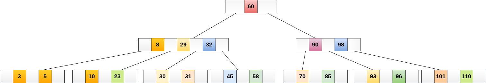

# B树

## 一棵m阶的B-Tree有如下特性
1. 每个节点最多m个子节点。
2. 除了根节点和叶子节点外，每个节点最少有`ceil(m/2)`个子节点。
3. 如果根节点不是叶子节点，那根节点至少包含两个子节点。
4. 所有的叶子节点都位于同一层。
5. 每个节点都包含k个元素，且`ceil(m/2)-1≤k≤m-1`。
6. 每个节点中的元素从小到大排列。
7. 每个元素左节点中的每个元素都小于等于该元素，右节点中的每个元素都大于等于该元素。

## 搜索

搜索数据项：49

- 将49与根节点中的元素78进行比较。因为49<78，移动到78的左子树。
- 将49与元素40进行比较，因为49>40，将49与下一个元素56进行比较，因为49<56，移动到40的右子树（56的左子树）。
- 将49与元素45进行比较，因为49>45，将49与下一个元素49进行比较，找到。

## 插入

如果插入后节点中元素个数小于等于m-1，则直接按递增顺序插入元素。如果大于m-1，则按照以下步骤操作。

- 按元素的递增顺序插入新元素。
- 将该节点拆成两个节点，并将中间的元素`ceil(m/2)`移动到其父节点。
- 如果此时父节点中元素个数大于m-1，则按照相同的步骤将其拆分。

将节点8插入到5阶B树中。

按照搜索的步骤，将8插入5的右侧

该节点现在包含5个元素，大于m-1。因此，将中间元素8移动到其父节点

## 删除

如果删除的元素不在叶子节点中，则用直接前驱（左子树中最大的元素）或直接后继（右子树中最小的元素）与要删除的元素交换位置，此时问题转化为删除叶子节点中的元素。

要删除的元素在叶子节点中，如果删除后节点中元素个数大于等于`ceil(m/2)-1`，则直接从节点中删除元素。如果删除后节点中元素个数小于`ceil(m/2)-1`，则按照以下步骤操作。

- 如果左侧兄弟节点中元素个数大于`ceil(m/2)-1`，则将父节点中的最小元素下移到要删除元素的节点，并将兄弟节点中最大元素上移到父节点。
- 如果右侧兄弟节点中元素个数大于`ceil(m/2)-1`，则将父节点中的最小元素下移到要删除元素的节点，并将兄弟节点中最小元素上移到父节点。
- 如果兄弟节点中元素个数都小于等于`ceil(m/2)-1`，则将删除元素后的节点与左（或右）兄弟节点及父节点的最小元素进行合并，形成新的节点。

如果删除后父节点中元素个数小于`ceil(m/2)-1`，则按照相同的步骤处理。

从5阶B树中删除60，删除后节点中有3个元素，直接从节点中删除元素

删除80，用直接前驱77与要删除的元素80交换位置，删除后节点中有3个元素，直接删除80

删除38，右侧兄弟节点中元素个数大于2，则将父节点中的最小元素49下移到这个节点，并将兄弟节点中最小元素70推送到父节点。

删除49，兄弟节点中元素个数都小于等于2，则将删除元素后的节点与右兄弟节点及父节点的最小元素进行合并，形成新的节点。此时父节点中不足2个元素，按照相同的步骤处理。
