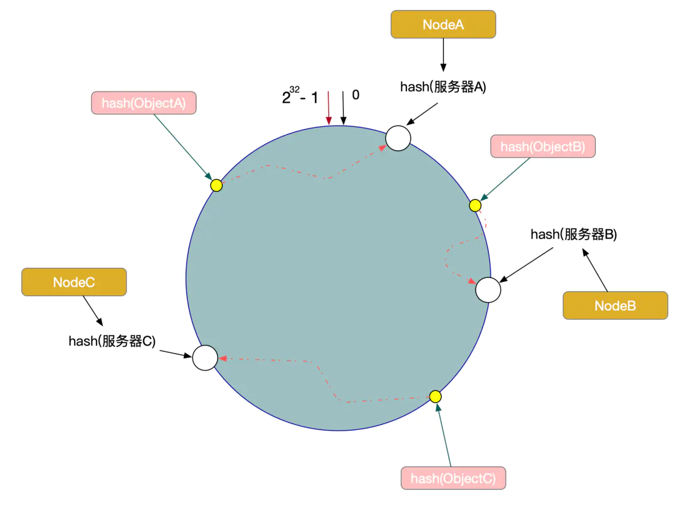
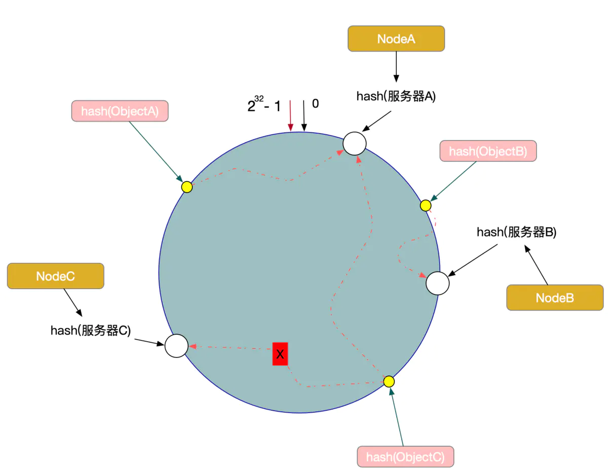

# 一致性Hash算法

一致性Hash算法也是使用取模的方法, 不过, 源地址hash算法的取模方法是对服务器的数量进行取模, 而一致性的Hash算法是对2的32方取模。即, 一致性Hash算法将整个Hash空间组织成一个虚拟的圆环, Hash函数的值空间为0 ~ 2^32 - 1(一个32位无符号整型), 整个哈希环如下: 


整个圆环以顺时针方向组织, 圆环正上方的点代表0, 0点右侧的第一个点代表1, 以此类推。

将各个服务器使用服务器的IP得到一个哈希值, 这样每台服务器就确定在了哈希环的一个位置上, 比如有三台机器, 使用IP地址哈希后在环空间的位置: 


将客户端ip使用相同的函数Hash计算出哈希值, 并确定此数据在环上的位置, 从此位置沿环顺时针查找, 遇到的服务器就是其应该定位到的服务器。

例如, 现在有ObjectA, ObjectB, ObjectC三个客户端, 经过哈希计算后, 在环空间上的位置如下: 



假设Node C宕机了, 则A、B不会受到影响, 只有Object C对象被重新定位到Node A。所以在一致性Hash算法中, 如果一台服务器不可用, 受影响的仅仅是此服务器到其环空间前一台服务器之间的数据(这里为Node C到Node B之间的数据), 其他不会受到影响。



假设增加了一台服务器Node X, 此时对象ObjectA、ObjectB没有受到影响, 只有Object C重新定位到了新的节点X上。


# 数据倾斜问题

在一致性Hash算法服务节点太少的情况下, 容易因为节点分布不均匀面造成数据倾斜(客户端大部分访问到某一台服务器上)问题


为了解决数据倾斜问题, 一致性Hash算法引入了虚拟节点机制, 即对每一个服务器节点计算多个哈希, 每个计算结果位置都放置一个此服务节点, 称为虚拟节点。

具体操作可以为服务器IP或主机名后加入编号来实现。


# 代码

```java
//每个服务器ip的虚拟结点数量为100
private static final Integer VIRTUAL_NODES = 100;

public static void main(String[] args) {

    // key: 虚拟节点 value: 服务器ip
    TreeMap<Integer, String> nodeMap = new TreeMap<Integer, String>();
    // 遍历服务器ip, 生成对应的虚拟结点
    for (String serverIp : SERVER_IP_LIST) {
        for (int i = 0; i < VIRTUAL_NODES; i++) {
            nodeMap.put(getHash(serverIp + "VN" + i), serverIp);
        }
    }

    for (String clientIp : CLIENT_IP_LIST) {
        SortedMap<Integer, String> subMap = nodeMap.tailMap(getHash(clientIp));
        Integer firstKey = null;
        try {
            firstKey = subMap.firstKey();
        } catch (Exception e) {
        }

        if (firstKey == null) {
            firstKey = nodeMap.firstKey();
        }
        System.out.println("请求的服务器ip为" + nodeMap.get(firstKey));
    }
}
```
