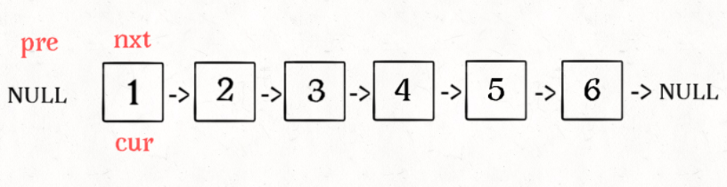
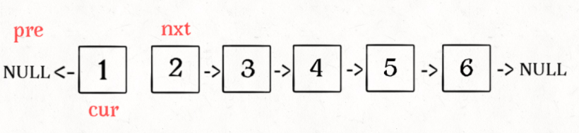
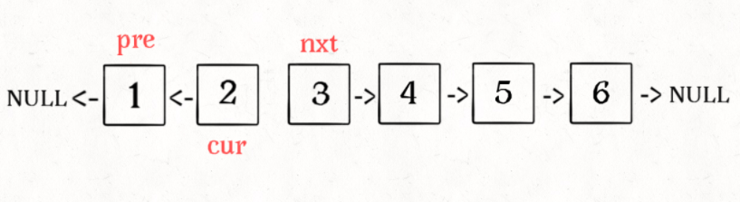
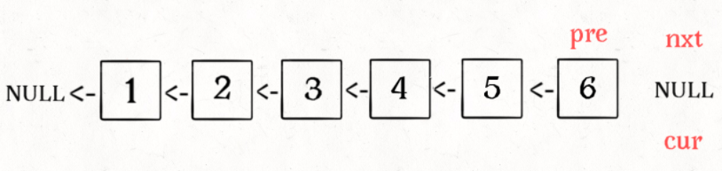

# 反转整个链表









```java
// 反转以 a 为头结点的链表
ListNode reverse(ListNode a) {
    ListNode pre, cur, nxt;
    pre = null; cur = a; nxt = a;
    while (cur != null) {
        nxt = cur.next;
        // 逐个结点反转
        cur.next = pre;
        // 更新指针位置
        pre = cur;
        cur = nxt;
    }
    // 返回反转后的头结点
    return pre;
}
```

# 反转 a 到 b 之间的结点

```java
/** 反转区间 [a, b) 的元素, 注意是左闭右开 */
ListNode reverse(ListNode a, ListNode b) {
    ListNode pre, cur, nxt;
    pre = null; cur = a; nxt = a;
    // while 终止的条件改一下就行了
    while (cur != b) {
        nxt = cur.next;
        cur.next = pre;
        pre = cur;
        cur = nxt;
    }
    // 返回反转后的头结点
    return pre;
}
```
