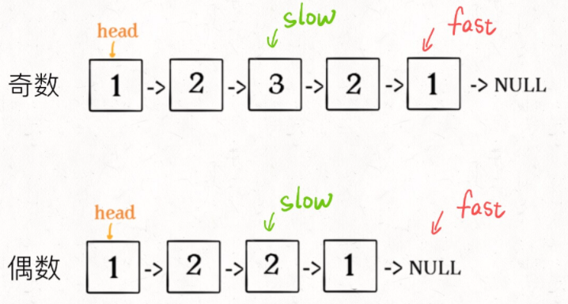

# 找到链表的中点

用一快一慢的两个指针, 快指针每次走两步, 慢指针每次走一步, 那么快指针到达链尾的时候, 慢指针就走了中点

```java
ListNode slow, fast;
slow = fast = head;
while (fast != null && fast.next != null) {
    slow = slow.next;
    fast = fast.next.next;
}
// slow 指针现在指向链表中点
```


