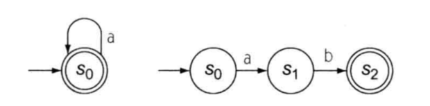
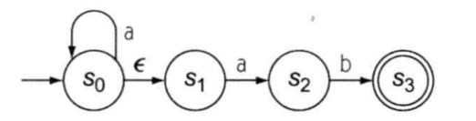
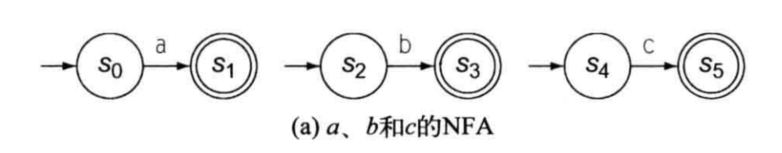
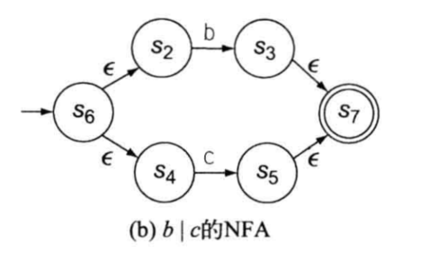
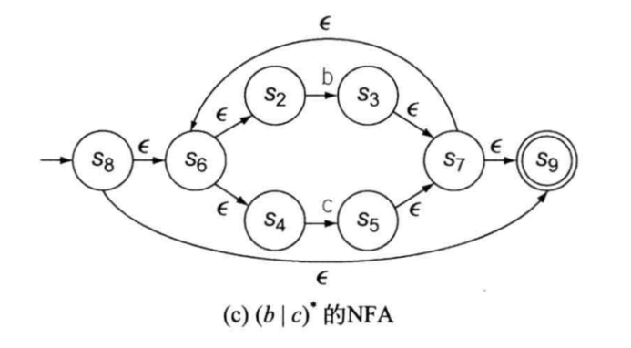
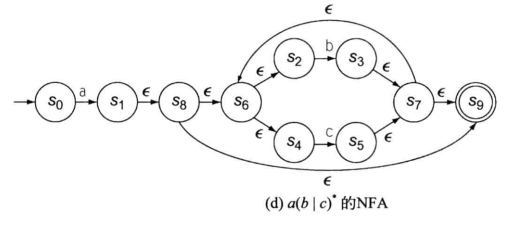

# 利用 ε转移 合并两个FA

例如: 正则表达式`a*`和`ab`

利用 ε转移 合并两个FA成为`a*ab`

ε转移使得状态s0在遇到字幕a时, 可以选择两种不同的转移: `s0->s0`或`s0->s1->s2`

如果一个FA包含了这种对单个输入字符有多种可能的转移时, 称这个FA为非确定有限状态自动机(Nondeterministic Finite Automata, NFA)

# 根据正则表达式生成NFA(Thompson构造法)

通过Thompson构造法对 `a(b|c)*` 进行构造

将RE中每个字符构建成简单的NFA:

括号的优先级最高, 先构造括号中的表达式`b|c`

闭包的优先级比连接高, 所以接着构造`(b|c)*`

最后把`a`和`(b|c)*`连起来

