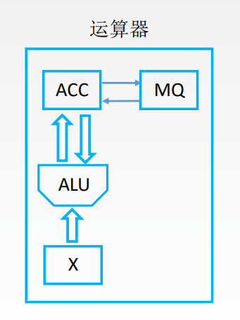
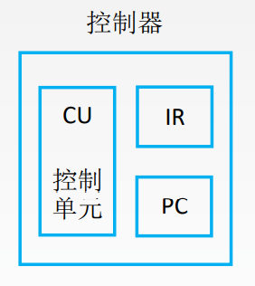

# 运算器的基本组成

运算器: 用于实现算术运算（如: 加减乘除）、逻辑运算（如: 与或非）

- ACC:  累加器, 用于存放操作数, 或运算结果。
- MQ:  乘商寄存器, 在乘、除运算时, 用于存放操作数或运算结果。
- X:  通用的操作数寄存器, 用于存放操作数
- ALU:  算术逻辑单元, 通过内部复杂的电路实现算数运算、逻辑运算

# 控制器的基本组成

- CU: 控制单元, 分析指令, 给出控制信号
- IR: 指令寄存器, 存放当前执行的指令
- PC: 程序计数器, 存放下一条指令地址, 有自动加1功能

