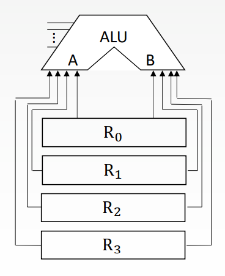
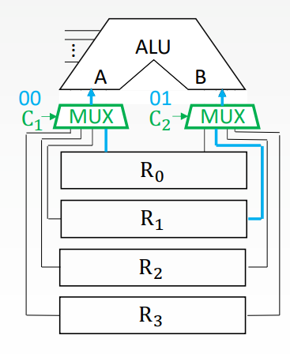
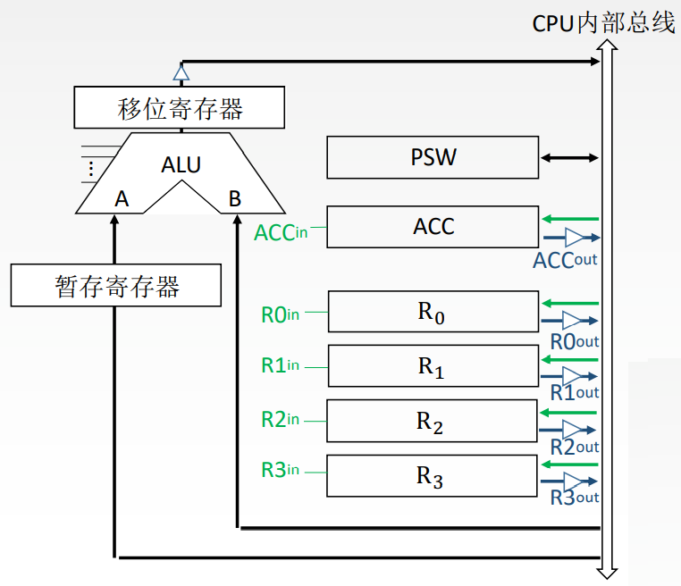
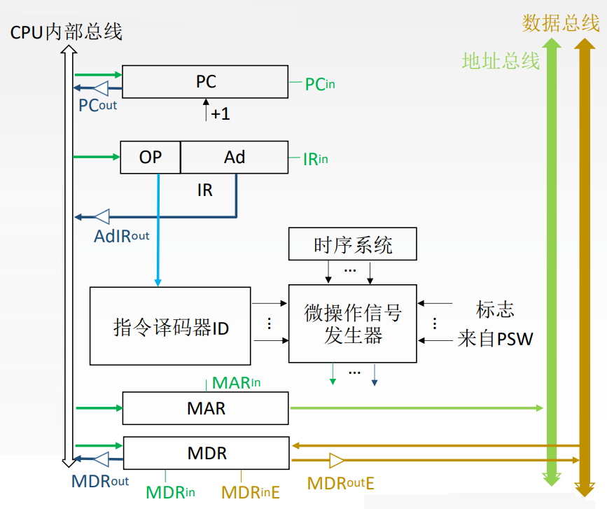
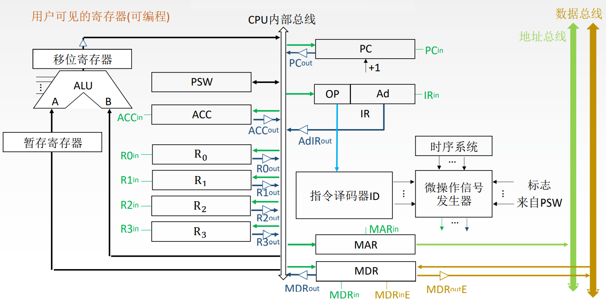

# 运算器的基本结构

1. 算术逻辑单元: 主要功能是进行算术/逻辑运算。
2. 通用寄存器组: 如AX、BX、CX、DX、SP等, 用于存放操作数(包括源操作数、目的操作数及中间结果)和各种地址信息等。SP是堆栈指针, 用于指示栈顶的地址

问题: 如果直接用导线连接, 相当于多个寄存器同时并且一直向ALU传输数据

## 解决方法1 使用多路选择器

使用多路选择器根据控制信号选择一路输出

## 解决方法2 使用三态门

使用三态门可以控制每一路是否输出

如: R0out为1时R0中的数据输出到A端, R0out为0时R0中的数据无法输出到A端

使用三态门性能较高, 基本不存在数据冲突现象, 但结构复杂, 硬件量大, 不易实现。

# CPU内部各器件的连接方式

- 专用数据通路方式: 根据指令执行过程中的数据和地址的流动方向安排连接线路。
- CPU内部单总线方式: 将所有寄存器的输入端和输出端都连接到一条公共的通路上。

## CPU内部单总线方式

需要使用暂存寄存器

暂存寄存器: 用于暂存从主存读来的数据, 这个数据不能存放在通用寄存器中, 否则会破坏其原有内容。

如: 两个操作数分别来自主存和R0, 最后结果存回R0, 那么从主存中取来的操作数直接放入暂存器, 就不会破坏运算前R0的内容。

CPU内部单总线方式结构简单, 容易实现, 但数据传输存在较多冲突的现象, 性能较低。

# 控制器的基本结构

1. 程序计数器: 用于指出下一条指令在主存中的存放地址。CPU就是根据PC的内容去主存中取指令的。因程序中指令(通常)是顺序执行的, 所以PC有自增功能。
2. 指令寄存器: 用于保存当前正在执行的那条指令。
3. 指令译码器: 仅对操作码字段进行译码, 向控制器提供特定的操作信号。
4. 微操作信号发生器: 根据IR的内容(指令)、PSW的内容(状态信息)及时序信号, 产生控制整个计算机系统所需的各种控制信号, 其结构有组合逻辑型和存储逻辑型两种。
5. 时序系统: 用于产生各种时序信号, 它们都是由统一时钟(CLOCK)分频得到。
6. 存储器地址寄存器: 用于存放所要访问的主存单元的地址。
7. 存储器数据寄存器: 用于存放向主存写入的信息或从主存中读出的信息。

# CPU的基本结构

