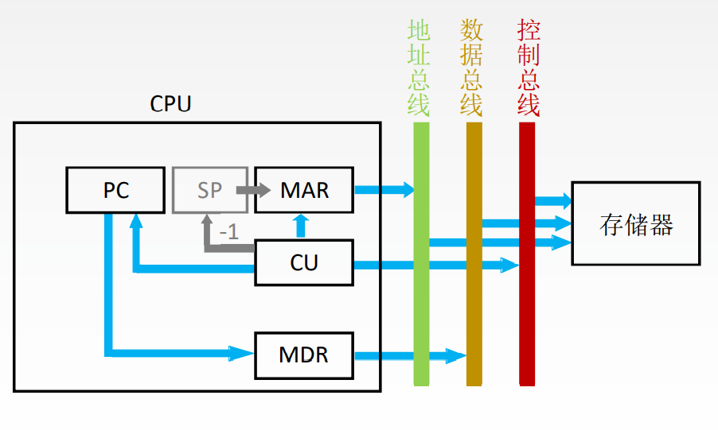

# 中断

暂停当前任务去完成其他任务。为了能够恢复当前任务, 需要保存断点。一般使用堆栈来保存断点, 用SP表示栈顶地址, 假设SP指向栈顶元素, 进栈操作是先修改指针, 后存入数据。

# 中断周期

1. CU控制将SP减1, 修改后的地址送入MAR, 记做: `(SP)-1 → SP`和`(SP) → MAR`
2. CU发出控制信号, 启动主存做写操作, 记做: `1 → W`
3. 将断点(PC内容) 送入MDR, 记做: `(PC) → MDR`
4. CU控制将中断服务程序的入口地址(由向量地址形成部件产生)送入PC, 记做: `向量地址→ PC`

