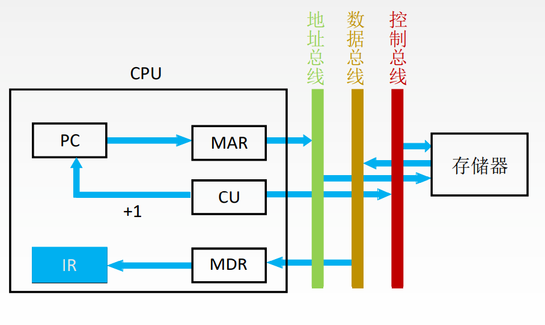

# 取指周期

1. 当前指令地址送至存储器地址寄存器, 记做: `(PC) → MAR`
3. 将MAR所指主存中的内容经数据总线送入MDR, 记做: `M(MAR) → MDR`
2. CU发出控制信号, 经控制总线传到主存, 如果是读信号, 则记做: `1 → R`
4. 将MDR中的内容(此时是指令)送入IR, 记做: `(MDR) → IR`
5. CU发出控制信号, 形成下一条指令地址, 记做: `(PC)+1 → PC`

