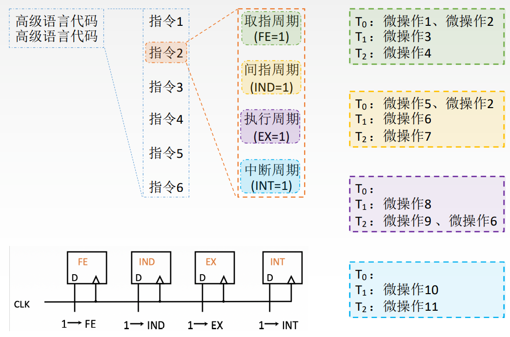

# 微命令和微操作

微命令即控制部件通过控制线向执行部件发出各种控制命令。

CU通过发出一个微命令, 完成对应的微操作。

如: 微命令 `PCout、MARin 有效`。完成对应的微操作 `(PC)→MAR`。

如果某些微操作使用的CPU部件不重复, 则一个节拍内可以并行完成这些微操作

# 定长机器周期

不同指令的执行周期所需节拍数各不相同。为了简化设计, 选择定长的机器周期, 以可能出现的最大节拍数为准(通常以访存所需节拍数作为参考)

若实际所需节拍数较少, 可将微操作安排在机器周期末尾几个节拍上进行

