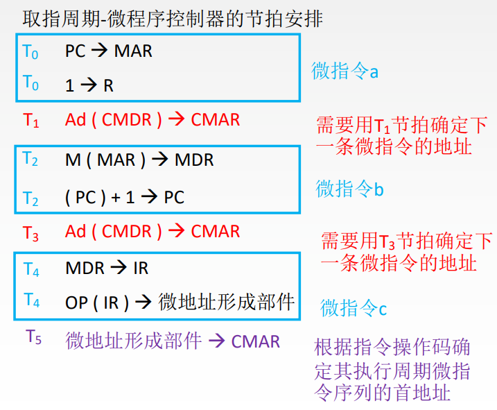

# 分析每个阶段的微操作序列

取指周期-硬布线控制器的节拍安排

# 写出对应机器指令的微操作命令及节拍安排

(1) 写出每个周期所需要的微操作(参照硬布线)

(2)补充微程序控制器特有的微操作: 

a. 取指周期: 
- Ad ( CMDR ) → CMAR
- OP ( IR ) → 微地址形成部件 → CMAR

b. 执行周期: 
- Ad(CMDR) → CMAR

# 确定微指令格式

根据微操作个数决定采用何种编码方式, 以确定微指令的操作控制字段的位数。

根据CM中存储的微指令总数, 确定微指令的顺序控制字段的位数。

最后按操作控制字段位数和顺序控制字段位数就可确定微指令字长。

# 编写微指令码点

根据操作控制字段每一位代表的微操作命令, 编写每一条微指令的码点。
