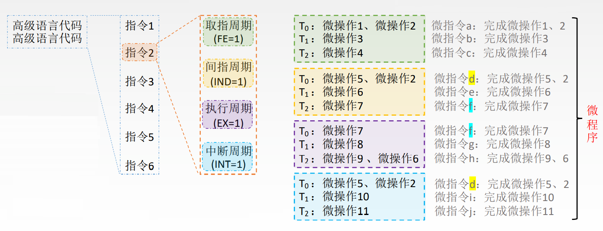
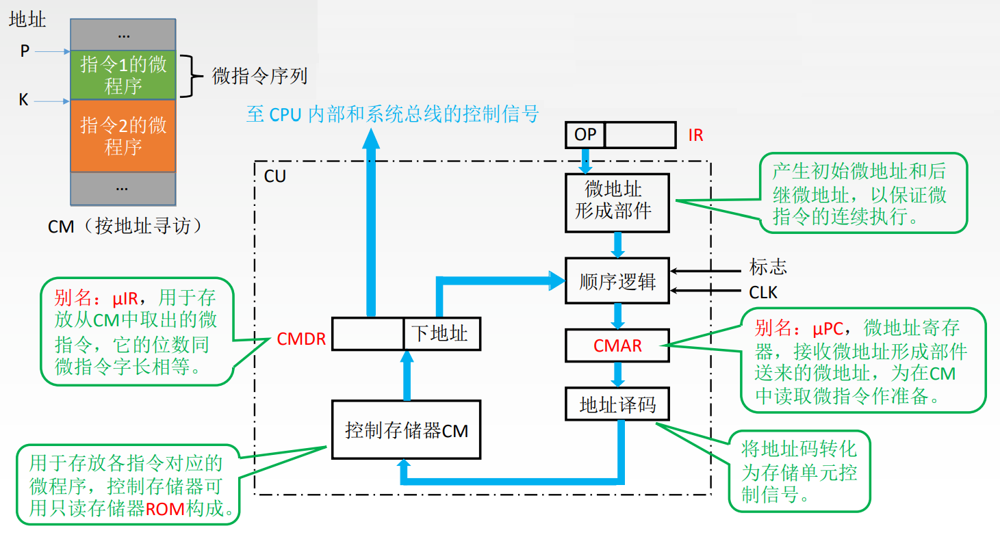
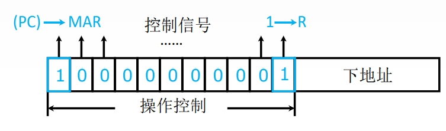
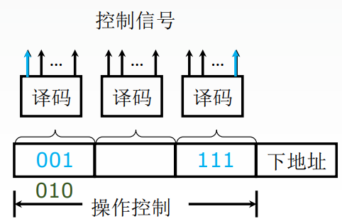
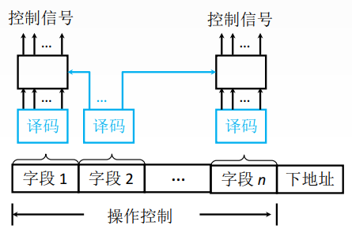

# 微程序

一条指令对应一个微程序

# 微指令

一个微程序由多条微指令组成

微指令由微操作组成



# 微指令基本格式

## 水平型微指令
```
[微指令操作][下一条微指令的地址]
```

优点: 微程序短, 执行速度快

缺点: 微指令长, 编写微程序较麻烦

## 垂直型微指令
```
[微操作码][目的地址][源地址]
```

优点: 微指令短、简单、规整, 便于编写微程序

缺点: 微程序长, 执行速度慢, 工作效率低

## 混合型微指令
在垂直型的基础上增加一些不太复杂的并行操作。

# 微程序控制器的基本结构



# 水平型微指令的编码方式

## 直接编码（直接控制）方式

在微指令的操作控制字段中, 每一位代表一个微操作命令, 某位为 “1” 表示该控制信号有效



优点: 简单、直观, 执行速度快, 操作并行性好

缺点: 微指令字长过长, n个微命令就要求微指令的操作字段有n位, 造成控存容量极大

## 字段直接编码方式

将微指令的控制字段分成若干 “段”, 每段经译码后发出控制信号



微命令字段分段的原则
- 互斥性微命令分在同一段内, 相容性微命令分在不同段内
- 每个小段中包含的信息位不能太多, 否则将增加译码线路的复杂性和译码时间
- 一般每个小段还要留出一个状态, 表示本字段不发出任何微命令。因此, 当某字段的长度为3位时, 最多只能表示7个互斥的微命令, 通常用000表示不操作

# 字段间接编码方式



一个字段的某些微命令需由另一个字段中的某些微命令来解释, 由于不是靠字段直接译码发出的微命令, 故称为字段间接编码, 又称隐式编码

# 微指令的地址形成方式

1. 微指令的 下地址字段 指出: 微指令格式中设置一个下地址字段, 由微指令的下地址字段直接指出后继微指令的地址, 这种方式又称为断定方式
2. 根据机器指令的 操作码 形成: 当机器指令取至指令寄存器后, 微指令的地址由操作码经微地址形成部件形成
3. 增量计数器法: `(CMAR) + 1 → CMAR`
4. 分支转移`[操作控制字段][转移方式][转移地址]`: 转移方式: 指明判别条件；转移地址: 指明转移成功后的去向
5. 由硬件产生微程序入口地址: 第一条微指令地址由专门硬件产生（用专门的硬件记录取指周期微程序首地址）。中断周期由硬件产生中断周期微程序首地址（用专门的硬件记录）
