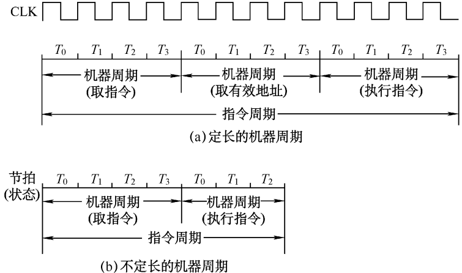
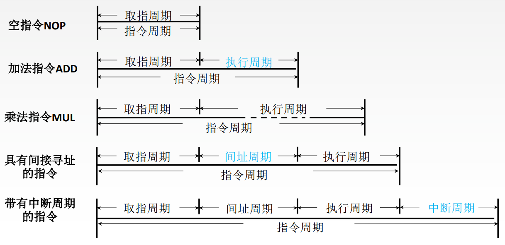
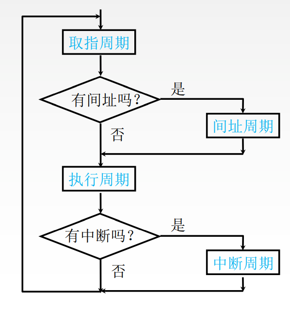

# 指令周期

CPU从主存中取出并执行一条指令所需的全部时间。

指令周期常常用若干机器周期来表示, 机器周期又叫CPU周期。

一个机器周期又包含若干时钟周期(也称为节拍、T周期或CPU时钟周期, 它是CPU操作的最基本单位)。

# 定长的机器周期

每个指令周期内机器周期数相等, 每个机器周期内的节拍数也相等。需要统一为执行时间最久的操作所用的周期

# 不定长的机器周期

每个指令周期内机器周期数可以不等, 每个机器周期内的节拍数也可以不等。

# 指令周期流程

使用4个触发器表示不同的工作周期

- FE触发器: fetch, FE=1时, 表示处于取指周期
- IND触发器: in direct, IND=1时, 表示处于间指周期
- EX触发器: execute, EX=1时, 表示处于执行周期
- INT触发器: interrupt, INT=1时, 表示处于中断周期
