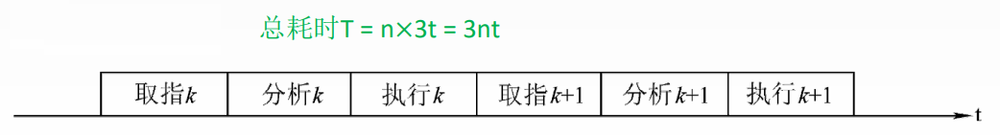
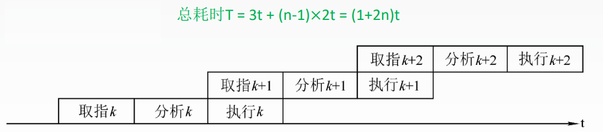
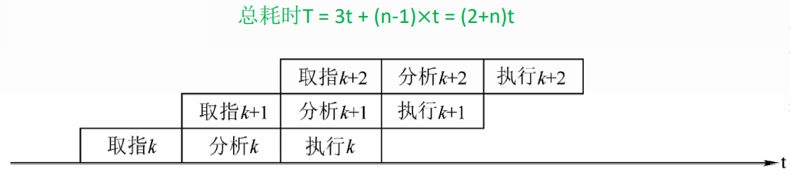
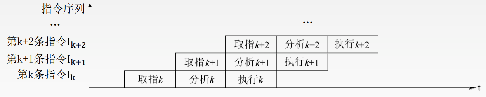
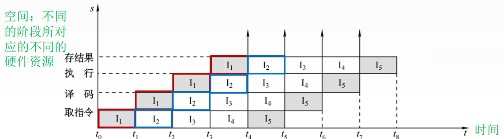

# 顺序执行方式

设取指、分析、执行3个阶段的时间都相等, 用t表示

传统冯·诺依曼机采用顺序执行方式, 又称串行执行方式。

优点: 控制简单, 硬件代价小。

缺点: 执行指令的速度较慢, 在任何时刻, 处理机中只有一条指令在执行, 各功能部件的利用率很低。

# 一次重叠执行方式

优点: 程序的执行时间缩短了1/3, 各功能部件的利用率明显提高。

缺点: 需要付出硬件上较大开销的代价, 控制过程也比顺序执行复杂了。

# 二次重叠执行方式

与顺序执行方式相比, 指令的执行时间缩短近2/3。这是一种理想的指令执行方式, 在正常情况下, 处理机中同时有3条指令在执行。

# 指令执行过程图

主要用于分析指令执行过程以及影响流水线的因素

# 时空图

主要用于分析流水线的性能

