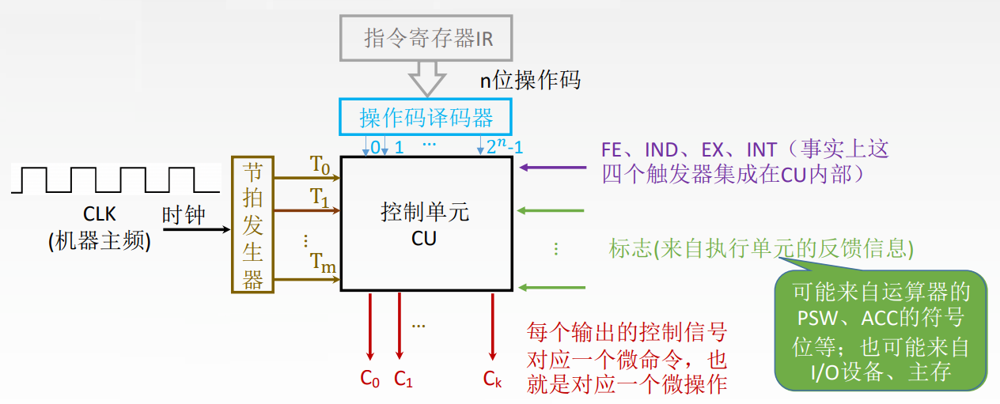
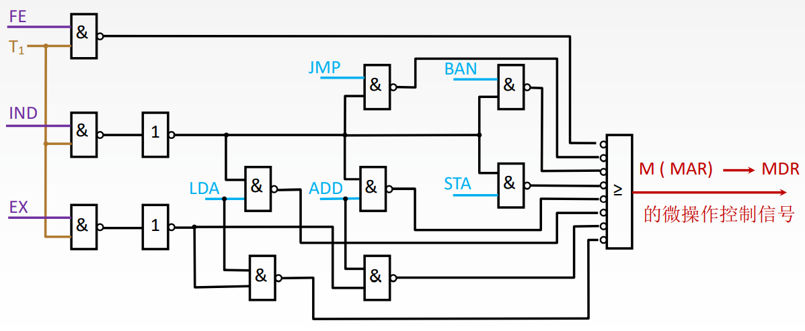
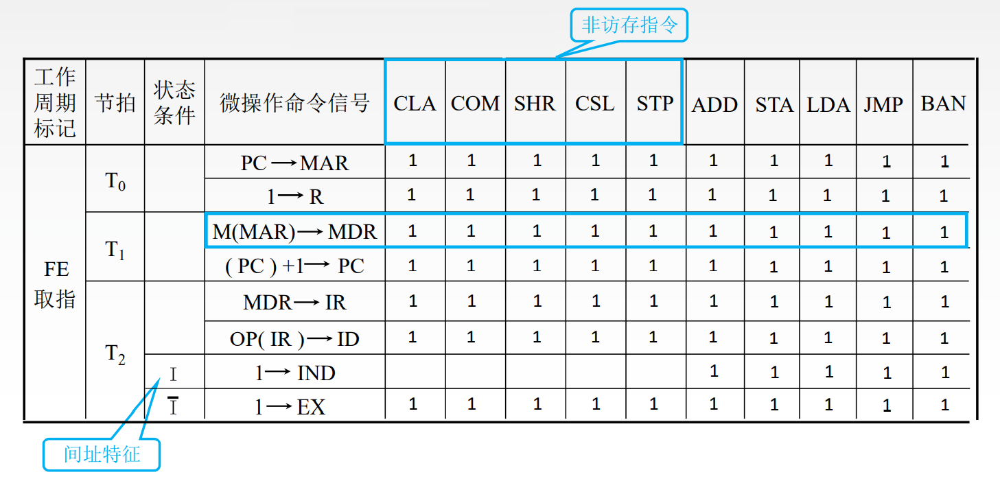
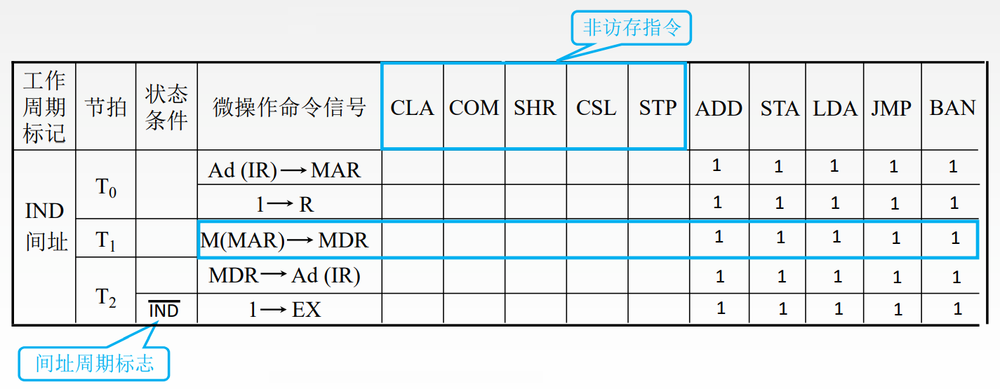
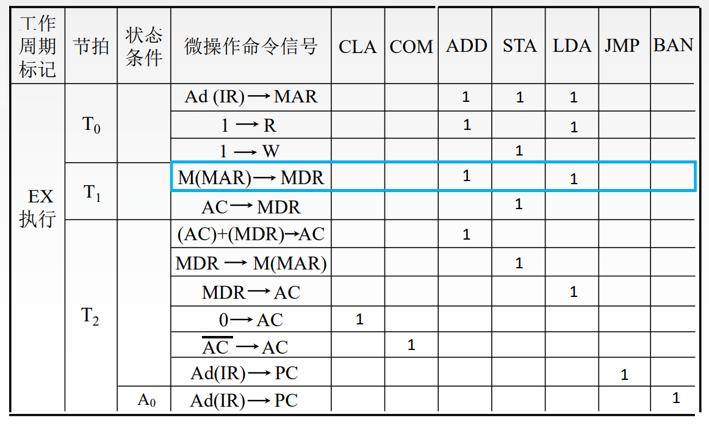

# 硬布线控制器

假设 C1输出的微命令是`M（MAR）→MDR`, 

则C1的逻辑表达式为: `FE·T1 + IND·T1(ADD+STA+LDA+JMP+BAN) + EX·T1(ADD+LDA)`

对应的电路为: 

# 设计硬布线控制器

设计步骤: 

1. 分析每个阶段的微操作序列（取值、间址、执行、中断 四个阶段）
2. 选择CPU的控制方式(用定长机器周期还是不定长机器周期?每个机器周期安排几个节拍?)
3. 安排微操作时序(如何用n个节拍完成整个机器周期内的所有微操作)
4. 电路设计

# 分析每个阶段的微操作序列

列出所有指令在各个阶段的微操作序列

## 取指周期:
1. PC → MAR
2. M (MAR) → MDR
3. MDR → IR
4. (PC) + 1 → PC
5. 1 → R
6. OP (IR) → ID

ID 是指令译码器(Instruction Decoder)

## 间址周期:
1. Ad(IR) → MAR
2. 1 → R
3. M (MAR) → MDR
4. MDR → Ad(IR)

## 执行周期(列出部分):

### CLA (clear ACC ACC清零)

1. 0 → ACC

### LDA X (取数指令, 把X所指内容取到ACC)

1. Ad (IR) → MAR
2. 1 → R
3. M (MAR) → MDR
4. MDR → ACC

### JMP X (无条件转移)

1. Ad (IR) → PC

### BAN X (Branch ACC Negative 条件转移, 当ACC为负时转移)

A0 表示ACC为负

1. A0 • Ad (IR) → PC

# 选择CPU的控制方式

假设采用同步控制方式（定长机器周期）, 一个机器周期内安排3个节拍。

# 安排微操作时序

- 原则一 微操作的先后顺序不得随意更改
- 原则二 被控对象不同的微操作尽量安排在一个节拍内完成
- 原则三 占用时间较短的微操作尽量安排在一个节拍内完成并允许有先后顺序

## 取指周期

确定微命令的先后顺序

- `M (MAR) → MDR`需要在`PC → MAR`之后执行
- `(PC) + 1 → PC`需要在`PC → MAR`之后执行
- `MDR → IR`需要在`M (MAR) → MDR`之后执行
- `OP (IR) → ID`需要在`MDR → IR`之后执行

分配时钟周期

- T0执行 `PC → MAR` 和 `1 → R`
- T1执行 `M (MAR) → MDR` 和 `(PC) + 1 → PC`
- T2执行 `MDR → IR` 和 `OP (IR) → ID`

`MDR → IR` 是CPU内部寄存器的数据传送, 速度很快, 因此在一个时钟周期内可以紧接着完成 `OP (IR) → ID` 也就是可以一次同时发出两个微命令。

## 间址周期

同理

- T0执行 `Ad(IR) → MDR` 和 `1 → R`
- T1执行 `M (MAR) → MDR`
- T2执行 `MDR → Ad(IR)`

## 执行周期

### CLA (clear ACC ACC清零)

- T0执行
- T1执行
- T2执行 `0 → ACC`

### LDA X (取数指令, 把X所指内容取到ACC)

- T0执行 `Ad (IR) → MAR` 和 `1 → R`
- T1执行 `M (MAR) → MDR`
- T2执行 `MDR → AC`

### JMP X (无条件转移)

- T0执行
- T1执行
- T2执行 `Ad (IR) → PC`

### BAN X (Branch ACC Negative 条件转移, 当ACC为负时转移)

- T0执行
- T1执行
- T2执行 `A0 • Ad (IR) → PC`

# 电路设计

列出操作时间表

根据表格得出`M（MAR）→MDR`的逻辑表达式为: `FE·T1 + IND·T1(ADD+STA+LDA+JMP+BAN) + EX·T1(ADD+LDA)`
