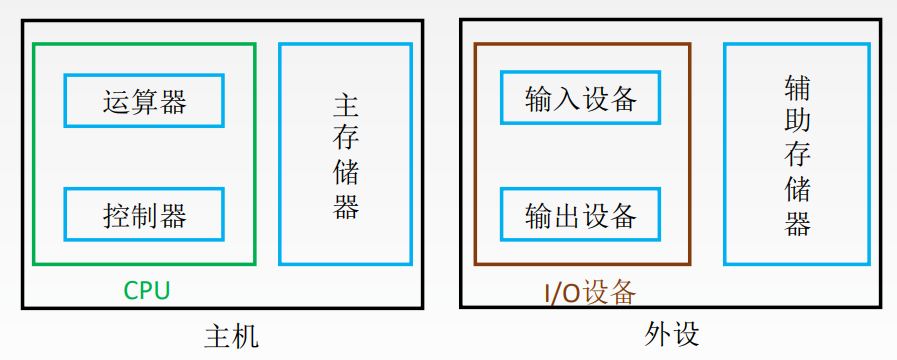
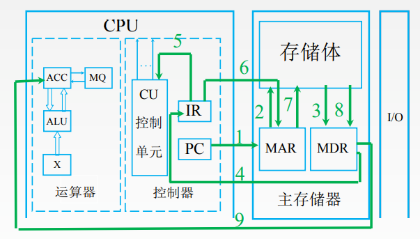
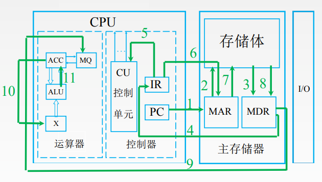

# 现代计算机的结构

# 计算机的工作过程

- 初: (PC)=0, 指向第一条指令的存储地址
- #1: (PC)->MAR, 将PC的内容送入MAR, 导致(MAR)=0
- #3: M(MAR)->MDR, 从主存中取出MAR指向的内容送入MDR, 导致(MDR)=000001 0000000101
- #4: (MDR)->IR, MDR的数据送入IR, 导致(IR)=000001 0000000101
- 取指后PC自动+1, (PC)=1
- #5: OP(IR)->CU, IR中指令的操作码送入CU, CU分析后得知, 这是“取数”指令
- #6: Ad(IR)->MAR, IR中指令的地址码送到MAR, 导致(MAR)=5
- #8: M(MAR)->MDR, 从主存中取出MAR指向的内容送入MDR, 导致(MDR)=0000000000000010=2
- #9: (MDR)->ACC, 把MDR中的数据送入ACC, 导致(ACC)=0000000000000010=2

- #1: (PC)->MAR, 导致(MAR)=1
- #3: M(MAR)->MDR, 导致(MDR)=000100 0000000110 
- #4: (MDR)->IR, 导致(IR)= 000100 0000000110
- #5: OP(IR)->CU, 指令的操作码送到CU,  CU分析后得知, 这是“乘法”指令
- #6: Ad(IR)->MAR, 指令的地址码送到MAR, 导致(MAR)=6
- #8: M(MAR)->MDR, 导致(MDR)=0000000000000011=3
- #9: (MDR)->MQ, 导致(MQ)=0000000000000011=3
- #10: (ACC)->X, 导致(X)=2
- #11: (MQ)*(X)->ACC, 由ALU实现乘法运算, 导致(ACC)=6, 如果乘积太大, 则需要MQ辅助存储
