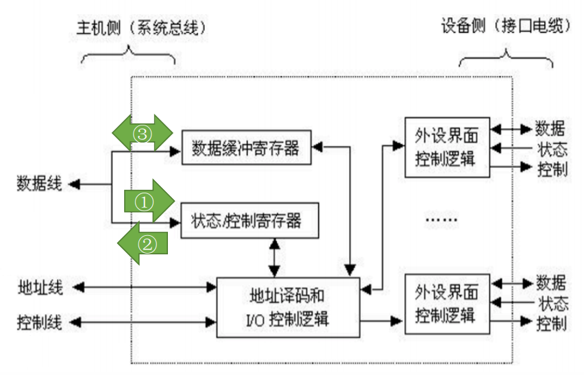
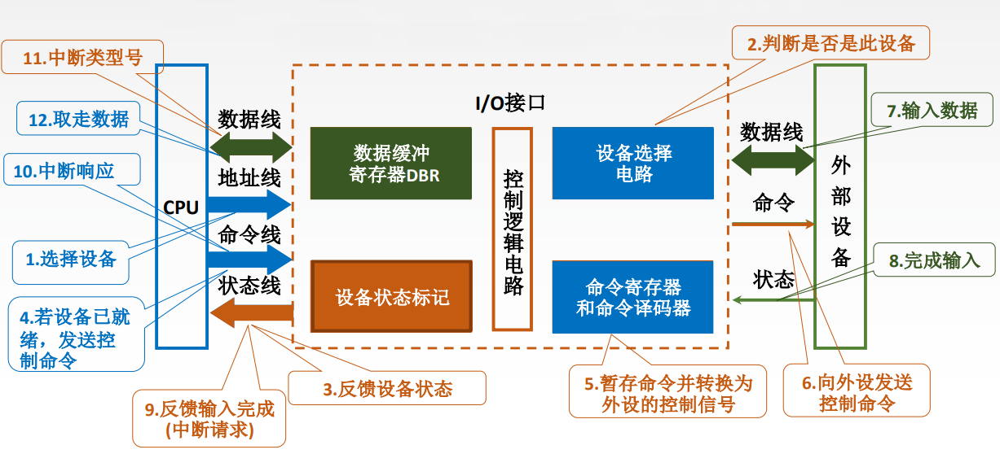

# I/O接口

I/O接口: 又称I/O控制器(I/O Controller)、设备控制器, 负责协调主机与外部设备之间的数据传输

I/O接口的作用
- 数据缓冲: 通过数据缓冲寄存器(DBR)达到主机和外设工作速度的匹配
- 错误或状态监测: 通过状态寄存器反馈设备的各种错误、状态信息, 供CPU查用
- 控制和定时: 接收从控制总线发来的控制信号、时钟信号
- 数据格式转换: 串-并、并-串 等格式转换
- 与主机和设备通信: 实现 主机—I/O接口—I/O设备 之间的通信

# I/O接口的工作原理

1. 发命令: 发送命令字到I/O控制寄存器, 向设备发送命令(需要驱动程序的协助)
1. 读状态: 从状态寄存器读取状态字, 获得设备或I/O控制器的状态信息
1. 读/写数据: 从数据缓冲寄存器发送或读取数据, 完成主机与外设的数据交换

控制寄存器、状态寄存器在使用时间上是错开的, 因此有的I/O接口中可将二者合二为一

# I/O端口编址

## 统一编址

把I/O端口当做存储器的单元进行地址分配, 用统一的访存指令就可以访问I/O端口, 又称存储器映射方式。

如系统总线中地址线共10根, 则可以访问的存储单元个数为2^10= 1024个, 假设要给10个I/O端口编址: 
1. 0～9表示I/O地址, 10～1023为主存单元地址
2. 0～1013表示主存单元地址, 1014～1023为IO地址
3. 10～19表示I/O地址, 0～9、20～1023为主存单元地址

靠不同的地址码区分内存和I/O设备, I/O地址要求相对固定在地址的某部分。

优点: 
- 不需要专门的输入/输出指令, 所有访存指令都可直接访问端口, 程序设计灵活性高
- 端口有较大的编址空间
- 读写控制逻辑电路简单

缺点: 
- 端口占用了主存地址空间, 使主存地址空间变小
- 外设寻址时间长(地址位数多, 地址译码速度慢)

## 独立编址

I/O端口地址与存储器地址无关, 独立编址。CPU需要设置专门的输入/输出指令访问端口, 又称I/O映射方式。

靠不同的指令区分内存和I/O设备。

优点: 
- 使用专用I/O指令, 程序编制清晰
- I/O端口地址位数少, 地址译码速度快
- I/O端口的地址不占用主存地址空间

缺点: 
- I/O指令类型少, 一般只能对端口进行传送操作, 程序设计灵活性差
- 需要CPU提供存储器读/写、I/O设备读/写两组控制信号, 增加了控制逻辑电路的复杂性

# I/O接口的基本结构

