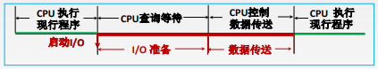
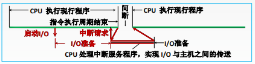
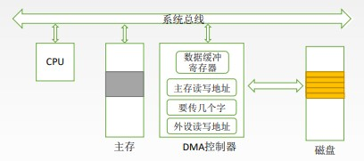
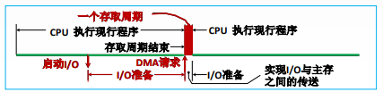

# 程序查询方式

CPU不断轮询检查I/O控制器中的“状态寄存器”，检测到状态为“已完成”之后，再从数据寄存器取出输入数据

优点：接口设计简单、设备量少。

缺点：CPU在信息传送过程中要花费很多时间用于查询和等待，而且如果采用独占查询，则在一段时间内只能和一台外设交换信息，效率大大降低。

# 程序中断方式

等待键盘I/O时CPU可以先去执行其他程序，键盘I/O完成后I/O控制器向CPU发出中断请求，CPU响应中断请求，并取走输入数据

CPU需要花大量的时间来处理中断服务程序，CPU利用率严重下降。

# DMA控制方式

主存与高速I/O设备之间有一条直接数据通路（DMA总线）。CPU向DMA接口发出“读/写”命令，并指明主存地址、磁盘地址、读写数据量等参数。DMA控制器自动控制磁盘与主存的数据读写，每完成一整块数据读写（如1KB为一整块），才向CPU发出一次中断请求。

# 通道控制方式

通道是具有特殊功能的处理器，能对I/O设备进行统一管理。通道可以识别并执行一系列通道指令，通道指令种类、功能通常比较单一。

1. CPU向通道发出I/O指令。指明通道程序在内存中的位置，并指明要操作的是哪个I/O设备。CPU就可以去做其他事情
2. 通道执行内存中的通道程序，控制I/O设备完成一系列任务
3. 道执行完规定的任务后，向CPU发出中断请求，之后CPU对中断进行处理
