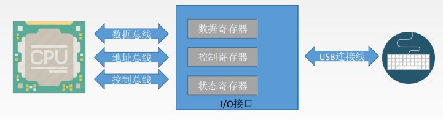

# I/O接口

又称I/O控制器(I/O Controller)、设备控制器, 负责协调主机与外部设备之间的数据传输

I/O控制器多种多样, 也会制定相应的标准, 如: 用于控制USB设备的IO接口、用于控制SATA 3.0硬盘的IO接口等

I/O控制器就是一块芯片, 常被集成在主板上

现在的I/O接口也会被集成在南桥芯片内部

# I/O系统基本组成

## I/O硬件

包括外部设备、I/O接口 、I/O总线等

## I/O软件

包括驱动程序、用户程序、管理程序、升级补丁等

通常采用I/O指令和通道指令实现主机和I/O设备的信息交换

I/O 指令: CPU 指令的一部分

通道指令: 通道程序提前编制好放在主存中, 在含有通道的计算机中, CPU执行I/O指令对通道发出命令, 由通道执行一系列通道指令, 代替CPU对I/O设备进行管理
