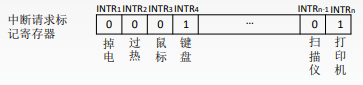
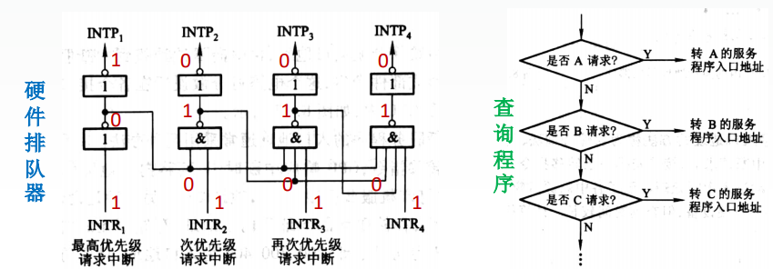
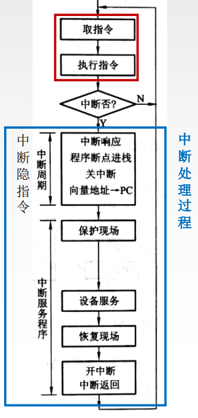
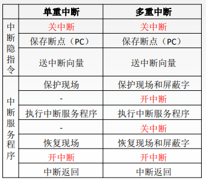
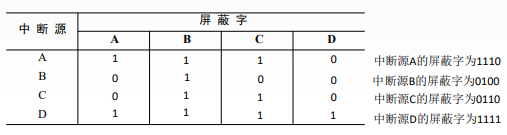

# 中断

程序中断是指在计算机执行现行程序的过程中，出现某些急需处理的异常情况或特殊请求，CPU暂时中止现行程序，而转去对这些异常情况或特殊请求进行处理，在处理完毕后CPU又自动返回到现行程序的断点处，继续执行原程序。

工作流程：
1. 中断请求：中断源向CPU发送中断请求信号。
2. 中断响应：响应中断的条件。中断判优：多个中断源同时提出请求时通过中断判优逻辑响应一个中断源。
3. 中断处理：中断隐指令。中断服务程序。

# 中断分类

根据中断源的不同，可以把中断分为硬件中断和软件中断两大类，而硬件中断又可以分为外部中断和内部中断两类。

外部中断一般是指由计算机外设发出的中断请求，如：键盘中断、打印机中断、定时器中断等。外部中断是可以屏蔽的中断，也就是说，利用中断控制器可以屏蔽这些外部设备的中断请求。

内部中断是指因硬件出错（如突然掉电、奇偶校验错等）或运算出错（除数为零、运算 溢出、单步中断等）所引起的中断。内部中断是不可屏蔽的中断。

# 中断请求标记(判断是哪个设备发来的中断信号)

每个中断源向CPU发出中断请求的时间是随机的。为了记录中断事件并区分不同的中断源，中断系统需对每个中断源设置中断请求标记触发器INTR，当其状态为“1”时，表示中断源有请求。

这些触发器可组成中断请求标记寄存器，该寄存器可集中在CPU中，也可分散在各个中断源中。

对于外中断，CPU是在统一的时刻即每条指令执行阶段结束前向接口发出中断查询信号，以获取I/O的中断请求，也就是说，CPU响应中断的时间是在每条指令执行阶段的结束时刻。

# 中断判优

中断判优既可以用硬件实现，也可用软件实现：硬件实现是通过硬件排队器实现的，它既可以设置在CPU中，也可以分散在各个中断源中；软件实现是通过查询程序实现的。

# 中断优先级

1. 硬件故障中断属于最高级，其次是软件中断；
2. 非屏蔽中断优于可屏蔽中断；
3. DMA请求优于I/O设备传送的中断请求
4. 高速设备优于低速设备；
5. 输入设备优于输出设备；
6. 实时设备优于普通设备。

# 中断处理过程

1. 中断请求：中断源(引起中断的事件或设备)向CPU发出的请求中断的要求。
1. 中断判优：当有多个中断源发出请求时，需要决定先处理哪个中断请求；
1. 中断响应：CPU中止现行程序转至中断服务程序的过程；
1. 中断处理：CPU执行中断服务程序；
1. 中断返回: 执行完中断服务程序后，返回到被中断的程序

## 中断隐指令

中断隐指令并不是一条具体的指令，而是CPU在检测到中断请求时自动完成的一系列动作

中断隐指令的主要任务：
1. 关中断。在中断服务程序中，为了保护中断现场（即CPU主要寄存器中的内容）期间不被新的中断所打断，必须关中断，从而保证被中断的程序在中断服务程序执行完毕之后能接着正确地执行下去。
2. 保存断点。为了保证在中断服务程序执行完毕后能正确地返回到原来的程序，必须将原来程序的断点（即程序计数器（PC）的内容）保存起来。可以存入堆栈，也可以存入指定单元。
3. 引出中断服务程序。引出中断服务程序的实质就是取出中断服务程序的入口地址并传送给程序计数器（PC）。

## 中断服务程序

中断服务程序的主要任务：
1. 保护现场，保存通用寄存器和状态寄存器的内容，以便返回原程序后可以恢复CPU环境。可使用堆栈，也可以使用特定存储单元。
2. 中断服务(设备服务)主体部分，如通过程序控制需打印的字符代码送入打印机的缓冲存储器中
3. 恢复现场，通过出栈指令或取数指令把之前保存的信息送回寄存器中
4. 中断返回，通过中断返回指令回到原程序断点处。

# 单重中断与多重中断

单重中断：执行中断服务程序时不响应新的中断请求。

多重中断：又称中断嵌套，执行中断服务程序时可响应新的中断请求。

# 中断屏蔽技术

中断屏蔽技术主要用于多重中断，CPU要具备多重中断的功能，须满足下列条件。
1. 在中断服务程序中提前设置开中断指令。
2. 优先级别高的中断源有权中断优先级别低的中断源。

每个中断源都有一个屏蔽触发器，1表示屏蔽该中断源的请求，0表示可以正常申请，所有屏蔽触发器组合在一起，便构成一个屏蔽字寄存器，屏蔽字寄存器的内容称为屏蔽字。

屏蔽字设置的规律：
1. 一般用‘1’表示屏蔽，’0’表示正常申请。
2. 每个中断源对应一个屏蔽字(在处理该中断源的中断服务程序时，屏蔽寄存器中的内容为该中断源对应的屏蔽字)。
3. 屏蔽字中‘1’越多，优先级越高。每个屏蔽字中至少有一个’1’(至少要能屏蔽自身的中断)。

设某机有4个中断源A、B、C、D，其硬件排队优先次序为A>B>C>D，现要求将中断处理次序改为D>A>C>B。写出每个中断源对应的屏蔽字。

1. D能屏蔽ABCD
2. A能屏蔽ABC
3. C能屏蔽BC
4. B能屏蔽B

