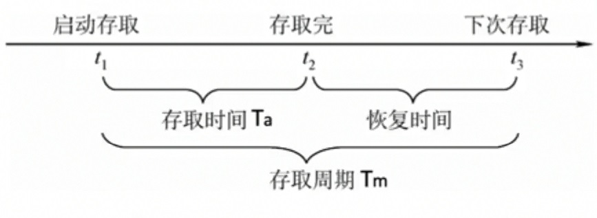

# 存储元

存储元(Storage Unit)是存储器的最小存储单元, 它的作用是用来存放一位二进制代码0或1。

# 存储单元(存储字)

多个存储元的集合。一般以8位二进制作为一个存储单元, 也就是一个字节。

1个存储单元称为1个存储字

# 存储器

由多个存储单元组成。

# 地址

为了标识和访问每个存储单元, 给每个存储单元规定一个编号, 即
存储单元的地址。

存储单元的地址用二进制无符号数表示, 从0开始, 顺序加1, 则n位二进制
数可以表示2^n个存储单元的地址。

地址总线使用对应的地址来寻找每个存储单元。

# 地址线和数据线与存储容量的关系

设存储容量为: 2的r次方*m位(存储单元的数量为2的r次方, 每个存储单元有m个存储元)

则: 地址线需要r根, 数据线需要m根。

# 片选

可以理解成选片。举个例子, 有很多芯片挂在同一总线上(像电脑里很多外设都是挂在总线上), 但我们有时候需要对其中特定的某个芯片进行数据、地址或命令的独立传输, 此时, 我们需要有一个信号来告诉挂在总线上的芯片们, 这些数据、地址是传给哪个芯片的。那这样的话, 其他芯片就会对这些信号"漠不关心", 而目标芯片就知道这些数据是传给自己的从而做出反应。这个信号就叫做片选信号CS(chip select)。

# 存储芯片的表示

字数×位数

例如: 1K×4位, 表示有1024个存储单元, 每个存储单元有4个存储元

# 存取周期

每一个存取周期可以读/写1个存储字

