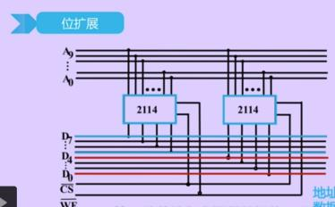
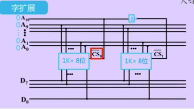
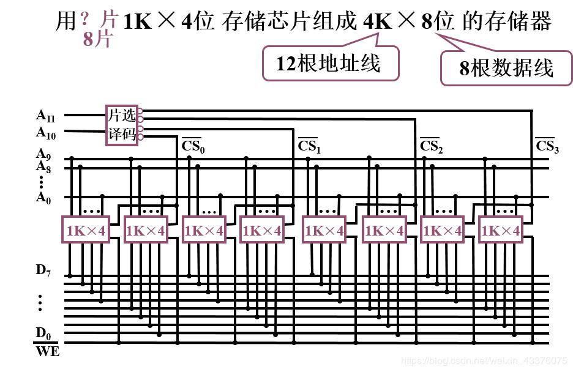

# 位扩展

例如, 2片1K×4位的芯片, 组成1K×8位的存储器

- 芯片的片选线直接与CPU的片选线(CS)相连
- 芯片的读写控制线直接与CPU的读写控制线(WE)相连
- 芯片的地址线直接与CPU的地址线相连
- 第一个芯片的数据线连接在CPU的高位数据线中, 第二个芯片的数据线连接在CPU的低位数据线中



# 字扩展

例如, 2片1K×4位的芯片, 组成2K×4位的存储器

- 由CPU的片选线决定操作哪个芯片
- 通过非门使两个芯片收到不同的片选信号
- 芯片的片选线与CPU的最高位地址线相连
- 芯片的地址线与CPU的低位地址线相连
- 芯片的数据线直接与CPU的数据线相连



# 字位同时扩展

例如, 几片1K×4位的芯片, 组成4K×8位的存储器?
```
4K×8 ÷ 1K×4 = 4 × 2 = 8
```
8片1K×4位的芯片, 组成2K×8位的存储器

- 按位数分成几组, 先进行位扩展
- 每组的第一个芯片的数据线与CPU的高位数据线相连, 第二个芯片的数据线与CPU的低位数据线相连
- 再进行字扩展, 每个组芯片的地址线与CPU的低位地址线相连
- 剩下的CPU高位地址线通过译码器(此处是2:4译码器)与每组芯片的片选相连, 用来选择操作哪个芯片


