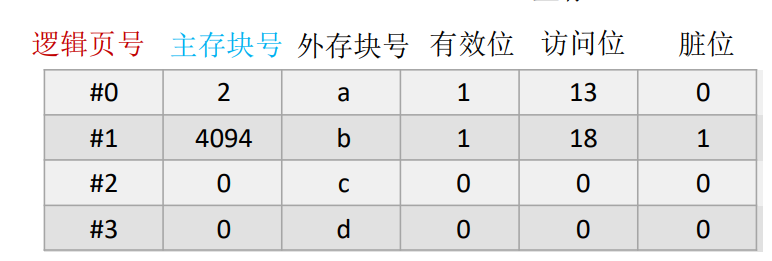
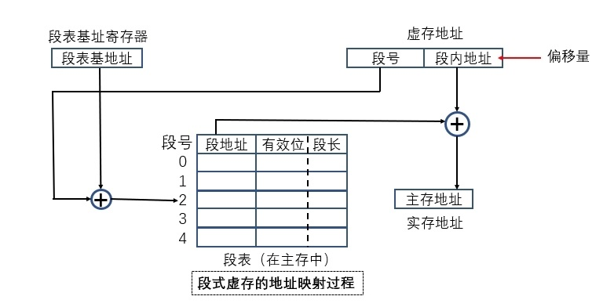

# 虚拟存储器

虚拟存储器只是一个容量非常大的存储器的逻辑模型，不是任何实际的物理存储器。它借助于磁盘等辅助存储器来扩大主存容量，使之为更大或更多的程序所使用。

主存加上辅存组成的虚拟存储器的逻辑上的地址称为虚地址或逻辑地址。
而主存的访问地址则称为实地址或物理地址。

CPU不能直接访问辅存, 所以需要把虚地址映射到实地址进行访问。

# 页式虚拟存储器

将若干个存储字组成一个页, 主存和辅存的页大小保持一致。

页表的结构


- 有效位：该页是否已经调入主存
- 访问位: 用于操作系统实现替换算法
- 脏位: 主存中该页的数据是否有修改

优点

- 页面的起点和终点地址是固定的，方便编造页表，新页调入主存也很容易掌握，比段式空间浪费小，易于管理，不存在外碎片。

缺点

- 页长与程序的逻辑大小不相关，处理、保护和共享都没有段式方便。

# 段式虚拟存储器

段按照程序的逻辑来分, 一个段存储程序的一段逻辑, 可以动态改变大小。



- 有效位 该段是否已经调入实存
- 段地址 在该段已经调入实存的情况下，该段在实存中的首地址
- 段长 记录该段的实际长度

优点：

- 段的逻辑独立性使其易于编译、管理、修改和保护，也便于多道程序共享。
- 段长可以根据需要动态改变，允许自由调度，以便有效利用主存空间。

缺点：

- 主存空间分配比较麻烦
- 容易在段间留下许多外碎片，造成存储空间利用率降低
- 由于段长不一定是2的整数次幂，因而不能简单地像分页方式那样用虚地址和实地址的最低若干二进制位作为段内偏移量，并与段号进行直接拼接，必须用加法操作通过段地址与段内偏移量的求和运算求得物理地址。因此，段式存储管理比页式存储管理方式需要更多的硬件支持。

# 段页式虚拟存储器

- 实存被等分成页。
- 先段后页：每个程序则先按逻辑结构分段，每段再按照实存的页大小分页，程序按页进行调入和调出操作，但可按段进行编程、保护和共享。
- 每道程序均通过一个段表和多个页表进行两级再定位。段表中的每一个表项对应一个段，每个表项有一个指针指向该段的页表。页表则指明该段各页再主存中的位置，以及是否已装入、是否已修改等状态信息。

地址结构
```
[段号][段内页号][页内地址]
```

优点

- 结合了段式和页式的优点。

缺点

- 在由虚地址向主存地址的映射过程中需要多次查表，需要花费时间，因而实现复杂度较高。
