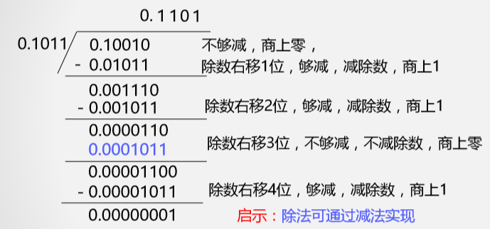

# 原码除法

## 符号位

同号得正异号得负, 使用异或门实现

## 二进制原码手工除法运算方法

- 启示: 除法可通过减法和移位实现
- 问题: 机器如何判断每步是否够减

## 恢复余数法

如何判断是否够减: 利用减法, 通过余数符号判断

由于符号位单独计算, 把被除数和除数都取绝对值

- 假如x=-0.1011, y=-0.1101
- 去掉符号位后原码表示为x=0.1011, y=0.1101
- 因为要用到减法, 所以把两个数转换为补码表示: x补=0.1011, y补=0.1101, (-y)补=1.0011

开始使用恢复余数除法计算

| 余数(补码) | 商(原码) | 操作                                            |
| -------------------- | -------- | ------------------------------------------------- |
| 0.1011               | 0.0000   | 余数初始值为被除数, 商初始值为0                                  |
| 0.1011+1.0011=1.1110 | 0.0000   | 余数减去除数, 即: x补+(-y)补          |
| 1.1110               | 0.0000   | 余数为负(1.1110), 商最低位设为0         |
| 1.1110+0.1101=0.1011 | 0.0000   | 余数为负, 加上除数进行恢复, 即: x补+y补 |
| 1.0110               | 0.0000   | 余数和商整体逻辑左移(代替除数右移)1位 |
| 1.0110+1.0011=0.1001 | 0.0000   | 余数减去除数                             |
| 0.1001               | 0.0001   | 余数为正(0.1001), 商最低位设为1         |
| 1.0010               | 0.0010   | 余数和商整体逻辑左移1位             |
| 1.0010+1.0011=0.0101 | 0.0010   | 余数减去除数                             |
| 0.0101               | 0.0011   | 余数为正, 商最低位设为1                 |
| 0.1010               | 0.0110   | 余数和商整体逻辑左移1位             |
| 0.1010+1.0011=1.1101 | 0.0110   | 余数减去除数                             |
| 1.1101               | 0.0110   | 余数为负, 商最低位设为0                 |
| 1.1101+0.1101=0.1010 | 0.0110   | 余数为负, 加上除数进行恢复            |
| 1.0100               | 0.1100   | 余数和商整体逻辑左移1位             |
| 1.0100+1.0011=0.0111 | 0.1100   | 余数减去除数                             |
| 0.0111               | 0.1101   | 余数为正, 商最低位设为1                 |
| 0.0111               | 0.1101   | 商已经修改了5次, 计算完成, 此时商中的内容就是结果 |

这种方法的不足: 
- 减去余数后需要恢复余数的次数不确定

## 加减交替法

- 假如x=-0.1011, y=-0.1101
- 去掉符号位后原码表示为x=0.1011, y=0.1101
- 因为要用到减法, 所以把两个数转换为补码表示: x补=0.1011, y补=0.1101, (-y)补=1.0011

运算规则:
- 若余数>=0, 商1, 除数右移1位, 用余数减去这个右移的除数
- 若余数<0, 商0, 除数右移1位, 用余数加上这个右移的除数
- 加上右移1位的除数使用先加除数再减去右移1位的除数实现

| 余数(补码)       | 商(原码) | 操作                                            |
| -------------------- | -------- | ------------------------------------------------- |
| 0.1011               | 0.0000   | 余数初始值为被除数, 商初始值为0     |
| 0.1011+1.0011=1.1110 | 0.0000   | 余数减去除数, 即: x补+(-y)补             |
| 1.1110               | 0.0000   | 余数为负(1.1110), 商最低位设为0         |
| 1.1100               | 0.0000   | 余数和商整体左移(代替除数右移)1位  |
| 1.1100+0.1101=0.1001 | 0.0000   | 余数为负, 加上除数, 即: x补+y补        |
| 0.1001               | 0.0001   | 余数为正, 商1                                |
| 1.0010               | 0.0010   | 左移                                            |
| 1.0010+1.0011=0.0101 | 0.0010   | 余数为正, 减去除数                        |
| 0.0101               | 0.0011   | 余数为正, 商1                                |
| 0.1010               | 0.0110   | 左移                                            |
| 0.1010+1.0011=1.1101 | 0.0110   | 余数为正, 减去除数                        |
| 1.1101               | 0.0110   | 余数为负, 商0                                |
| 1.1010               | 0.1100   | 左移                                            |
| 1.1010+0.1101=0.0111 | 0.1100   | 余数为负, 加上除数                        |
| 0.0111               | 0.1101   | 余数为正, 商1                                |
| 0.0111               | 0.1101   | 商已经修改了5次, 计算完成, 此时商中的内容就是结果 |

# 补码除法(加减交替法)

运算规则

- 符号位参加运算, 除数与被除数均用双符号补码表示
- 被除数与除数同号, 被除数减去除数, 被除数与除数异号, 被除数加上除数。
- 余数与除数同号, 商上1, 余数左移一位减去除数； 余数与除数异号, 商上0, 余数左移一位加上除数。
- 重复上一步, 得到n位商(n为数据位数位数)
- 一般在末尾补1

设`A=-0.1001`, `B=0.1101`, 求`[A+B]补`

- A补=1.0111
- B补=0.1101
- -B补=1.0011

| 余数               | 商    | 操作                                          |
| -------------------- | ------ | ----------------------------------------------- |
| 1.0111               | 0      | 余数初始值为被除数, 商初始值为0   |
| 1.0111+0.1101=0.0100 | 1      | 被除数和除数异号, 做加法。结果为与除数同号, 商1 |
| 0.1000+1.0011=1.1011 | 10     | 余数左移一位减去除数。结果与除数异号, 商0 |
| 1.0110+0.1101=0.0011 | 101    | 余数左移一位加上除数。结果为与除数同号, 商1 |
| 0.0110+1.0011=1.1001 | 1010   | 余数左移一位减去除数。结果与除数异号, 商0 |
| 1.0010               | 1010   | 余数左移一位。此时已经得到4位商  |
| 1.0010               | 1.0101 | 在商的后面补1, 再加上小数点, 得到结果 |
