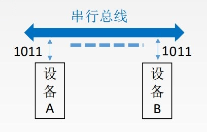
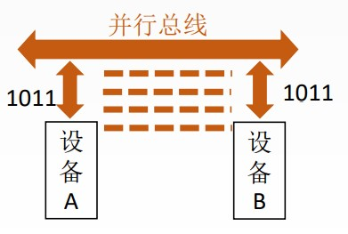

# 串行总线

优点: 只需要一条传输线, 成本低廉, 广泛应用于长距离传输；应用于计算机内部时, 可以节省布线空间。

缺点: 在数据发送和接收的时候要进行拆卸和装配, 要考虑串行并行转换的问题。

# 并行总线

优点: 总线的逻辑时序比较简单, 电路实现起来比较容易。

缺点: 信号线数量多, 占用更多的布线空间；远距离传输成本高昂；由于工作频率较高时, 并行的信号线之间会产生严重干扰, 对每条线等长的要求也越高, 所以无法持续提升工作频率。

# 速度对比

工作频率相同时, 串行总线传输速度比并行总线慢。

并行总线的工作频率无法持续提高, 而串行总线可以通过不断提高工作频率来提高传输速度, 最终超过并行总线。
