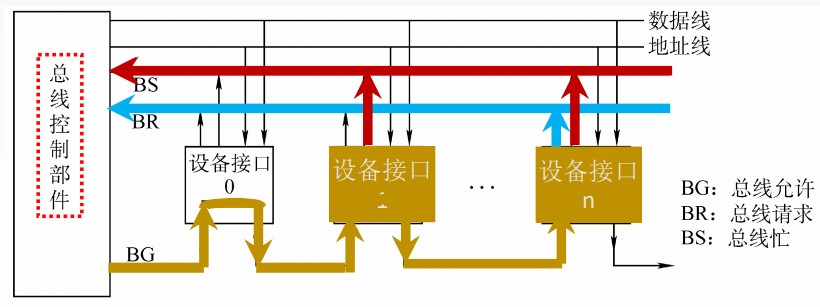
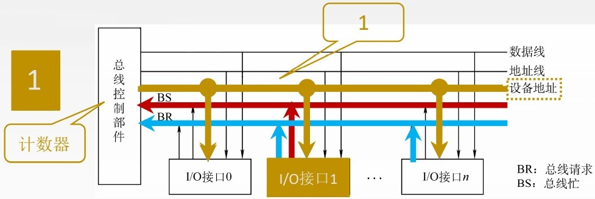
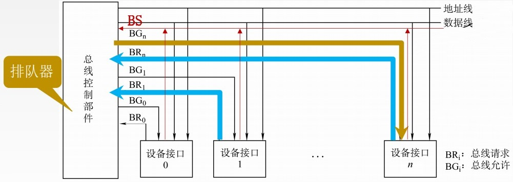

# 基本概念

主设备: 获得总线控制权的设备。

从设备: 被主设备访问的设备, 只能响应从主设备发来的各种总线命令。

总线仲裁: 多个主设备同时竞争主线控制权时, 以某种方式选择一个主设备优先获得总线控制权称为总线仲裁。

# 集中仲裁方式

1. 主设备发出请求信号；
2. 若多个主设备同时要使用总线, 则由总线控制器的判优、仲裁逻辑按一定的优先等级顺序确定哪个主设备能使用总线；
3. 获得总线使用权的主设备开始传送数据。

## 链式查询方式

1. 设备通过BR请求总线
2. 当总线空闲时, BG会链式查询设备, 并将总线分配给优先级最高(离总线控制器最近)的设备
3. 当总线分配后, 成为主设备的设备会通过BS将请求忙发送给总线, 并阻止BG继续传递, 此时总线被占用
4. 当主设备释放总线后, 总线检查还有BR信号, 再由BG向下一个设备发送总线允许请求

优点: 链式查询方式优先级固定。只需很少几根控制线就能按一定优先次序实现总线控制, 结构简单, 扩充容易。

缺点: 对硬件电路的故障敏感, 并且优先级不能改变。当优先级高的部件频繁请求使用总线时, 会使优先级较低的部件长期不能使用总线。

## 计数器查询方式

当总线控制器收到总线请求信号, 判断总线空闲时, 计数器开始计数, 计数值通过设备地址线发向各个部件。

当设备地址线上的计数值与某个请求使用总线设备的地址一致时, 该设备获得总线控制权。同时, 中止计数器的计数及查询。

优点: 计数初始值可以改变优先次序, 计数每次从"0"开始, 设备的优先级就按顺序排列, 固定不变；计数从上一次的终点开始, 此时设备使用总线的优先级相等；计数器的初值还可以由程序设置。对电路的故障没有链式敏感

缺点: 增加了控制线数, 若设备有n个, 则需logn+2条控制线。控制相对比链式查询相对复杂

## 独立请求方式

当总线上的部件需要使用总线时, 经各自的总线请求线发送总线请求信号, 在总线控制器中排队。

当总线控制器按一定的优先次序决定批准某个部件的请求时, 则给该部件发送总线响应信号。

# 分布仲裁方式

特点: 不需要中央仲裁器, 每个潜在的主模块都有自己的仲裁器和仲裁号, 多个仲裁器竞争使用总线。

当设备有总线请求时, 它们就把各自唯一的仲裁号发送到共享的仲裁总线上；

每个仲裁器将从仲裁总线上得到的仲裁号与自己的仲裁号进行比较；

如果仲裁总线上的号优先级高, 则它的总线请求不予响应, 并撤销它的仲裁号；

最后, 获胜者的仲裁号保留在仲裁总线上。
