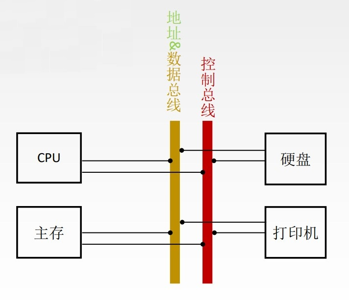

# 总线的传输周期(总线周期)

一次总线操作所需的时间（包括申请阶段、寻址阶段、传输阶段和结束阶段）, 通常由若干个总线时钟周期构成。

# 总线时钟周期

即机器的时钟周期。计算机有一个统一的时钟, 以控制整个计算机的各个部件, 总线也要受此时钟的控制。现在的计算机中, 总线时钟周期也有可能由桥接器提供。

# 总线的工作频率

总线上各种操作的频率, 为总线周期的倒数。

若总线周期=N个时钟周期, 则总线的工作频率=时钟频率/N。实际上指一秒内传送几次数据。

# 总线的时钟频率

即机器的时钟频率, 为时钟周期的倒数。

若时钟周期为T, 则时钟频率为1/T。实际上指一秒内有多少个时钟周期。

# 总线宽度

又称为总线位宽, 它是总线上同时能够传输的数据位数, 通常是指数据总线的根数, 如32根数据总线称为32位（bit）总线。

# 总线带宽

可理解为总线的数据传输率, 即单位时间内总线上可传输数据的位数, 通常用每秒钟传送信息的字节数来衡量, 单位可用字节/秒（B/s）表示。总线带宽是指总线本身所能达到的最高传输速率。

总线带宽 = 总线工作频率 × (总线宽度/8) B/s = (总线宽度/8) / 总线周期 B/s

# 总线复用

总线复用是指一种信号线在不同的时间传输不同的信息。可以使用较少的线传输更多的信息, 从而节省了空间和成本。

# 信号线数

地址总线、数据总线和控制总线3种总线数的总和称为信号线数。
