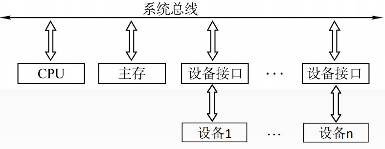
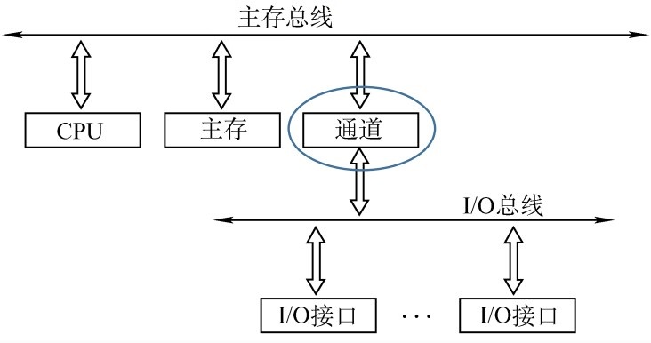
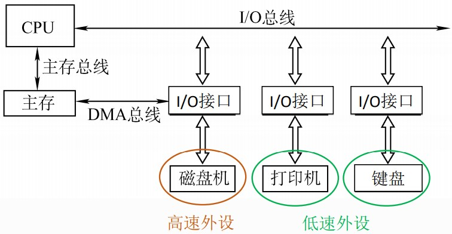
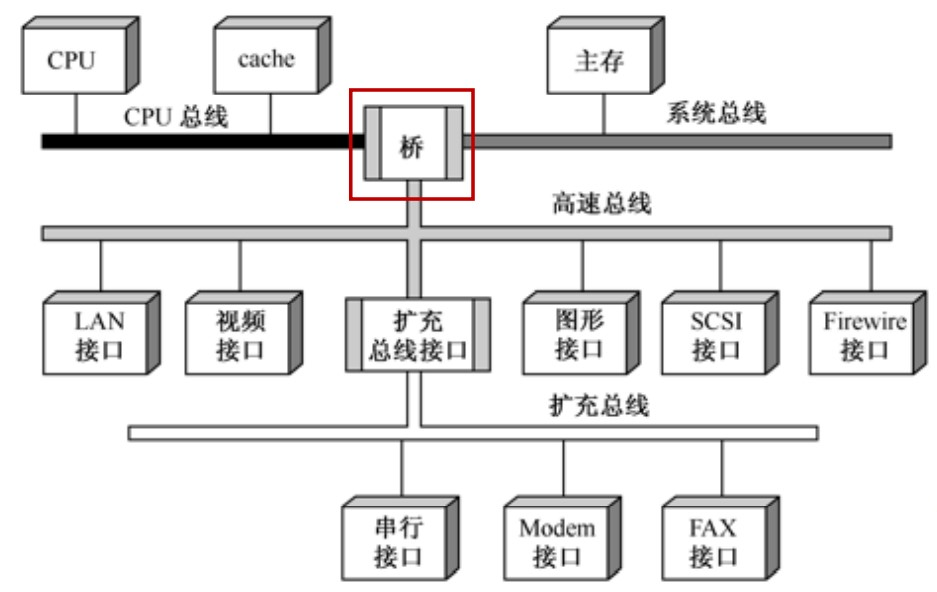

# 单总线结构

结构: CPU、主存、I/O设备（通过I/O接口）都连接在一组总线上, 允许I/O设备之间、I/O设备和CPU之间或I/O设备与主存之间直接交换信息。

优点: 结构简单, 成本低, 易于接入新的设备。

缺点: 带宽低、负载重, 多个部件只能争用唯一的总线, 且不支持并发传送操作。

# 双总线结构

支持突发传送: 送出一个地址, 收到多个地址连续的数据。

通道是具有特殊功能的处理器, 能对I/O设备进行统一管理。通道程序放在主存中。

结构: 双总线结构有两条总线, 一条是主存总线, 用于CPU、主存和通道之间进行数据传送；另一条是I/O总线, 用于多个外部设备与通道之间进行数据传送。

优点: 将较低速的I/O设备从单总线上分离出来, 实现存储器总线和I/O总线分离。

缺点: 需要增加通道等硬件设备。

# 三总线结构

DMA: Direct Memory Access, 直接内存访问。

结构: 三总线结构是在计算机系统各部件之间采用3条各自独立的总线来构成信息通路, 这3条总线分别为主存总线、I/O总线和直接内存访问DMA总线。

优点: 提高了I/O设备的性能, 使其更快地响应命令, 提高系统吞吐量。

缺点: 系统工作效率较低。

# 四总线结构(现代)

桥接器: 用于连接不同的总线, 具有数据缓冲、转换和控制功能。

## 北桥芯片

北桥（英语: Northbridge）用来处理高速信号, 通常处理中央处理器、存储器、PCI Express显卡（早年是AGP显卡）、高速PCI Express X16/X8的端口, 还有与南桥之间的通信。

## 南桥芯片

南桥（英语: Southbridge）用来处理低速信号, 通过北桥与中央处理器联系。在部分的芯片组架构中, 会将南桥的功能与北桥集成在一起；或者将部分功能移到北桥, 而部分的南桥功能则删除, 将被删除的接口功能使用额外独立的芯片组提供功能。这样使得整个芯片组架构中只会有单一芯片, 而不会另外的有南桥芯片。
