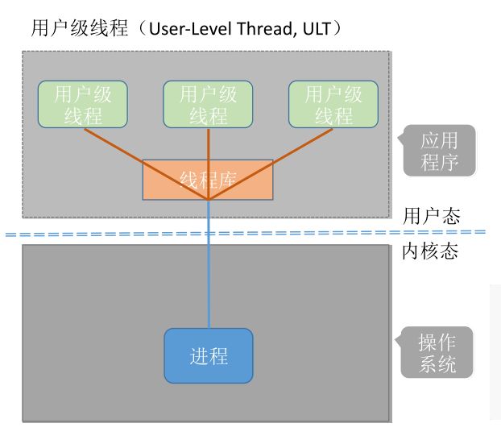
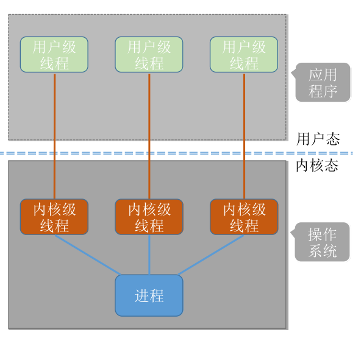
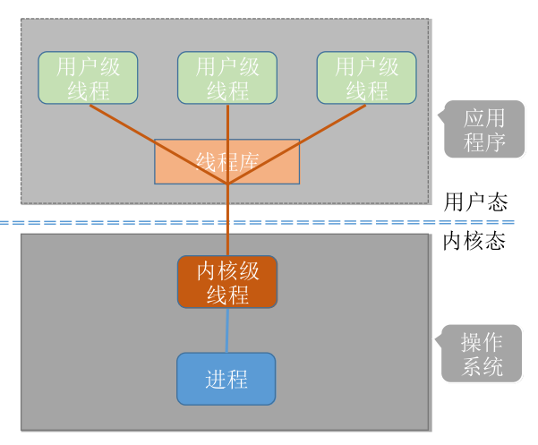
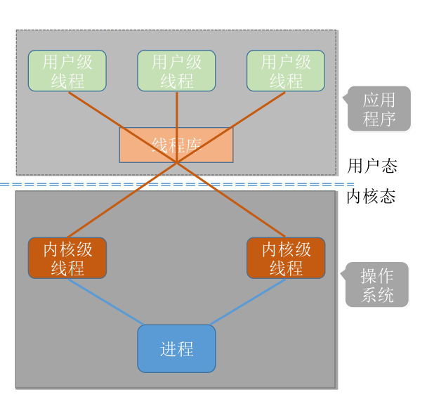

# 线程

线程是一个基本的CPU执行单元，也是程序执行流的最小单位。引入线程之后，不仅是进程之间可以并发，进程内的各线程之间也可以并发，从而进一步提升了系统的并发度，使得一个进程内也可以并发处理各种任务。引入线程后，进程只作为除CPU之外的系统资源的分配单元（如打印机、内存地址空间等都是分配给进程的）。线程则作为处理机的分配单元。

# 线程的实现方式

## 用户级线程

1. 用户级线程由应用程序通过线程库实现，所有的线程管理工作都由应用程序负责。
2. 用户级线程中，线程切换可以在用户态下即可完成，无需操作系统干预。
3. 操作系统内核意识不到线程的存在。

- 优点：用户级线程的切换在用户空间即可完成，不需要切换到核心态，线程管理的系统开销小，效率高
- 缺点：当一个用户级线程被阻塞后，整个进程都会被阻塞，并发度不高。多个线程不可在多核处理机上并行运行。

## 内核级线程

1. 内核级线程的管理工作由操作系统内核完成。
2. 线程调度、切换等工作都由内核负责，因此内核级线程的切换必然需要在核心态下才能完成。
3. 操作系统会为每个内核级线程建立相应的TCB（Thread Control Block，线程控制块），通过TCB对线程进行管理。

- 优点：当一个线程被阻塞后，别的线程还可以继续执行，并发能力强。多线程可在多核处理机上并行执行。
- 缺点：一个用户进程会占用多个内核级线程，线程切换由操作系统内核完成，需要切换到核心态，因此线程管理的成本高，开销大。

# 多线程模型

## 一对一模型

一个用户级线程映射到一个内核级线程。每个用户进程有与用户级线程同数量的内核级线程。

- 优点：当一个线程被阻塞后，别的线程还可以继续执行，并发能力强。多线程可在多核处理机上并行执行。
- 缺点：一个用户进程会占用多个内核级线程，线程切换由操作系统内核完成，需要切换到核心态，因此线程管理的成本高，开销大。

## 多对一模型

多个用户级线程映射到一个内核级线程。且一个进程只被分配一个内核级线程。

- 优点：用户级线程的切换在用户空间即可完成，不需要切换到核心态，线程管理的系统开销小，效率高
- 缺点：当一个用户级线程被阻塞后，整个进程都会被阻塞，并发度不高。多个线程不可在多核处理机上并行运行

## 多对多模型

n 用户及线程映射到 m 个内核级线程（n >= m）。每个用户进程对应 m 个内核级线程。

克服了多对一模型并发度不高的缺点（一个阻塞全体阻塞），又克服了一对一模型中一个用户进程占用太多内核级线程，开销太大的缺点。

