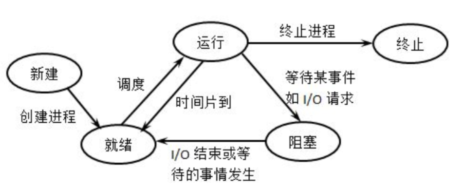
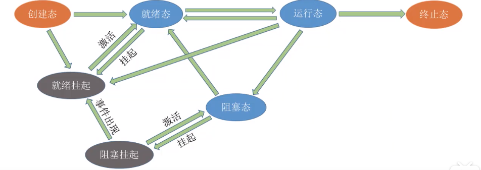

# 进程的状态

- 创建态：进程正在被创建时，它的状态是“创建态”，在这个阶段操作系统会为进程分配资源、初始化PCB
- 就绪态：当进程创建完成后，便进入“就绪态”，处于就绪态的进程已经具备运行条件，但由于没有空闲CPU，就暂时不能运行
- 运行态：当CPU空闲时，操作系统就会选择一个就绪进程，让它上处理机运行。如果一个进程此时在CPU上运行，那么这个进程处于“运行态”
- 阻塞态：在进程运行的过程中，可能会请求等待某个事件的发生（如等待某种系统资源的分配，或者等待其他进程的响应）。在这个事件发生之前，进程无法继续往下执行，此时操作系统会让这个进程下CPU，并让它进入“阻塞态”。当等待的事件发生时，进程从“阻塞态”回到“就绪态”
- 终止态：一个进程可以执行 exit 系统调用，请求操作系统终止该进程。此时该进程会进入“终止态”，操作系统会让该进程下CPU，并回收内存空间等资源，最后还要回收该进程的PCB。

# 进程状态的转换

## 进程的五状态模型

单CPU情况下，同一时刻只会有一个进程处于运行态，多核CPU情况下，可能有多个进程处于运行态

## 进程的七状态模型

挂起状态：暂时被调到外存等待的进程状态称为挂起状态。

挂起状态由可以进一步细分为：就绪挂起、阻塞挂起。

# 进程控制

进程控制就是要实现进程状态转换

# 实现进程控制

用“原语”实现进程控制

# 进程控制相关的原语

## 创建原语

1. 申请空白PCB
2. 为新进程分配所需资源
3. 初始化PCB
4. 将PCB插入就绪队列

## 撤销原语

1. 从PCB集合中找到终止进程的PCB
2. 若进程正在运行，立即剥夺CPU，将CPU分给其他进程
3. 终止其所有子进程
4. 将该进程的所有资源归还父进程或操作系统
5. 删除PCB

## 阻塞原语

1. 找到要阻塞的进程的PCB
2. 保护进程的运行现场，将PCB状态信息设为阻塞态，暂停进程
3. 将PCB插入相应事件的等待队列

## 唤醒原语

1. 在事件等待队列中找到PCB
2. 将PCB从等待队列移除，设置进程为就绪态
3. 将PCB插入就绪队列

## 切换原语

1. 将运行环境信息存入PCB
2. PCB移入相应队列
3. 选择另一个进程执行，并更新其PCB
4. 根据PCB恢复新进程所需的运行环境
