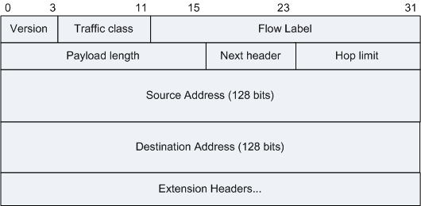

# IPv4数据包格式

其中源地址和目的地址都占4个字节

# IPv4地址分类

# IP地址的变形表示

- 点分十进制: 192.168.0.1
- 点分十六进制: 0xc0.0xa8.0x0.0x1
- 点分八进制: 0300.0250.00.01
- 点分十进制省略零: 192.168.1
- 点分十六进制省略零: 0xc0.0xa8.0x1
- 点分八进制省略零: 0300.0250.01
- 整数十六进制表示: 0xc0a80001
- 整数八进制表示(从十六进制转换过来): 030052000001
- 整数十进制表示(从十六进制转换过来): 3232235521
- 八进制和十六进制混合表示: 0300.0xa80001

# IPv6数据包格式

其中源地址和目的地址都占16个字节

# IPv6地址表示

冒号十六进制, 如: `2001:0410:0000:0001:0000:0000:0000:45ff`

一共由八个分组, 每组16位

0压缩: 把每个分组高位的0去掉: `2001:410:0:1:0:0:0:45ff`

`::`压缩: 几个分组连续的0用`::`表示(一个IPv6地址中只能有一个`::`): `2001:0410:0000:0001::45ff`

`0:0:0:0:0:0:0:0` 可以表示成 `::`

# 192.168.2.0/24表示的IP范围

192.168.2.0换成二进制, 四组, 每组8位: `11000000 10101000 00000010 00000000`

/24 表示前24位不变, 后8位由全0变化到全1。
又因为全0是子网网络地址, 全1是子网广播地址, 这两个地址是不分配给主机使用的。
所以有效的可分配的范围是前24位不变, 后8位由00000001变化为11111110的范围: 
`11000000 10101000 00000010 00000001` ~ `11000000 10101000 00000010 11111110`

再转换回十进制就是 192.168.2.1~192.168.2.254
