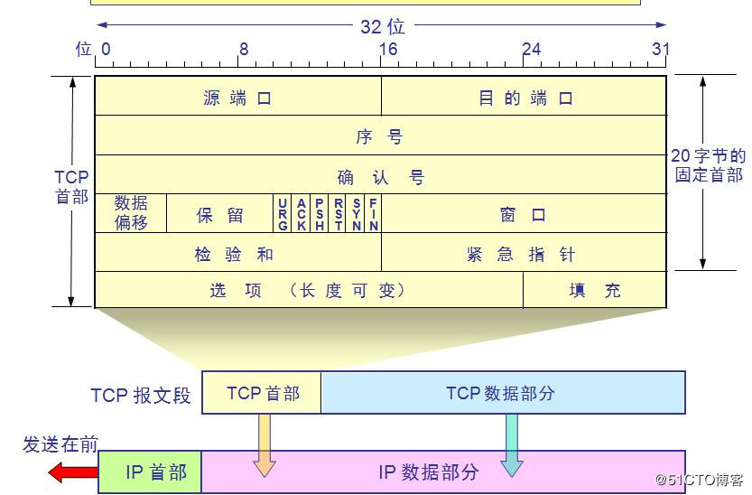
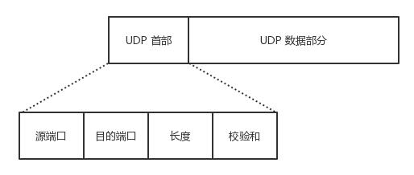

# TCP报文格式

源端口和目的端口各占2个字节

# UDP报文格式

源端口和目的端口各占2个字节

# 端口的范围

0~65535

# 端口分类

- 公认端口（Well Known Ports）0~1023，它们紧密绑定于一些服务，通常这些端口的通讯明确表明了某种服务的协议，如：80端口对应与HTTP通信，21端口绑定于FTP服务。
- 注册端口（Registered Ports）1024~49151，它们松散的绑定于一些服务，也就是说有许多服务绑定于这些端口，这些端口同样用于其他许多目的，如：许多系统处理端口从1024开始
- 动态/私有端口（Dyanmic and /or Private Ports）49152~65535，又叫临时端口，理论上，不应为服务分配这些端口，通常机器从1024开始分配动态端口。例如：客户端在发起TCP请求的时候，会随机选择一个端口号，然后用这个随机端口号和客户端地址组成请求体的头部，写入服务器端socket
- 端口的分配最终是操作系统执行的

# Windows临时端口

