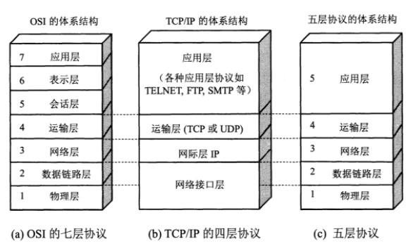

# OSI七层模型

1. 物理层: 比特流传输
2. 数据链路层: 介质访问, 链路管理
3. 网络层: 寻址和路由选择
4. 传输层: 端到端的连接
5. 会话层: 建立, 维护和管理会话
6. 表示层: 处理数据格式
7. 应用层: 提供应用程序间通信

# TCP/IP模型

## TCp/IP五层模型的实现

1. 物理层: 中继器, 集线器, 网线, HUB
2. 数据链路层: 网卡, 网桥, 二层交换机
3. 网络层: 路由器, 三层交换机
4. 传输层: 操作系统
5. 应用层: 软件
