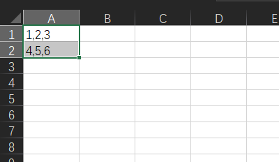
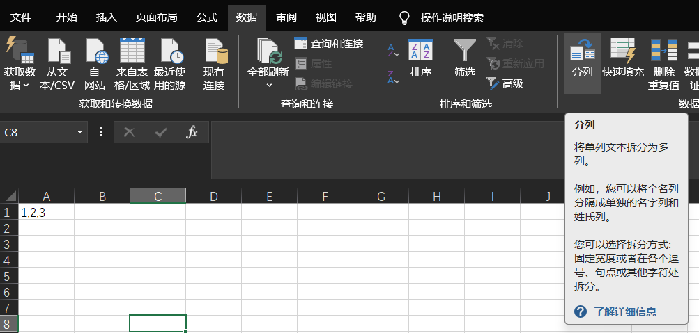
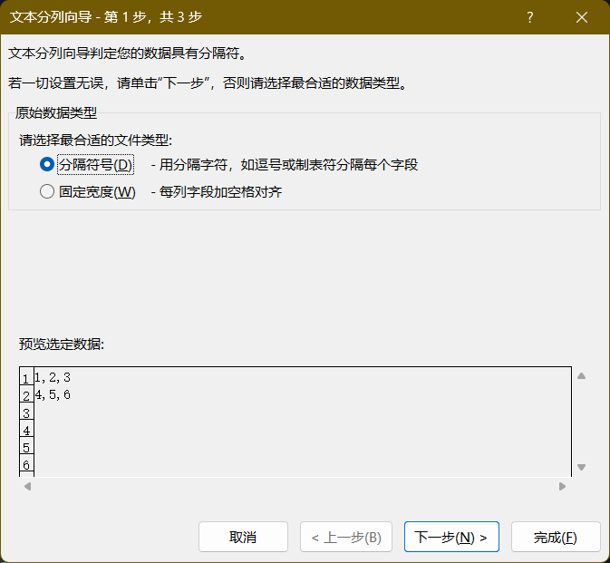
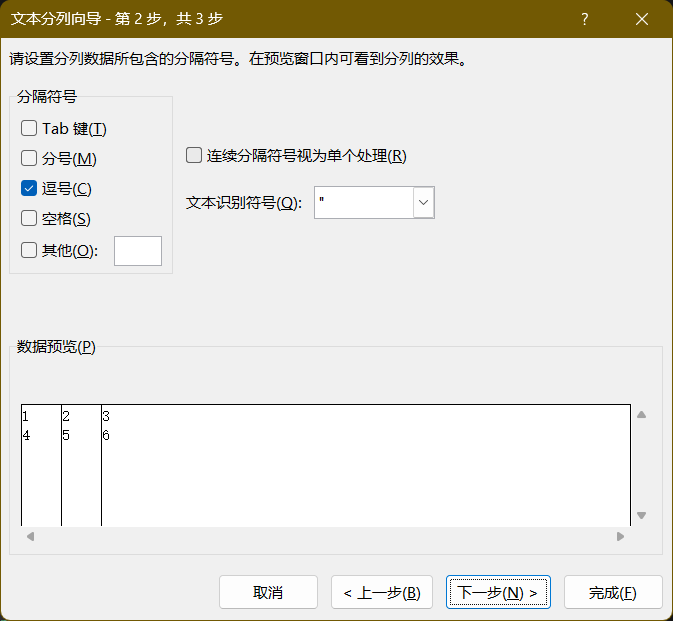
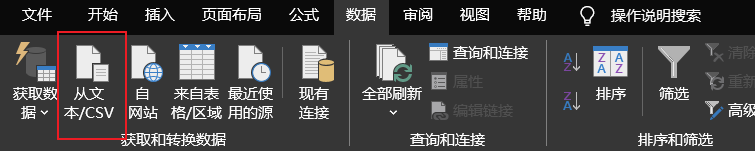
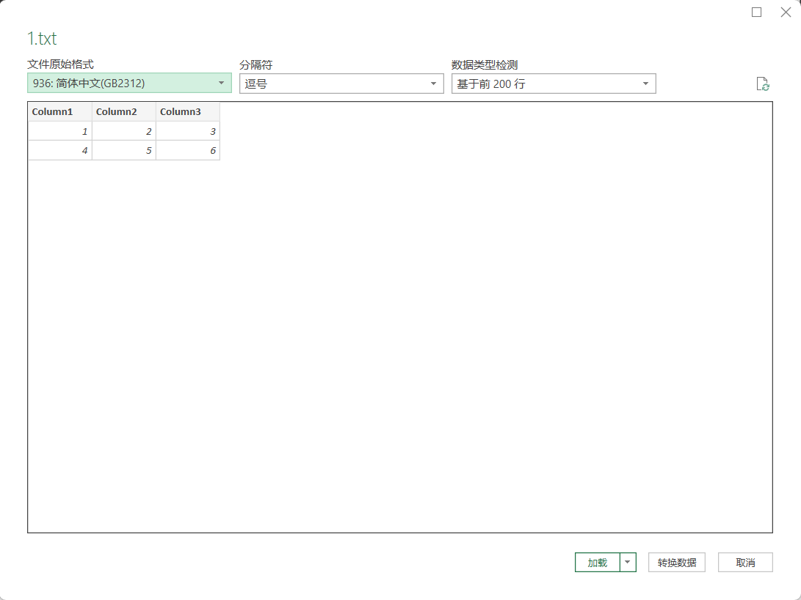

# 文本数据导入

## 复制数据导入

1. 复制数据
    ```
    1,2,3
    4,5,6
    ```

2. 粘贴到excel, 并选中


3. 数据 -> 分列


4. 分隔符号 -> 下一步


5. 逗号 -> 下一步


6. 完成

## 从文本文件导入

1. 数据 -> 从文本/CSV


2. 选择文件, 设置格式 -> 转换数据


3. 关闭并上载
