# 排序(从小到大)

## 选择排序

找到未排序的元素中最小的元素将它与未排序元素的第一个元素交换

找到最小元素1

与第一个元素8交换

找到最小元素2

与第一个元素6交换


```
/**
 * 选择排序
 * @param array 要排序的数据
 */
public void sort(Comparable[] array) {
    for (int i = 0; i < array.length; i++) {
        // 寻找[i,length)区间里的最小值
        // 并把最小值的索引保存到minIndex中
        int minIndex = i;
        for (int j = i + 1; j < array.length; j++) {
            if (array[j].compareTo(array[minIndex]) < 0) {
                minIndex = j;
            }
        }
        // 将最小的元素与剩下的元素列表中第一名元素交换
        ArrayUtil.swap(array, i, minIndex);
        // 此时[0,i]的元素已经排好序
    }
}
```

## 插入排序

遍历所有元素, 将遍历到的元素放到正确的位置

首先遍历到8, 由于在8之前没有元素, 继续下一步
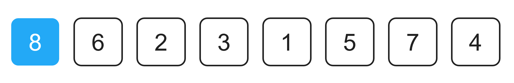
接着遍历到6
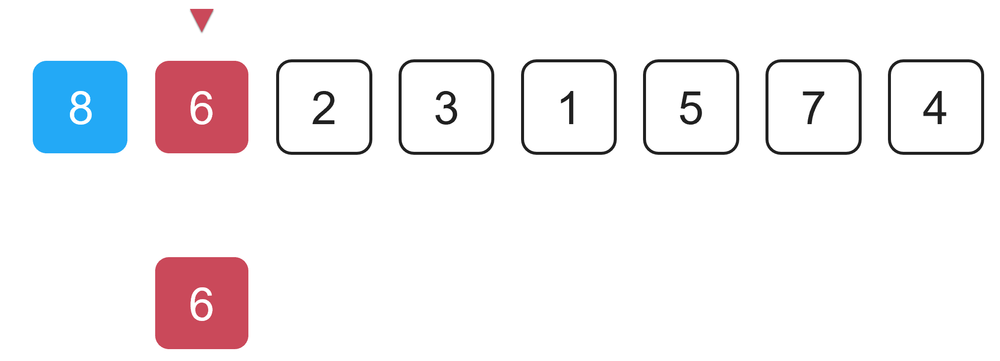
由于6比8小, 所以将8向后移动
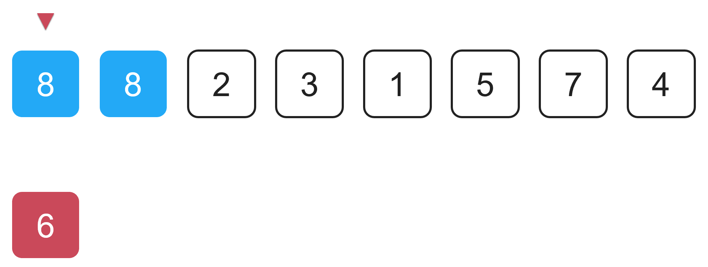
将6放到8原来的位置(正确的位置), 前两个元素排好序了, 继续下一步
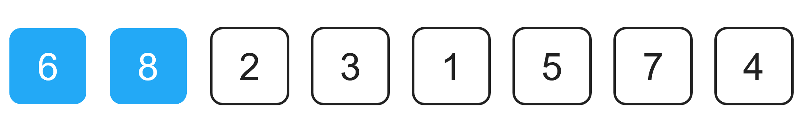
接着遍历到2
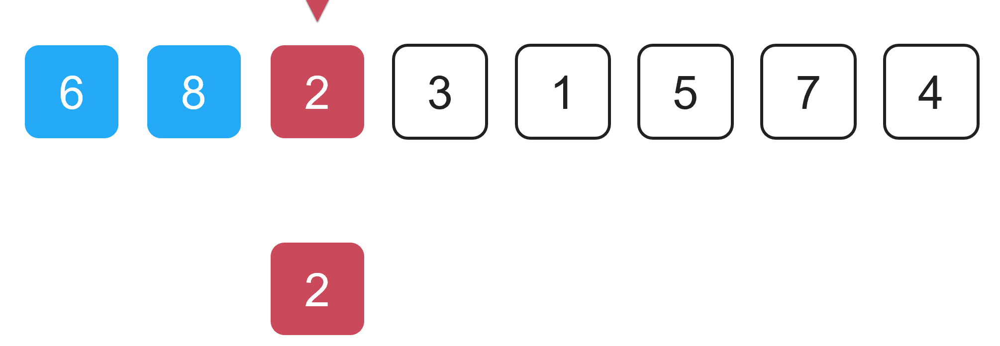
由于2比8小, 所以将8向后移动
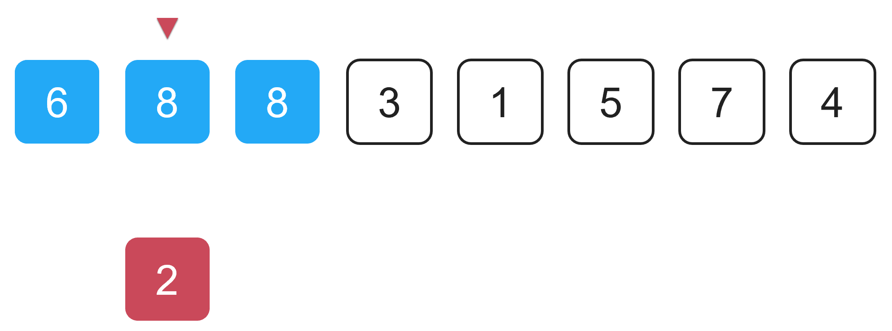
由于2比6小, 所以将6向后移动
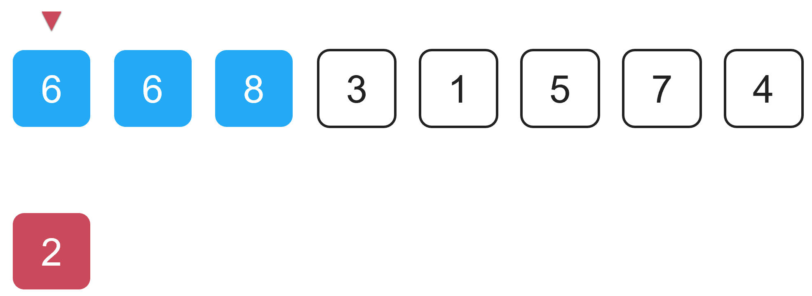
将2放到6原来的位置(正确的位置), 前三个元素排好序了, 继续下一步
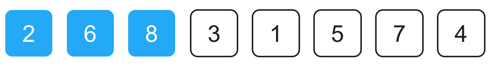

```
/**
 * 插入排序
 */
public void sort(Comparable[] array) {
    // 遍历元素
    for (int i = 1; i < array.length; i++) {
        // 将当前遍历到的元素array[i]提取出来
        Comparable item = array[i];
        // 寻找array[i]合适的插入位置
        // j保存元素item应该插入的位置
        int j;
        for (j = i; j > 0; j--) {
            if (item.compareTo(array[j - 1]) < 0) {
                array[j] = array[j - 1];
            } else {
                break;
            }
        }
        // 将item插入j的位置
        array[j] = item;
    }
}
```

## 归并排序

将素组不断二分, 直到每个数组长度为1,
再将分开的数组不断合并, 合并过程中排序

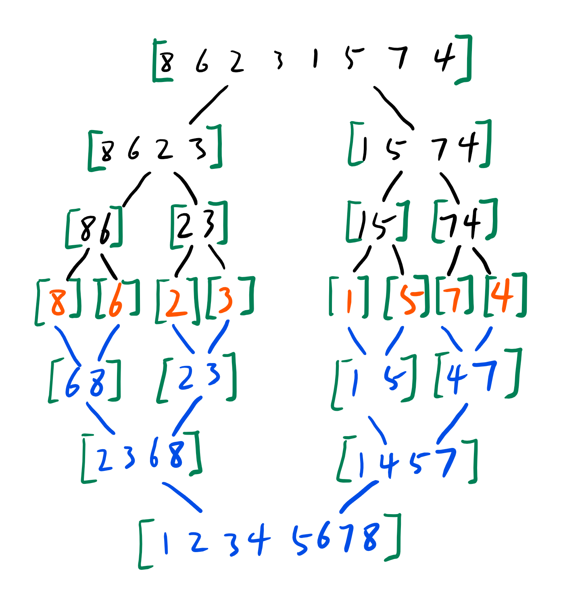

合并过程

创建待排序数组的副本,
建立3个索引i,j,k

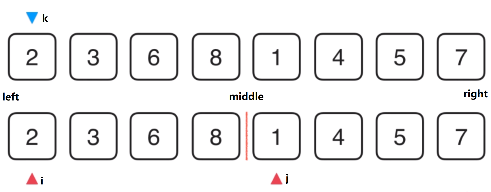

比较i和j元素的大小,j指向的值小


将j指向的值覆盖原数组k指向的值,
k右移,j右移,i保持不变

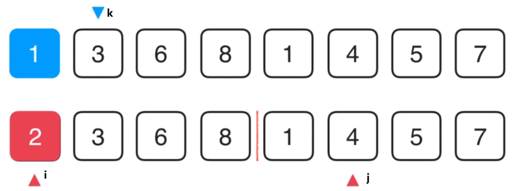

比较i和j元素的大小,i指向的值小

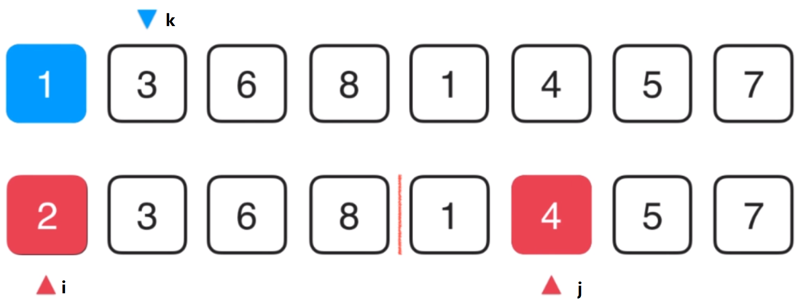

将i指向的值覆盖原数组k指向的值,
k右移,i右移,j保持不变

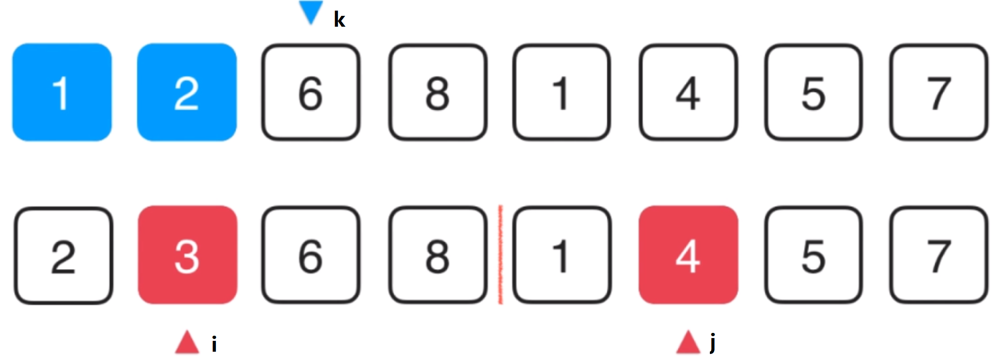

```
/**
 * 归并, 合并
 * 将arr[l...mid]和arr[mid+1...r]两部分进行归并
 *
 * @param l   left
 * @param mid middle
 * @param r   right
 */
private static void merge(Comparable[] arr, int l, int mid, int r) {
    Comparable[] aux = Arrays.copyOfRange(arr, l, r + 1);
    // 初始化, i指向左半部分的起始索引位置l
    // j指向右半部分起始索引位置mid + 1
    int i = l;
    int j = mid + 1;
    for (int k = l; k <= r; k++) {
        if (i > mid) {
            // 左半部分元素已经全部处理完毕
            arr[k] = aux[j - l];
            j++;
        } else if (j > r) {
            // 右半部分元素已经全部处理完毕
            arr[k] = aux[i - l];
            i++;
        } else if (aux[i - l].compareTo(aux[j - l]) < 0) {
            // 左半部分所指元素 < 右半部分所指元素
            arr[k] = aux[i - l];
            i++;
        } else {
            // 左半部分所指元素 >= 右半部分所指元素
            arr[k] = aux[j - l];
            j++;
        }
    }
}

/**
 * 将数组二分
 * 递归使用归并排序,对arr[l...r]的范围进行排序
 */
private static void sort(Comparable[] arr, int l, int r) {
    if (l >= r)
        return;

    int mid = (l + r) / 2;
    sort(arr, l, mid);
    sort(arr, mid + 1, r);
    merge(arr, l, mid, r);
}

/**
 * 归并排序
 */
@Override
public void sort(Comparable[] array) {
    sort(array, 0, array.length - 1);
}
```