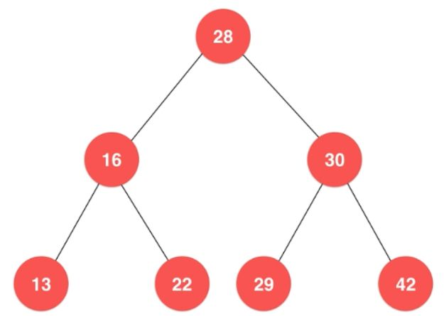
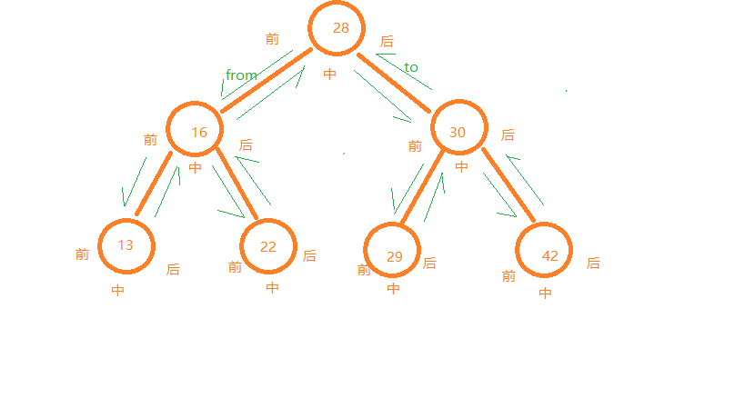

# 二分搜索树

## 满足的条件

1. 每个节点都大于它的左孩子, 小于它的右孩子
2. 每个节点的左子树和右子树都是二分搜索树
3. 不一定是完全二叉树

## 插入新节点

例: 节点20) 首先和根节点28比较, 20小于28, 插入到28的左子树中。
因为28有左节点, 所以再和16比较, 20大于16, 插入到16的右子树中。
因为16有右节点, 所以再和22比较, 20小于22, 插入到22的左子树中。
由于22没有左节点, 所以20作为22的左节点插入到二叉树中。
操作完成。

 ## 查找
 
例: 查找15) 首先和根节点28比较, 15小于28, 去28的左子树中查找。
和16比较, 15小于16, 在16的左子树中查找。
和13比较, 15大于13, 在13的右子树中查找。
由于13没有右节点, 查找结束, 没有找到匹配的节点。
操作完成。

## 遍历

### 深度优先遍历

沿绿色箭头遍历整个二叉树(从from开始, 到to完成遍历)。在遍历的过程中每个节点被访问到3次, 按被访问到的先后分成了\[前, 中, 后\]。

#### 前序遍历

遍历时到'前'的位置时做操作(例: 输出节点), 在'中'和'后'的位置不做操作。

遍历完成后输出的结果为: 28, 16, 13, 22, 30, 29, 42

#### 中序遍历

遍历时到'中'的位置时做操作(例: 输出节点), 在'前'和'后'的位置不做操作。

遍历完成后输出的结果为: 13, 16, 22, 28, 29, 30, 42 (结果是升序排列的)

#### 后序遍历

遍历时到'后'的位置时做操作(例: 输出节点), 在'前'和'中'的位置不做操作。

遍历完成后输出的结果为: 13, 22, 16, 29, 42, 30, 28 (可以用来释放二叉树的空间, 在两棵子树都释放后再释放父节点)

### 广度优先遍历

