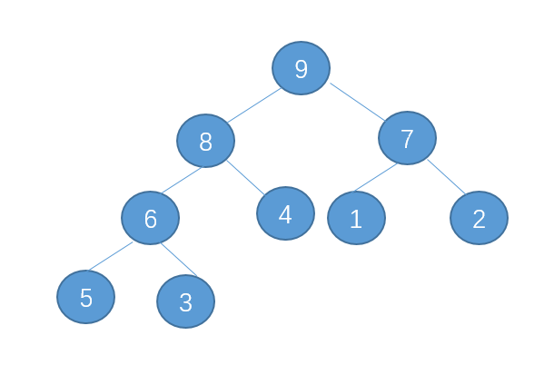

# 二叉堆

## 满足的条件

1. 最大堆的任何一个节点不大于他的父亲节点
2. 最小堆的任何一个节点不小于他的父亲节点
3. 是完全二叉树



## 使用数组实现二叉堆


根节点从1开始建立索引, 根据某个节点的索引(index)可以计算出它的根节点和子节点的索引

- parent(index) = index / 2
- leftChild(index) = 2 * index
- rightChild(index) = 2 * index + 1

## 添加元素

新元素添加到末尾, 之后对末尾元素进行ShiftUp操作, 保持堆的性质

### ShiftUp

目标元素与父节点比较, 如果大于父节点就与父节点交换,
之后继续向上比较,直到不大于父节点或到达根节点

## 取出根节点元素

取出根节点, 用最后一个元素替换根节点的元素, 堆count减一, 之后对根节点元素进行ShiftDown操作, 保持堆的性质

### ShiftDown

目标元素与子节点比较, 如果小于子节点就与这个子节点交换, 如果小于两个子节点, 就和两个中最大的子节点交换, 
之后继续向下比较,直到不小于子节点或没有子节点

```
/**
 * 最大二叉堆
 */
public class Heap {
    // 使用数组实现堆
    private Comparable[] data;
    // 容量
    private int capacity;
    // 实际存放的元素个数
    private int count;

    public Heap(int capacity) {
        data = new Comparable[capacity + 1];
        count = 0;
        this.capacity = capacity;
    }

    public Heap(Comparable[] array) {
        data = new Comparable[array.length + 1];
        capacity = array.length;
        System.arraycopy(array, 0, data, 1, array.length);
        count = array.length;
        for (int i = count / 2; i >= 1; i--) {
            shiftDown(i);
        }
    }

    public int size() {
        return count;
    }

    public boolean isEmpty() {
        return count == 0;
    }

    /**
     * 向堆中添加元素
     */
    public void insert(Comparable item) {
        assert count + 1 <= capacity;
        // 将item添加到数组末尾
        data[count + 1] = item;
        count++;
        // 将新添加的元素移动到合适位置
        shiftUp(count);
    }

    /**
     * 取出堆中最大元素
     */
    public Comparable extractMax() {
        assert count > 0;
        Comparable item = data[1];
        // 将末尾元素移动到被取出的元素位置
        ArrayUtil.swap(data, 1, count);
        count--;
        // 将元素移动到合适位置
        shiftDown(1);
        return item;
    }

    /**
     * 向下移动data[index]使data符合最大堆的定义
     */
    private void shiftDown(int index) {
        while (2 * index <= count) {
            // 存在左子节点, 待交换节点默认为左子节点
            int targetIndex = 2 * index;
            if (targetIndex + 1 <= count) {
                // 存在右子节点
                if (data[targetIndex + 1].compareTo(data[targetIndex]) > 0) {
                    // 右节点大于左节点, 待交换节点更新为右子节点
                    targetIndex = targetIndex + 1;
                }
            }
            if (data[index].compareTo(data[targetIndex]) > 0) {
                // 父节点比两个子节点都大
                break;
            }
            // 将最大的元素放到父节点位置
            ArrayUtil.swap(data, index, targetIndex);
            // index向下移动
            index = targetIndex;
        }
    }

    /**
     * 向上移动data[index]使data符合最大堆的定义
     */
    private void shiftUp(int index) {
        // 父节点: data[index / 2]
        while (index > 1 && data[index / 2].compareTo(data[index]) < 0) {
            // 如果比父节点大, 交换位置
            ArrayUtil.swap(data, index / 2, index);
            // index向上移动
            index = index / 2;
        }
    }
}
```
