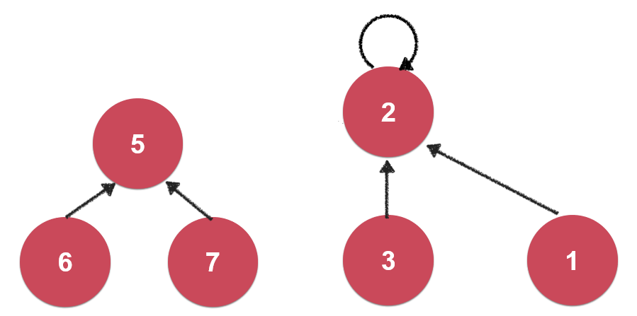
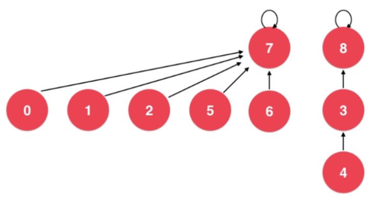
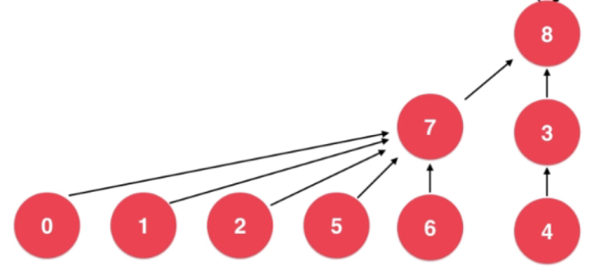
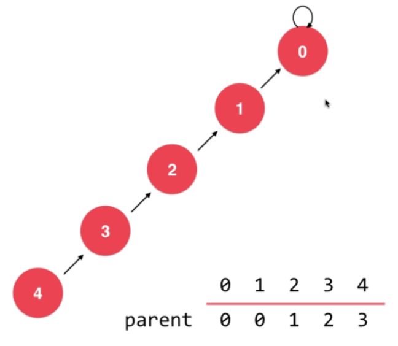
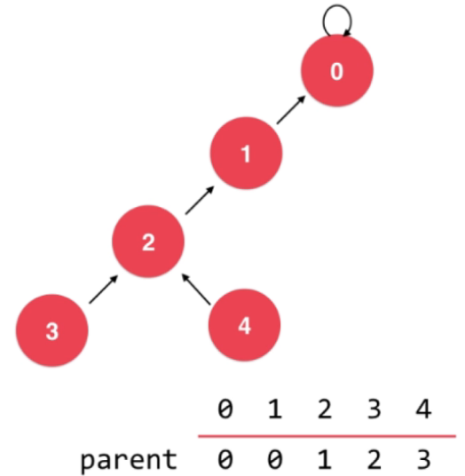
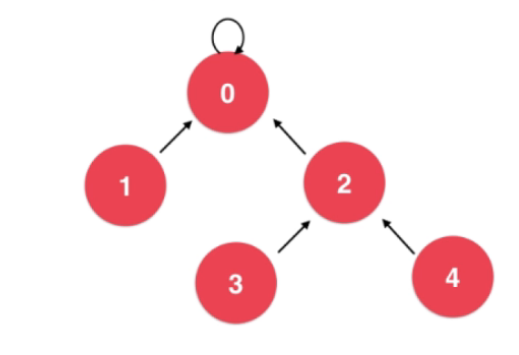

# 并查集

解决两个节点是否相连接的问题

使用树表示, 每个节点指向父节点,有相同的根节点即为相连接



1,2,3连接

5,6,7连接

如果7要和3连接,只需要将将7的根节点与3的根节点相连接


## 根据树的高度进行优化



根节点为7的树高度为2, 根节点为8的树高度为3

合并时将高度小的合并到高度大的集合中



## 路径压缩

在查找根节点的过程中将树的高度进行压缩



1. 寻找4的根节点, 首先看4的父节点是不是根节点, 不是就把4的父节点设置为4的父节点的父节点2



2. 接下来找到4的父节点2, 寻找2的根节点, 首先看2的父节点是不是根节点, 不是就把2的父节点设置为2的父节点的父节点0



3. 找到2的父节点0, 0是根节点, 找到了4的根节点0, 并完成了压缩

```
public class UnionFind {

    // rank[i]表示以i为根的集合所表示的树的层数
    // 在后续的代码中, 我们并不会维护rank的语意, 也就是rank的值在路径压缩的过程中, 有可能不在是树的层数值
    // 这也是我们的rank不叫height或者depth的原因, 他只是作为比较的一个标准
    private int[] rank;
    private int[] parent; // parent[i]表示第i个元素所指向的父节点
    private int count;    // 数据个数

    // 构造函数
    public UnionFind5(int count){
        rank = new int[count];
        parent = new int[count];
        this.count = count;
        // 初始化, 每一个parent[i]指向自己, 表示每一个元素自己自成一个集合
        for( int i = 0 ; i < count ; i ++ ){
            parent[i] = i;
            rank[i] = 1;
        }
    }

    // 查找过程, 查找元素p所对应的集合编号
    // O(h)复杂度, h为树的高度
    private int find(int p){
        assert( p >= 0 && p < count );

        // 路径压缩
        while( p != parent[p] ){
            parent[p] = parent[parent[p]];
            p = parent[p];
        }
        return p;
    }

    // 查看元素p和元素q是否所属一个集合
    // O(h)复杂度, h为树的高度
    public boolean isConnected( int p , int q ){
        return find(p) == find(q);
    }

    // 合并元素p和元素q所属的集合
    // O(h)复杂度, h为树的高度
    public void unionElements(int p, int q){

        int pRoot = find(p);
        int qRoot = find(q);

        if( pRoot == qRoot )
            return;

        // 根据两个元素所在树的元素个数不同判断合并方向
        // 将元素个数少的集合合并到元素个数多的集合上
        if( rank[pRoot] < rank[qRoot] ){
            parent[pRoot] = qRoot;
        }
        else if( rank[qRoot] < rank[pRoot]){
            parent[qRoot] = pRoot;
        }
        else{ // rank[pRoot] == rank[qRoot]
            parent[pRoot] = qRoot;
            rank[qRoot] += 1;   // 此时, 我维护rank的值
        }
    }
}
```
