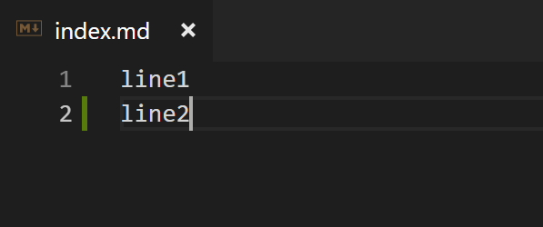
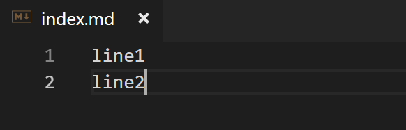

# Git

## 基本操作

`git init`初始化仓库

```
$ git init
Initialized empty Git repository in /gitStudy/.git/
```

`git status`查看仓库状态

```
$ git status
// 当前处于master分支
On branch master

// 还没有提交
No commits yet

nothing to commit (create/copy files and use "git add" to track)

```

```
// 创建文件
$ touch index.md
// 再查看仓库状态
$ git status
On branch master

No commits yet

// 还没有被git管理的文件
Untracked files:
  (use "git add <file>..." to include in what will be committed)

        index.md

nothing added to commit but untracked files present (use "git add" to track)

```

`git add`向暂存区添加文件

暂存区是提交之前的临时区域

```
// 将index.md加入暂存区
$ git add index.md
// 再查看仓库状态
$ git status
On branch master

No commits yet

Changes to be committed:
  (use "git rm --cached <file>..." to unstage)

        new file:   index.md
```

`git commit`将暂存区中的文件保存到仓库的历史记录

```
// -m 参数表示提交信息(这次提交的说明)
// 不加参数-m会启动编辑器编辑更加详细的信息
$ git commit -m "init"
[master (root-commit) 3d80cac] init
 1 file changed, 0 insertions(+), 0 deletions(-)
 create mode 100644 index.md

// 提交后查看状态
$ git status
On branch master
nothing to commit, working tree clean

```

`git log`查看提交日志

```
$ git log
// 指向这次提交的哈希值
commit 3d80cac7b9a01248b82fff96bf49d1a4fb5b84bb (HEAD -> master)
// 提交人
Author: zhaoshengzhi <iloveyesterday@outlook.com>
// 提交时间
Date:   Sun Sep 2 14:52:58 2018 +0800

// 提交信息
    init


```

`git diff`查看更改前后的差别

修改index.md


```
// 查看当前工作树与暂存区的区别
// '+'表示增加的内容
// '-'表示删除的内容
$ git diff
diff --git a/index.md b/index.md
index e69de29..5d93580 100644
--- a/index.md
+++ b/index.md
@@ -0,0 +1 @@
+line1
\ No newline at end of file

```

```
// 将index.md加入暂存区
$ git add index.md
// 当前工作树与暂存区没有区别git diff无结果
$ git diff

```

```
// 查看两次提交的区别
//HEAD指向当前分支中最新一次提交
$ git diff HEAD
diff --git a/index.md b/index.md
index e69de29..5d93580 100644
--- a/index.md
+++ b/index.md
@@ -0,0 +1 @@
+line1
\ No newline at end of file

```

```
// 提交修改
$ git commit -m "add line"
[master 4625ea6] add line
 1 file changed, 1 insertion(+)

// 查看日志
$ git log
commit 4625ea6a7678b8e91fa8072592fcf008b9ffac05 (HEAD -> master)
Author: zhaoshengzhi <iloveyesterday@outlook.com>
Date:   Sun Sep 2 15:20:32 2018 +0800

    add line

commit 3d80cac7b9a01248b82fff96bf49d1a4fb5b84bb
Author: zhaoshengzhi <iloveyesterday@outlook.com>
Date:   Sun Sep 2 14:52:58 2018 +0800

    init


```

## 分支

`git branch`查看分支列表

```
// *表示当前分支
$ git branch
* master


```

`git checkout -b`以master为基础创建并切换到新分支

```
$ git checkout -b work
Switched to a new branch 'work'

// 查看分支
$ git branch
  master
* work


```

修改index.md



```
// 提交
$ git add index.md
$ git commit -m "add branch"
[work a973dca] add branch
 1 file changed, 2 insertions(+), 1 deletion(-)

```

切换回master分支发现文件并没有被修改
```
$ git checkout master
Switched to branch 'master'

```


切换到work分支可以看到修改后的文件

```
$ git checkout work
Switched to branch 'work'

```



`git checkout -`切换到上一个分支

```
$ git checkout -
Switched to branch 'master'

$ git checkout -
Switched to branch 'work'

```

`git merge`合并分支

```
// 先切换到master分支
$ git checkout master
Switched to branch 'master'

// --no-ff 记录合并到提交历史记录
$ git merge --no-ff work
// 弹出编辑器, 记录提交信息
Merge branch 'work'

# Please enter a commit message to explain why this merge is necessary,
# especially if it merges an updated upstream into a topic branch.
#
# Lines starting with '#' will be ignored, and an empty message aborts
# the commit.

// 关闭编辑器
// 合并完成
Merge made by the 'recursive' strategy.
 index.md | 3 ++-
 1 file changed, 2 insertions(+), 1 deletion(-)


```

```
// 以图表形式查看
$ git log --graph
*   commit 81cff34a8c4f367d433fce200bb0b8dfa2e2e88a (HEAD -> master)
|\  Merge: 4625ea6 a973dca
| | Author: zhaoshengzhi <iloveyesterday@outlook.com>
| | Date:   Sun Sep 2 16:08:44 2018 +0800
| |
| |     Merge branch 'work'
| |
| * commit a973dca5e3450db2b7fc53225f2ae4bb8863f926 (work)
|/  Author: zhaoshengzhi <iloveyesterday@outlook.com>
|   Date:   Sun Sep 2 15:47:24 2018 +0800
|
|       add branch
|
* commit 4625ea6a7678b8e91fa8072592fcf008b9ffac05
| Author: zhaoshengzhi <iloveyesterday@outlook.com>
| Date:   Sun Sep 2 15:20:32 2018 +0800
|
|     add line
|
* commit 3d80cac7b9a01248b82fff96bf49d1a4fb5b84bb
  Author: zhaoshengzhi <iloveyesterday@outlook.com>
  Date:   Sun Sep 2 14:52:58 2018 +0800

:...skipping...
*   commit 81cff34a8c4f367d433fce200bb0b8dfa2e2e88a (HEAD -> master)
|\  Merge: 4625ea6 a973dca
| | Author: zhaoshengzhi <iloveyesterday@outlook.com>
| | Date:   Sun Sep 2 16:08:44 2018 +0800
| |
| |     Merge branch 'work'
| |
| * commit a973dca5e3450db2b7fc53225f2ae4bb8863f926 (work)
|/  Author: zhaoshengzhi <iloveyesterday@outlook.com>
|   Date:   Sun Sep 2 15:47:24 2018 +0800
|
|       add branch
|
* commit 4625ea6a7678b8e91fa8072592fcf008b9ffac05
| Author: zhaoshengzhi <iloveyesterday@outlook.com>
| Date:   Sun Sep 2 15:20:32 2018 +0800
|
|     add line
|
* commit 3d80cac7b9a01248b82fff96bf49d1a4fb5b84bb
  Author: zhaoshengzhi <iloveyesterday@outlook.com>
  Date:   Sun Sep 2 14:52:58 2018 +0800

      init

```

`git reset`回溯历史版本

```
// 回到哈希值指向的时间点
$ git reset --hard 4625ea6a7678b8e91fa8072592fcf008b9ffac05
HEAD is now at 4625ea6 add line


```

