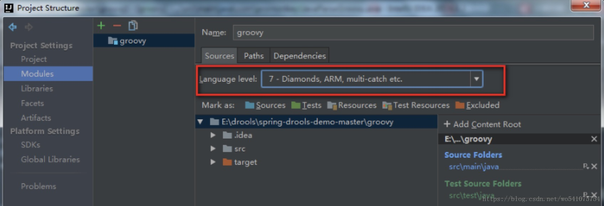
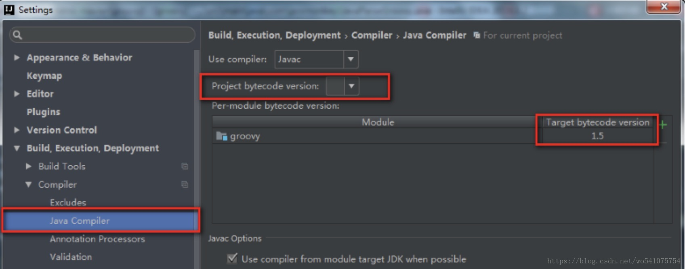

# IDEA中引入tomcat的jar包

## 情境

spring配置文件中用到了dbcp2, 但是maven中没有它的依赖
```
<bean 
    id="dataSource" 
    class="org.apache.tomcat.dbcp.dbcp2.BasicDataSource"
    destroy-method="close">
    <property name="driverClassName" value="com.mysql.jdbc.Driver" />
    <property name="url"
        value="jdbc:mysql:///testdb />
    <property name="username" value="root" />
    <property name="password" value="123" />
</bean>
```
## 解决

1. 打开IDEA，打开project structure File->Project structure
    
2. Modules->Dependencies
    
3. 点击右边加号, 选择2 Library...
    
4. 选择tomcat即可，然后Add Selected
    
5. 此时idea虽然还会报错, 但是已经可以正常运行了

# IDEA中SSH框架配置问题: 找不到hbm.xml映射文件

hbm.xml文件跟实体类放在同一包下,
启动的时候就出错:
```
java.io.FileNotFoundException: 
    class path resource 
    [cn/buaa/hbm] cannot be 
    resolved to URL because it does not exist
```
如果加上 classpath:还是找不到

是由于我们设定了src文件夹是存放代码的，
resource文件夹是存放资源的，
因此intellij在编译的时候会忽略src文件夹下面的xml文件，
导致最后发布的文件夹下面丢失了这些映射文件。

解决方法: 放到resources目录下,
在resource下新建一个目录hbm

配置文件改成:
```
<value>hbm/xxx.hbm.xml</value>
```

# Compilation failed: internal java compiler error 解决办法

## 错误现象

使用Idea导入新项目或升级idea或新建项目时会出现以下异常信息：
Error:java: Compilation failed: internal java compiler error 

## 错误原因

导致这个错误的原因主要是因为jdk版本问题，此处有两个原因，一个是编译版本不匹配，一个是当前项目jdk版本不支持。

## 查看项目的jdk

File ->Project Structure ->Project Settings ->Project:

查看此两处是否与目标jdk一致。

## 查看工程的jdk

File ->Project Structure ->Project Settings ->Modules:


## 查看java编译器版本

File ->Settings ->Build, Execution, Deployment ->Compiler ->Java Compiler:


导入java项目时此处处问题的概率比较多。
针对此问题，重新打开或修改pom文件（maven项目）中的内容很可能导致jdk版本重新变为1.5。如果是maven项目，可在pom文件中指定jdk相关信息：
```
<build>
    <plugins>
        <plugin>
            <groupId>org.apache.maven.plugins</groupId>
            <artifactId>maven-compiler-plugin</artifactId>
            <configuration>
                <source>1.7</source>
                <target>1.7</target>
            </configuration>
        </plugin>
    </plugins>
</build>
```

# IDEA格式化代码快捷键失灵原因

今天做代码优化时发现格式化代码快捷键不好使了

各种找原因，最后发现是与网易云音乐快捷键冲突

解决办法：
1. 关闭网易云音乐   
2. 修改网易云音乐快捷键

# 解决IDEA调试时不显示list中为null的元素

设置显示Arraylist中的null完整查看初始数组大小，扩容过程

* 老版本：Settings -> Debugger -> Data Views -> Arrays -> Hide null array elements
* 新版本：Settings -> Debugger -> Data Views -> Java 取消Hide null elements in array and collections

或者设置断点，开始调试后，在idea下方的提示信息区的Variables或Watches右键选择Customize Data Views,取消Hide null elements in array and collections

