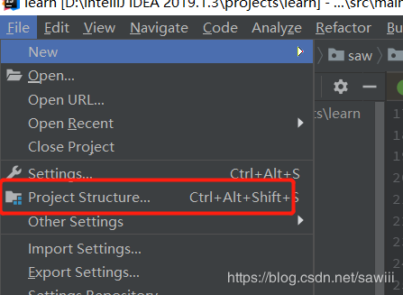
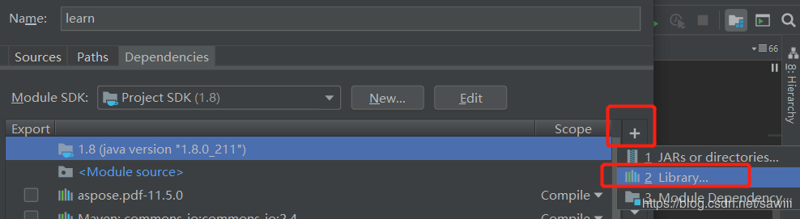
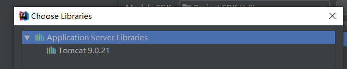

# IDEA中引入tomcat的jar包

## 情境

spring配置文件中用到了dbcp2, 但是maven中没有它的依赖
```
<bean 
    id="dataSource" 
    class="org.apache.tomcat.dbcp.dbcp2.BasicDataSource"
    destroy-method="close">
    <property name="driverClassName" value="com.mysql.jdbc.Driver" />
    <property name="url"
        value="jdbc:mysql:///testdb />
    <property name="username" value="root" />
    <property name="password" value="123" />
</bean>
```
## 解决

1. 打开IDEA，打开project structure File->Project structure
    
2. Modules->Dependencies
    
3. 点击右边加号, 选择2 Library...
    
4. 选择tomcat即可，然后Add Selected
    

# IDEA中SSH框架配置问题: 找不到hbm.xml映射文件

hbm.xml文件跟实体类放在同一包下,
启动的时候就出错:
```
java.io.FileNotFoundException: 
    class path resource 
    [cn/buaa/hbm] cannot be 
    resolved to URL because it does not exist
```
如果加上 classpath:还是找不到

是由于我们设定了src文件夹是存放代码的，
resource文件夹是存放资源的，
因此intellij在编译的时候会忽略src文件夹下面的xml文件，
导致最后发布的文件夹下面丢失了这些映射文件。

解决方法: 放到resources目录下,
在resource下新建一个目录hbm

配置文件改成:
```
<value>hbm/xxx.hbm.xml</value>
```
