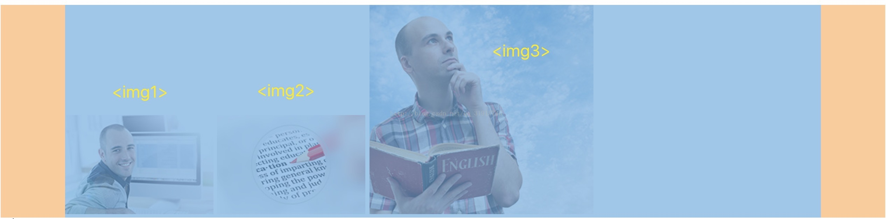
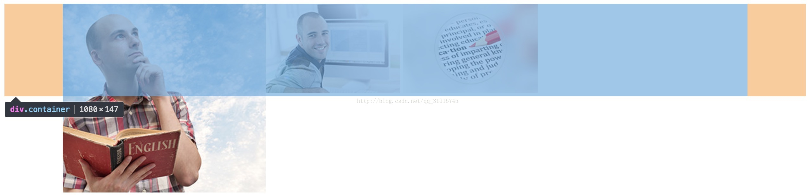

回顶部

- <a href="#常用的块级元素和行内元素有哪些">常用的块级元素和行内元素有哪些</a>
- <a href="#块级元素的特点">块级元素的特点</a>
- <a href="#行内元素的特点">行内元素的特点</a>
- <a href="#img是什么类型的元素">img是什么类型的元素</a>
- <a href="#为什么要清除浮动">为什么要清除浮动</a>
- <a href="#标准盒模型和IE盒模型">标准盒模型和IE盒模型</a>
- <a href="#boxsizing">box-sizing</a>
- <a href="css/css3.md">css3的新特性</a>
- <a href="#css的选择器权重比较以及权重计算规则">css的选择器权重比较以及权重计算规则</a>
- <a href="#display的取值">display的取值</a>
- <a href="#垂直margin的合并">垂直margin的合并</a>
- <a href="css/center.md">居中</a>
- <a href="#负边距">负边距</a>

# 常用的块级元素和行内元素有哪些

- 块级元素: div、p、h1~h6、ul、ol、dl、li、dd、table、hr、table、header、section、aside、footer
- 行内元素: span、img、a、label、input、i、textarea、select、sub、sup、strong、em

# 块级元素的特点

1. 总是从新的一行开始
2. 高度、宽度都是可控的
3. 宽度没有设置时，默认为100%
4. 块级元素中可以包含块级元素和行内元素

# 行内元素的特点

1. 和其他元素在一行中
2. 高度、宽度以及内边距都是不可控的
3. 宽高就是内容的高度，不可以改变
4. 行内元素只能行内元素，不能包含块级元素

# img是什么类型的元素

img是行内元素，但同时它也是置换元素。

置换元素一般内置宽高属性，因此可以设置其宽高。

### 什么是置换元素

置换元素就是会根据标签属性来显示的元素。反之就是非置换元素了。
比如img根据src属性来显示，input根据value属性来显示，因此可知道img和input是置换元素，
当然同理textarea, select,也是置换元素

# 为什么要清除浮动?举个实际场景

当元素浮动之后，不会影响块级元素的布局，只会影响内联元素布局。此时文档流中的普通流就会表现成该浮动块不存在一样的布局模式。当包含块的高度小于浮动块的时候，此时就会出现高度塌陷

举例: 

把img3设为 float：left, 父元素产生高度塌陷

清除浮动: clear: both;

# 标准盒模型和IE盒模型

# box-sizing的取值

1. content-box: 默认值, 让元素维持W3C盒模型
2. border-box 让元素维持IE盒模型

# css的选择器权重比较以及权重计算规则

CSS 优先级的计算规则如下：

- 元素标签中定义的样式（Style 属性）,加 1,0,0,0
- 每个 ID 选择符(如 #id),加 0,1,0,0
- 每个 Class 选择符(如 .class).每个属性选择符(如 [attribute=]).每个伪类(如 :hover)加 0,0,1,0
- 每个元素选择符（如 p）或伪元素选择符(如 :first-child)等，加 0,0,0,1
  然后，将这四个数字分别累加，就得到每个 CSS 定义的优先级的值，
  然后从左到右逐位比较大小，数字大的 CSS 样式的优先级就高。
  1,0,0,0 > 0,99,99,99。也就是说从左往右逐个等级比较，前一等级相等才往后比。
  例子：
  css 文件或`<style>`中如下定义：

1.  h1 {color: red;}
    /_ 一个元素选择符，结果是 0,0,0,1 _/
2.  body h1 {color: green;}
    /_ 两个元素选择符，结果是 0,0,0,2 _/
3.  h2.grape {color: purple;}
    /_ 一个元素选择符.一个 Class 选择符，结果是 0,0,1,1_/
4.  li#answer {color: navy;}
    /_ 一个元素选择符，一个 ID 选择符，结果是 0,1,0,1 _/
    元素的 style 属性中如下定义：
    h1 {color: blue;}
    /_ 元素标签中定义，一个元素选择符，结果是 1,0,0,1_/

如此以来，h1 元素的颜色是蓝色。
注意：
1.!important 声明的样式优先级最高，如果冲突再进行计算。 2.如果优先级相同，则选择最后出现的样式。 3.继承得到的样式的优先级最低。

结论是：比较同一级别的个数，数量多的优先级高，如果相同即比较下一级别的个数
important->内联->ID->类->标签|伪类|属性选择->伪对象->继承->通配符->继承

最后汇总为一张表

| 选择器         | 表达式或示例      | 权重                   |
| -------------- | ----------------- | ---------------------- |
| ID 选择器      | #aaa              | 100                    |
| 类选择器       | .aaa              | 10                     |
| 标签选择器     | h1                | 1                      |
| 属性选择器     | [title]           | 10                     |
| 相邻选择器     | selecter+selecter | 拆分为两个选择器再计算 |
| 兄长选择器     | selecter~selecter | 拆分为两个选择器再计算 |
| 父子选择器     | selecter>selecter | 拆分为两个选择器再计算 |
| 后代选择器     | selecter selecter | 拆分为两个选择器再计算 |
| 通配符         | \*                | 0                      |
| 各种伪类选择器 | :hover            | 10                     |
| 各种伪元素     | ::after           | 1                      |

# display的取值

1.  none 此元素不会被显示，并且不占据页面空间
2.  inline 行内元素 元素会在一行内显示，超出屏幕宽度自动换行，不能设置宽度和高度，元素的宽度和高度只能是靠元素内的内容撑开
3.  block 块级元素 会独占一行，如果不设置宽度，其宽度会自动填满父元素的宽度，可以设置宽高，即使设置的宽度小于父元素的宽度，块级元素也会独占一行
4.  inline-block 行内块元素 与行内元素一样可以在一行内显示，而且可以设置宽高，可以设置 margin 和 padding
5.  list-item 列表元素
6.  table 会作为块级表格来显示(类似于`<table>`)，表格前后带有换行符
7.  inline-table 会作为内联表格来显示(类似于`<table>`)，表格前后没有换行符
8.  table-cell 会作为表格单元格来显示(类似于`<td>`)
9.  flex 多栏多列布局

# 垂直margin的合并

垂直 margin 合并就是上下相邻的两个块级元素，如果刚好，上面设置 margin-bottom，下面设置 margin-top，这俩外边距相遇了，那两个就合并了，本来可能上面 margin-bottom 设置 20px，margin-top 设置 10px，合并之后两个元素上下的距离就变为 20px，即两个属性中较大的值

垂直 margin 合并是在同一个 BFC 中才会发生的，如果两个 BFC 的垂直 margin 不会合并

# 负边距

todo
