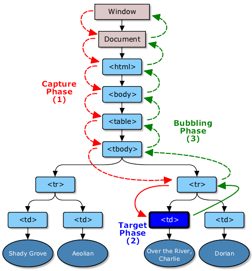
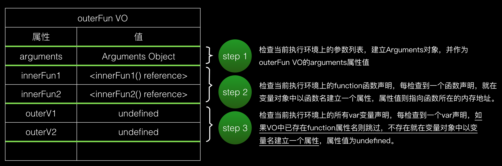

- <a href="js/type.md">JavaScript数据类型</a>
- <a href="js/jsclass.md">类</a>
- <a href="#闭包">闭包</a>
- <a href="#闭包的缺点">闭包的缺点</a>
- <a href="js/event.md">事件</a>
- <a href="js/cross.md">跨域</a>
- <a href="#判断true或false">判断true或false</a>
- <a href="#设置和删除cookie">设置和删除cookie</a>
- <a href="#javascript中的this">javascript中的this</a>
- <a href="#prototype和">prototype和proto</a>
- <a href="js/scope.md">作用域.作用域链</a>
- <a href="#全文单词首字母大写">全文单词首字母大写</a>
- <a href="#ajax的工作原理和过程">ajax的工作原理和过程</a>
- <a href="#JavaScript异步加载">JavaScript异步加载</a>

<a id="闭包"></a>
# 闭包

闭包就是能够读取其他函数内部变量的函数

```
function f1(){
    var n=999;
    function f2(){
        alert(n); // 999
    }
}
```

上面代码中的 f2 函数，就是闭包。

<a id="闭包的缺点"></a>
# 闭包的缺点

1.  由于闭包会使得函数中的变量都被保存在内存中，内存消耗很大

2.  使用闭包时，会涉及到跨作用域访问，每次访问都会导致性能损失

<a id="判断true或false"></a>
# 判断true或false

值为 false

```
new Boolean();
Boolean(0);
Boolean(null);
Boolean(undefined);
Boolean("");
Boolean(false);
Boolean(NaN);
```

其他情况均为 true

```
Boolean({}) // true
Boolean([]) // true
Boolean("null") // true
Boolean("0") // true
```

<a id="设置和删除cookie"></a>
# 设置和删除cookie

```
// 设置cookie
// key: 键, value: 值, expires: 有效时长(ms)
function setCookie(key, value, expires) {
    let d = new Date();
    d.setTime(d.getTime() + expires);
    document.cookie = key + "=" + value + "; " + "expires="+d.toUTCString();
}

// 获取cookie
function getCookie(cname) {
    var name = cname + "=";
    var ca = document.cookie.split(';');
    for(var i=0; i<ca.length; i++) {
        var c = ca[i];
        while (c.charAt(0)==' ') c = c.substring(1);
        if (c.indexOf(name) != -1) return c.substring(name.length, c.length);
    }
    return "";
}

// 清除cookie  
function clearCookie(key) {
    setCookie(key, "", -1);  
}  
```

<a id="javascript中的this"></a>
# javascript中的this

this 永远指向的是最后调用它的对象，也就是看它执行的时候是谁调用的

<a id="prototype和"></a>
# prototype和\_\_proto\_\_

显示原型(prototype): 显示原型实现基于原型的继承和属性的共享

隐式原型(\[\[prototype\]\]): 隐式原型是的作用就是构成原型链, 
通过隐式原型可以一层层往上查找对象的原型 \_\_proto\_\_是个不标准的属性, 
是浏览器为了实现对\[\[prototype\]\]的访问所提供的一个方法, 
常理来说\[\[prototype\]\]即隐式原型是不可访问的,
ES5 里提供了 Object.getPrototypeOf()这个方法来获得\[\[prototype\]\]

prototype 和\_\_proto\_\_都指向原型对象, 
任意一个函数(包括构造函数)都有一个 prototype 属性, 
指向该函数的原型对象，同样 **任意一个构造函数实例化的对象** , 
都有一个\_\_proto\_\_属性, 指向构造函数的原型对象

```
function Foo(){}
var Boo = {name: "Boo"};
Foo.prototype = Boo;
var f = new Foo();

console.log(f.__proto__ === Foo.prototype); // true
console.log(f.__proto__ === Boo);   // true
Object.getPrototypeOf(f) === f.__proto__;   // true

let b = 1;
console.log(b.__proto__ === Number.prototype) // true
console.log(1.__proto__) // Uncaught SyntaxError: Invalid or unexpected token
```


<a id="全文单词首字母大写"></a>
# 全文单词首字母大写

```
function ReplaceFirstUper(str)  
{
    str = str.toLowerCase();
    return str.replace(/\b(\w)|\s(\w)/g, function(m){  
        return m.toUpperCase();  
    });
}

console.log(ReplaceFirstUper('i have a pen, i have an apple!'));
// 输出: I Have A Pen, I Have An Apple!
```

<a id="ajax的工作原理和过程"></a>
# ajax的工作原理和过程

Ajax 的工作原理相当于在用户和服务器之间加了—个中间层(AJAX 引擎),使用户操作与服务器响应异步化 并不是所有的用户请求都提交给服务器,像—些数据验证和数据处理等都交给 Ajax 引擎自己来做, 只有确定需要从服务器读取新数据时再由 Ajax 引擎代为向服务器提交请求

Ajax 异步请求

请求过程：浏览器(当前页面不会丢弃) --> Ajax 引擎(http 协议) --> Web 服务器

响应过程：Web 服务器 --> 准备部分数据 ---> Ajax 引擎(http 协议) --> dom 编程

Ajax 的工作过程

1.  创建 Ajax 引擎对象(XMLHttpRequest(其它).ActiveXObject(ie))

2.  打开服务器之间的连接

3.  发送异步请求

4.  获取服务器端的响应数据

```
function getData() {
    // 1. 创建Ajax引擎对象
    var xmlhttp = null;
    // 非IE浏览器创建XmlHttpRequest对象
    if (window.XmlHttpRequest) {
        xmlhttp = new XmlHttpRequest();
    }
    // IE浏览器创建XmlHttpRequest对象
    if (window.ActiveXObject) {
        try { xmlhttp = new ActiveXObject("Microsoft.XMLHTTP"); }
        catch (e) {
            try { xmlhttp = new ActiveXObject("msxml2.XMLHTTP"); }
            catch (ex) {}
        }
    }
    if (!xmlhttp) {
        alert("创建xmlhttp对象异常！");
        return false;
    }
    // 2. 打开服务器之间的连接
    // 第三个参数设置请求是否为异步模式。
    // 如果是TRUE，JavaScript函数将继续执行，而不等待服务器响应。
    // 同步：提交请求->等待服务器处理->处理完毕返回 这个期间客户端浏览器不能干任何事
    // 异步: 请求通过事件触发->服务器处理（这是浏览器仍然可以作其他事情）->处理完毕
    xmlhttp.open("POST", url, false);

    xmlhttp.onreadystatechange = function () {
        if (xmlhttp.readyState == 4) {
            document.getElementById("user1").innerHTML = "数据正在加载...";
            // 4. 获取服务器端的响应数据
            if (xmlhttp.status == 200) {
                console.log(xmlhttp.responseText);
            }
        }
    }
    // 3. 发送异步请求
    xmlhttp.send();
}
```

<a id="JavaScript异步加载"></a>
# JavaScript异步加载

## defer="defer"和 async="true/false"

async: 加载后续文档元素的过程将和 JS 的加载与执行并行进行（异步）

defer: 加载后续文档元素的过程将和 JS 的加载并行进行（异步），但 JS 的执行要在所有文档元素解析完成之后，DOMContentLoaded 事件触发之前完成

使用这两个属性的脚本中不能调用 document.write 方法

## 动态创建 script

```
function addScriptTag(src){
    var script = document.createElement('script');
    script.setAttribute("type","text/javascript");
    script.src = src;
    document.body.appendChild(script);
}
window.onload = function(){
    addScriptTag("js/index.js");
}
```

# DOMContentLoaded

当页面文档加载并解析完毕之后会马上触发 DOMContentLoaded 事件，而不会等待样式文件.图片文件和子框架页面的加载

```
document.addEventListener("DOMContentLoaded", function(event) {
    console.log("DOM fully loaded and parsed");
});
```

# 事件流

DOM 标准事件流则分为三个阶段:事件捕获阶段，处理事件阶段，事件冒泡阶段



# 数组深拷贝

1.  简单方法: `arr2 = JSON.parse(JSON.stringify(arr1));`
2.  递归

# 数组浅拷贝

1.  `arr2 = arr1.slice(0);`
2.  `arr2 = arr1.concat();`

# 提高递归效率

todo

# 回调地狱

```
fs.readFile('./sample.txt', 'utf-8', (err, content) => {
    let keyword = content.substring(0, 5);
    db.find(`select * from sample where kw = ${keyword}`, (err, res) => {
        get(`/sampleget?count=${res.length}`, data => {
           console.log(data);
        });
    });
});
```

每增加一个异步请求，就会多添加一层回调函数的嵌套，这段代码中三个异步函数的嵌套已经开始使一段本可以语言明确的代码编程不易阅读与维护了。

左侧明显出现了一个三角形的缩进区域，过多的回调也就让我们陷入“回调地狱”。

## Promise 解决回调地狱

嵌套操作变成了通过 then 连接的链式操作。代码的整洁度上有了一个较大的提高。

```
function getData(url) {
    return new Promise((resolve, reject) => {
        setTimeout(() => {
            resolve(url.replace('url', 'data'))
        }, 1000)
    })
}

function doTest() {
    getData('url_111').then(data => {
        console.log(data)
        // getData('url_222').then(data => {
        //     console.log(data)
        // })
        return getData('url_222')
    }).then(data => {
        console.log(data)
        return getData('url_333')
    }).then(data => {
        console.log(data)
    })
}

doTest()
```

# readyState 状态

- 0: 未初始化 XMLHttpRequest对象已经创建，但还没有调用 open()方法。值为 0 表示对象已经存在，否则浏览器会报错：对象不存在。
- 1: 正在发送请求 对 XMLHttpRequest 对象进行初始化，即调用 open()方法，根据参数(method,url,true)，完成对象状态的设置。并调用 send()方法开始向服务端发送请求。值为 1 表示正在向服务端发送请求。
- 2: 载入完成 此阶段接收服务器端的响应数据。但获得的还只是服务端响应的原始数据，并不能直接在客户端使用。值为 2 表示 send()方法执行完成，已经接收完全部响应数据。并为下一阶段对数据解析作好准备。
- 3: 解析数据 正在解析响应内容 此阶段解析接收到的服务器端响应数据。即根据服务器端响应头部返回的 MIME 类型把数据转换成能通过 responseBody.responseText 或 responseXML 属性存取的格式，为在客户端调用作好准备。值为 3 表示正在解析数据。
- 4: 响应内容解析完成 此阶段确认全部数据都已经解析为客户端可用的格式，解析已经完成。值为 4 表示数据解析完毕，可以通过 XMLHttpRequest 对象的相应属性取得数据。

# 改变 this 的指向，call 和 apply 和 bind 的区别

1.  call(this 指向谁,arg1,arg2,...) // 参数一个一个传

2.  apply(this 指向谁,[arg1,arg2...]) // 参数为数组

3.  bind(this 指向谁) // 定义时不传参，调用时再传参

```
var a=2;
var json = {
    a: 1,
    show(){
        // alert(this.a); // 输出：1
        setTimeout(function(){
            // setTimeout中this默认为window,
            // 使用bind()改变this为json对象
            alert(this.a);
        }.bind(this),1000)
    }
}
json.show();// 正确输出：1，而不是：2
```

# 将字符串转换为整数的 parseInt 的第二个参数代表什么

转换成几进制

# 数组方法

### 创建数组

```
var arr1 = new Array(); //创建一个空数组
var arr2 = new Array(20); // 创建一个包含20项的数组
var arr3 = new Array("lily","lucy","Tom"); // 创建一个包含3个字符串的数组
var arr4 = []; //创建一个空数组
var arr5 = [20]; // 创建一个包含1项的数组
var arr6 = ["lily","lucy","Tom"]; // 创建一个包含3个字符串的数组
```

### 数组方法

1.  join()

join(separator): 将数组的元素组起一个字符串，以 separator 为分隔符，省略的话则用默认用逗号为分隔符，该方法只接收一个参数：即分隔符。

```
var arr = [1,2,3];
console.log(arr.join()); // 1,2,3
console.log(arr.join("-")); // 1-2-3
console.log(arr); // [1, 2, 3]（原数组不变）
```

通过 join()方法可以实现重复字符串，只需传入字符串以及重复的次数，就能返回重复后的字符串，函数如下：

```
function repeatString(str, n) {
return new Array(n + 1).join(str);
}
console.log(repeatString("abc", 3)); // abcabcabc
console.log(repeatString("Hi", 5)); // HiHiHiHiHi
```

2.  push()和 pop()

push(): 可以接收任意数量的参数，把它们逐个添加到数组末尾，并返回修改后数组的长度。
pop()：数组末尾移除最后一项，减少数组的 length 值，然后返回移除的项。

```
var arr = ["Lily","lucy","Tom"];
var count = arr.push("Jack","Sean");
console.log(count); // 5
console.log(arr); // ["Lily", "lucy", "Tom", "Jack", "Sean"]
var item = arr.pop();
console.log(item); // Sean
console.log(arr); // ["Lily", "lucy", "Tom", "Jack"]
```

3.  shift() 和 unshift()

shift()：删除原数组第一项，并返回删除元素的值；如果数组为空则返回 undefined 。
unshift:将参数添加到原数组开头，并返回数组的长度 。

这组方法和上面的 push()和 pop()方法正好对应，一个是操作数组的开头，一个是操作数组的结尾。

```
var arr = ["Lily","lucy","Tom"];
var count = arr.unshift("Jack","Sean");
console.log(count); // 5
console.log(arr); //["Jack", "Sean", "Lily", "lucy", "Tom"]
var item = arr.shift();
console.log(item); // Jack
console.log(arr); // ["Sean", "Lily", "lucy", "Tom"]
```

4.  sort()

sort()：按升序排列数组项——即最小的值位于最前面，最大的值排在最后面。

在排序时，sort()方法会调用每个数组项的 toString()转型方法，然后比较得到的字符串，以确定如何排序。即使数组中的每一项都是数值， sort()方法比较的也是字符串，因此会出现以下的这种情况：

```
var arr1 = ["a", "d", "c", "b"];
console.log(arr1.sort()); // ["a", "b", "c", "d"]
arr2 = [13, 24, 51, 3];
console.log(arr2.sort()); // [13, 24, 3, 51]
console.log(arr2); // [13, 24, 3, 51](元数组被改变)
```

为了解决上述问题，sort()方法可以接收一个比较函数作为参数，以便我们指定哪个值位于哪个值的前面。比较函数接收两个参数，如果第一个参数应该位于第二个之前则返回一个负数，如果两个参数相等则返回 0，如果第一个参数应该位于第二个之后则返回一个正数。以下就是一个简单的比较函数：

```
function compare(value1, value2) {
    if (value1 < value2) {
        return -1;
    } else if (value1 > value2) {
        return 1;
    } else {
        return 0;
    }
}
arr2 = [13, 24, 51, 3];
console.log(arr2.sort(compare)); // [3, 13, 24, 51]
```

如果需要通过比较函数产生降序排序的结果，只要交换比较函数返回的值即可：

```
function compare(value1, value2) {
    if (value1 < value2) {
        return 1;
    } else if (value1 > value2) {
        return -1;
    } else {
        return 0;
    }
}
arr2 = [13, 24, 51, 3];
console.log(arr2.sort(compare)); // [51, 24, 13, 3]
```

5.  reverse()

reverse()：反转数组项的顺序。

```
var arr = [13, 24, 51, 3];
console.log(arr.reverse()); //[3, 51, 24, 13]
console.log(arr); //[3, 51, 24, 13](原数组改变)
```

6.  concat()

concat() ：将参数添加到原数组中。这个方法会先创建当前数组一个副本，然后将接收到的参数添加到这个副本的末尾，最后返回新构建的数组。在没有给 concat()方法传递参数的情况下，它只是复制当前数组并返回副本。

```
var arr = [1,3,5,7];
var arrCopy = arr.concat(9,[11,13]);
console.log(arrCopy); //[1, 3, 5, 7, 9, 11, 13]
console.log(arr); // [1, 3, 5, 7](原数组未被修改)
```

从上面测试结果可以发现：传入的不是数组，则直接把参数添加到数组后面，如果传入的是数组，则将数组中的各个项添加到数组中。但是如果传入的是一个二维数组呢？

```
var arrCopy2 = arr.concat([9,[11,13]]);
console.log(arrCopy2); //[1, 3, 5, 7, 9, Array[2]]
console.log(arrCopy2[5]); //[11, 13]
```

上述代码中，arrCopy2 数组的第五项是一个包含两项的数组，也就是说 concat 方法只能将传入数组中的每一项添加到数组中，如果传入数组中有些项是数组，那么也会把这一数组项当作一项添加到 arrCopy2 中。

7.  slice()

slice()：返回从原数组中指定开始下标到结束下标之间的项组成的新数组。slice()方法可以接受一或两个参数，即要返回项的起始和结束位置。在只有一个参数的情况下， slice()方法返回从该参数指定位置开始到当前数组末尾的所有项。如果有两个参数，该方法返回起始和结束位置之间的项——但不包括结束位置的项。

```
var arr = [1,3,5,7,9,11];
var arrCopy = arr.slice(1);
var arrCopy2 = arr.slice(1,4);
var arrCopy3 = arr.slice(1,-2);
var arrCopy4 = arr.slice(-4,-1);
console.log(arr); //[1, 3, 5, 7, 9, 11](原数组没变)
console.log(arrCopy); //[3, 5, 7, 9, 11]
console.log(arrCopy2); //[3, 5, 7]
console.log(arrCopy3); //[3, 5, 7]
console.log(arrCopy4); //[5, 7, 9]
```

arrCopy 只设置了一个参数，也就是起始下标为 1，所以返回的数组为下标 1（包括下标 1）开始到数组最后。
arrCopy2 设置了两个参数，返回起始下标（包括 1）开始到终止下标（不包括 4）的子数组。
arrCopy3 设置了两个参数，终止下标为负数，当出现负数时，将负数加上数组长度的值（6）来替换该位置的数，因此就是从 1 开始到 4（不包括）的子数组。
arrCopy4 中两个参数都是负数，所以都加上数组长度 6 转换成正数，因此相当于 slice(2,5)。

8.  splice()

splice()：很强大的数组方法，它有很多种用法，可以实现删除.插入和替换。

删除：可以删除任意数量的项，只需指定 2 个参数：要删除的第一项的位置和要删除的项数。例如， splice(0,2)会删除数组中的前两项。

插入：可以向指定位置插入任意数量的项，只需提供 3 个参数：起始位置. 0（要删除的项数）和要插入的项。例如，splice(2,0,4,6)会从当前数组的位置 2 开始插入 4 和 6。
替换：可以向指定位置插入任意数量的项，且同时删除任意数量的项，只需指定 3 个参数：起始位置.要删除的项数和要插入的任意数量的项。插入的项数不必与删除的项数相等。例如，splice (2,1,4,6)会删除当前数组位置 2 的项，然后再从位置 2 开始插入 4 和 6。

splice()方法始终都会返回一个数组，该数组中包含从原始数组中删除的项，如果没有删除任何项，则返回一个空数组。

```
var arr = [1,3,5,7,9,11];
var arrRemoved = arr.splice(0,2);
console.log(arr); //[5, 7, 9, 11]
console.log(arrRemoved); //[1, 3]
var arrRemoved2 = arr.splice(2,0,4,6);
console.log(arr); // [5, 7, 4, 6, 9, 11]
console.log(arrRemoved2); // []
var arrRemoved3 = arr.splice(1,1,2,4);
console.log(arr); // [5, 2, 4, 4, 6, 9, 11]
console.log(arrRemoved3); //[7]
```

9.  indexOf()和 lastIndexOf()

indexOf()：接收两个参数：要查找的项和（可选的）表示查找起点位置的索引。其中， 从数组的开头（位置 0）开始向后查找。
lastIndexOf：接收两个参数：要查找的项和（可选的）表示查找起点位置的索引。其中， 从数组的末尾开始向前查找。

这两个方法都返回要查找的项在数组中的位置，或者在没找到的情况下返回 1。在比较第一个参数与数组中的每一项时，会使用全等操作符。

```
var arr = [1,3,5,7,7,5,3,1];
console.log(arr.indexOf(5)); //2
console.log(arr.lastIndexOf(5)); //5
console.log(arr.indexOf(5,2)); //2
console.log(arr.lastIndexOf(5,4)); //2
console.log(arr.indexOf("5")); //-
```

10. forEach()

forEach()：对数组进行遍历循环，对数组中的每一项运行给定函数。这个方法没有返回值。参数都是 function 类型，默认有传参，参数分别为：遍历的数组内容；第对应的数组索引，数组本身。

```
var arr = [1, 2, 3, 4, 5];
arr.forEach(function(x, index, a){
    console.log(x + '|' + index + '|' + (a === arr));
});
// 输出为：
// 1|0|true
// 2|1|true
// 3|2|true
// 4|3|true
// 5|4|true
```

11. map()

map()：指“映射”，对数组中的每一项运行给定函数，返回每次函数调用的结果组成的数组。

下面代码利用 map 方法实现数组中每个数求平方。

```
var arr = [1, 2, 3, 4, 5];
var arr2 = arr.map(function(item){
    return item*item;
});
console.log(arr2); //[1, 4, 9, 16, 25]
```

12. filter()

filter()：“过滤”功能，数组中的每一项运行给定函数，返回满足过滤条件组成的数组。

```
var arr = [1, 2, 3, 4, 5, 6, 7, 8, 9, 10];
var arr2 = arr.filter(function(x, index) {
    return index % 3 === 0 || x >= 8;
});
console.log(arr2); //[1, 4, 7, 8, 9, 10]
```

13. every()

every()：判断数组中每一项都是否满足条件，只有所有项都满足条件，才会返回 true。

```
var arr = [1, 2, 3, 4, 5];
var arr2 = arr.every(function(x) {
    return x < 10;
});
console.log(arr2); //true
var arr3 = arr.every(function(x) {
    return x < 3;
});
console.log(arr3); // false
```

14. some()

some()：判断数组中是否存在满足条件的项，只要有一项满足条件，就会返回 true。

```
var arr = [1, 2, 3, 4, 5];
var arr2 = arr.some(function(x) {
    return x < 3;
});
console.log(arr2); //true
var arr3 = arr.some(function(x) {
    return x < 1;
});
console.log(arr3); // false
```

15. reduce()和 reduceRight()

这两个方法都会实现迭代数组的所有项，然后构建一个最终返回的值。reduce()方法从数组的第一项开始，逐个遍历到最后。而 reduceRight()则从数组的最后一项开始，向前遍历到第一项。

这两个方法都接收两个参数：一个在每一项上调用的函数和（可选的）作为归并基础的初始值。

传给 reduce()和 reduceRight()的函数接收 4 个参数：前一个值.当前值.项的索引和数组对象。这个函数返回的任何值都会作为第一个参数自动传给下一项。第一次迭代发生在数组的第二项上，因此第一个参数是数组的第一项，第二个参数就是数组的第二项。

下面代码用 reduce()实现数组求和，数组一开始加了一个初始值 10。

```
var values = [1,2,3,4,5];
var sum = values.reduceRight(function(prev, cur, index, array){
    return prev + cur;
},10);
console.log(sum); //25
```

# 字符串方法

1.  charAt 返回指定索引出的字符

```
var str='abcd';
var a=str.charAt(0);
console.log(a); //'a'
console.log(str); //'abcd'
```

2.  charCodeAt 返回指定索引出的 unicode 字符

```
str.charCodeAt(0);   //97
```

3.  indexof 判断一个字符第一次出现在某个字符串的索引，如果包含返回它的索引，如果不包含返回-1.

```
str.indexOf('a');     //0
str.indexOf('e');     //-1
```

4.  lastIndexOf 判断一个字符最后一次出现在某个字符串的索引，如果包含返回它的索引，如果不包含返回-1.

```
str.lastIndexOf('b');   //1
str.lastIndexOf('e');   //-1
```

5.  concat 拼接 2 个字符串，返回一个新字符串，对原有字符串没有任何改变。

```
var str='qwe';
var str1='abc';
var str2=str.concat(str1);
console.log(str2);//"qweabc"
```

6.  substr(n,m) 从索引 n 开始，截取 m 个字符，将截取的字符返回，对原字符串没有任何改变。

```
var b=s.substr(1,1)
console.log(b);  //'w'
```

7.  substring(n,m) 从索引 n 开始，截取到索引 m,不包括 m.将截取的字符返回,对原字符串没有任何改变.

```
var ee=str.substring(1,3);
console.log(ee);  //"bc"
```

8.  slice(n,m) 从索引 n 开始，截取到索引 m,不包括 m.将截取的字符返回,对原字符串没有任何改变.

```
var aa=str.slice(0,3);
console.log（aa）;//'abc'
```

9.  split 用指定字符分割字符串，返回一个数组.对原字符串没有任何改变。

```
var a=str.split('');
console.log(a);  //["a", "b", "c", "d"]
```

10. replace('a',1); 替换指定字符，返回替换后新的字符串，对原有字符串有改变。(第一个参数可以是正则表达式) 只能替换一次 ，配合正则模式修饰符 g 使用

```
var str='aaaaee';
var reg=/a/g;
str.replace(reg,1);   //"1111ee"
```

11. match() 可在字符串内检索指定的值，或找到一个或多个正则表达式的匹配。把找到的字符放在数组里，返回一个数组。

```
var str='aaaa3ed33';
var reg=/a/g;
str.match(reg);  //["a", "a", "a", "a"]
```

12. search() 方法用于检索字符串中指定的子字符串，或检索与正则表达式相匹配的子字符串。

# 数组去重

1.

```
/*
    * 新建一新数组，遍历传入数组，值不在新数组就push进该新数组中
    */
function uniq(array) {
    let temp = [];
    for (let i = 0; i < array.length; i++) {
        if (temp.indexOf(array[i]) == -1) {
            temp.push(array[i]);
        }
    }
    return temp;
}
```

2.

```
/*
    * 缺点: 空间占用多
    *
    * 新建一js对象以及新数组，遍历传入数组时，判断值是否为js对象的键，
    * 不是的话给对象新增该键并放入新数组。
    * 问题: 判断是否为js对象键时，会自动对传入的键执行toString()，
    * 不同的键可能会被误认为一样，例如n[val]-- n[1]、n["1"]；
    * 解决上述问题还是得调用"indexOf"
    */
function uniq(array) {
    let result = [];
    let obj = {};
    for (let i = 0; i < array.length; i++) {
        let item = array[i];
        if (!obj[item]) {
            result.push(item);
            obj[item] = true;
        }
    }
    return result;
}
```

3.

```
/*
    * 给传入数组排序，排序后相同值相邻，
    * 然后遍历时,新数组只加入不与前一值重复的值。
    * 会打乱原来数组的顺序
    */
function uniq(array) {
    array.sort();
    var temp = [array[0]];
    for (var i = 1; i < array.length; i++) {
        if (array[i] !== temp[temp.length - 1]) {
            temp.push(array[i]);
        }
    }
    return temp;
}
```

4.

```
/*
    *
    * 如果当前数组的第i项在当前数组中第一次出现的位置不是i，
    * 那么表示第i项是重复的，忽略掉。否则存入结果数组。
    */
function uniq(array) {
    var temp = [];
    for (var i = 0; i < array.length; i++) {
        if (array.indexOf(array[i]) == i) {
            temp.push(array[i])
        }
    }
    return temp;
}
```

5.

```
// ES6的Set
function uniq(array) {
    return Array.from(new Set(array));
}
```

# new

1.  创建一个新对象；
2.  将构造函数的作用域赋给新对象（因此 this 就指向了这个新对象） ；
3.  执行构造函数中的代码（为这个新对象添加属性） ；
4.  返回新对象。

```
var obj = new Base();
```

```
var obj  = {};
obj.__proto__ = Base.prototype;
Base.call(obj);
```

# 变量对象

变量对象定义着一个函数内定义的参数列表.内部变量和内部函数。



变量对象是在函数被调用，但是函数尚未执行的时刻被创建的，这个创建变量对象的过程实际就是函数内数据(函数参数.内部变量.内部函数)初始化的过程。

# 活动对象

未进入执行阶段之前，变量对象中的属性都不能访问！但是进入执行阶段之后，变量对象转变为了活动对象，里面的属性都能被访问了，然后开始进行执行阶段的操作。所以活动对象实际就是变量对象在真正执行时的另一种形式。

# 变量提升

JavaScript 引擎的工作方式是，先解析代码，获取所有被声明的变量，然后再一行一行地运行。这造成的结果，就是所有的变量的声明语句，都会被提升到代码的头部，这就叫做变量提升。

## 变量提升只对 var 命令声明的变量有效，如果一个变量不是用 var 命令声明的，就不会发生变量提升

```
console.log(a); // undefined
var a =1;
console.log(aa); // ReferenceError: aa is not defined
aa =1;
```

let/const 声明的变量存在变量提升， 但是由于死区(当前作用域顶部到该变量声明位置中间的部分，都是该 let 变量的死区)我们无法在声明前访问这个变量

```
console.log(a);// ReferenceError: a is not defined
let a = 1;
```

### 变量提升的原因

首先要了解两个名词。

**JS 作用域和词法分析**

如何了解 JS 作用域呢？ 那么就要了解什么是执行环境。

执行环境：执行环境定义了变量和函数有权访问的其他数据。每个执行环境都有对应的变量对象(Variable Object),保存着该环境中定义的变量和函数。我们无法通过代码来访问它，但是解析器在处理数据的时候会在后台使用到它。

- 全局执行环境：最外围的执行环境。我们可以认为是 window 对象，因此所有的全局变量和函数都是做为 window 的属性和方法创建的。

- 局部执行环境：每个函数都有自己的执行环境，当执行流进入到一个函数时，函数的环境就被推入到执行栈当中，当函数执行完毕并且没有引用时，栈将其环境弹出，将控制权返回给之前的执行环境。

作用域

- 全局作用域：可以在代码中的任何地方都能被访问。

- 局部作用域 : 只有在函数内部才能访问。

- 作用域链：全局作用域和局部作用域中变量的访问，其实是由作用域链决定的。

每次进入一个新的执行环境，都会创建一个用于搜索变量和函数的作用域链。作用域链是函数被创建的作用域中对象的集合。作用域链可以保证对执行环境有权访问的所有变量和函数的有序访问。

作用域链的最前端始终是当前执行的代码所在的环境的变量对象，如果该环境是函数，则将其活动对象作为变量对象，下一个变量对象来自包含环境，下一个变量对象来自包含环境的包含环境，依次往上，直到全局执行变量。

标识符解析沿着作用域一级一级的向上搜索标识符的过程。搜索过程始终是从作用域的前端逐渐向后回朔，直到找到标识符。

这就是 JS 的作用域和作用域链。

词法分析：

在 JS 代码执行前，会执行词法分析。所以 JS 运行要分为词法分析和执行两个阶段。

函数在运行的瞬间，会生成一个活动对象 Active Object，简称 AO。

分析形参

- 如果函数有形参，则给当前活动对象增加属性，赋值为 undefined。
  分析变量
- 如果 AO 上还没有 XXX 属性，则给当前活动对象增加属性，赋值为 undefined.
- 如果 AO 上有 XXX 属性，则不做任何影响。
  分析函数
- 把函数赋值给 AO.XXX 属性
- 如果此前 XXX 属性已存在，则覆盖。

# 浏览器多个标签页之间的通信

页面 A 数据改变, 页面 B 也跟着改变

1.  websocket

2.  在页面 A 设置一个使用定时器不断刷新，检查 Cookies 的值是否发生变化，如果变化就进行更新

3.  监听 localstorage 事件, 当前页面修改 localStorage 会触发其他页面的监听函数

```
// 页面B设置
window.addEventListener('storage', (e) => console.log(e))
```

4.  SharedWorker

# AMD 和 CommonJS

### CommonJS 规范

模块必须通过 module.exports 导出对外的变量或接口，通过 require()来导入其他模块的输出到当前模块

```
// moduleA.js
module.exports = function(){
   return 'ok';
}

// moduleB.js
var func = require('./moduleA');
// 后续代码要等到moduleA加载完成后才会执行
var result = func();
console.log(result); // ok
```

CommonJS 是同步加载的。

在服务器端，所有模块都存放在本地磁盘, 加载时间是硬盘的读取时间。

在浏览器端，模块都放在服务器上，加载时间取决于网速，会阻塞页面。

### AMD 规范

实现: require.js

```
// [module]: 要加载的模块的数组
// callback: 加载成功之后的回调函数
require([module], callback);
```

```
// moduleA.js
define("moduleA", ["moduleC", "moduleD"], function(m1, m2) {
    return 'ok';
});

// moduleB.js
require(["moduleA"], function(func) {
    var result = func();
    console.log(result); // ok
});
```

AMD 的加载是异步的, 不会阻塞页面

# async 和 await

```
function getData(url) {
    return new Promise((resolve, reject) => {
        setTimeout(() => {
            resolve(url.replace('url', 'data'))
        }, 1000)
    })
}

function doTest() {
    getData('url_111').then(data => {
        console.log(data)
        return getData('url_222')
    }).then(data => {
        console.log(data)
        return getData('url_333')
    }).then(data => {
        console.log(data)
    })
}

doTest()
/**
    * 输出:
    * data_111
    * data_222
    * data_333
    */

async function doTest2() {
    // data是resolve的参数:url.replace('url', 'data')
    // await等到getData执行完才会继续执行后面的代码
    let data = await getData('async_url_111')
    console.log(data)
    data = await getData('async_url_222')
    console.log(data)
    data = await getData('async_url_333')
    console.log(data)

    return 'ok'
}

// async 函数返回的 Promise 对象，
//必须等到内部所有的 await 命令的 Promise 对象执行完，
//才会执行 then 方法的回调
doTest2().then(msg => {
    console.log(msg)
})
//
/**
    * 输出:
    * async_data_111
    * async_data_222
    * async_data_333
    * ok
    */
```

# 箭头函数

优势

- 更加简洁

- 修复了 this 的指向

普通函数中的 this:

1.  this 总是代表它的直接调用者(js 的 this 是执行上下文), 例如 obj.func ,那么 func 中的 this 就是 obj

2.  非严格模式下, 没找到直接调用者,则 this 指的是 window

3.  在严格模式下, 没找到直接调用者,则 this 指的是 undefined

4.  使用 call,apply,bind 可以改变 this 的指向

箭头函数中的 this

箭头函数没有自己的 this(也没有 arguments), 它的 this(和 arguments)是从父作用域继承而来; 默认指向在定义它时所处的对象(宿主对象),而不是执行时的对象

由于箭头函数不绑定 this, 它会捕获其所在上下文(即定义的位置)的 this 值, 作为自己的 this 值

所以 call() / apply() / bind() 方法对于箭头函数来说只是传入参数，对它的 this 毫无影响。

```
function P() {
    this.tmp = 0;
    setInterval(function () {
        // this -> Window
        this.tmp++;
        console.log('P -> ' + this.tmp);
    }, 1000);
}

function P2(val) {
    this.tmp2 = val;
    setInterval(() => {
        // this -> P2实例化的对象
        this.tmp2++;
        console.log('P2 -> ' + this.tmp2);
    }, 1000);
}

let o = new P();
let o2 = new P2(0);
let o3 = new P2(100);

/*
    输出:
    P -> NaN
    P2 -> 1
    P2 -> 101
    P -> NaN
    P2 -> 2
    P2 -> 102
    P -> NaN
    P2 -> 3
    P2 -> 103
*/
```

# Promise

三种状态:

1.  Pending(进行中)
2.  Fulfilled(已完成)
3.  Rejected(已失败)

Promise 对象的状态改变，只有两种可能: 从 Pending 变为 Fulfilled 和从 Pending 变为 Rejected。只要这两种情况发生，状态就不会再变了

常用方法

- Promise.all

Promise.all 可以将多个 Promise 实例包装成一个新的 Promise 实例。成功的时候返回(等到所有 Promise 完成后才返回)的是一个结果数组，失败的时候则返回最先被 reject 失败状态的值。

```
let p1 = new Promise((resolve, reject) => {
    resolve('p1')
})

let p2 = new Promise((resolve, reject) => {
    resolve('p2')
})

Promise.all([p1, p2]).then((result) => {
    console.log(result) // ['p1', 'p2']
})
```

- Promise.race

返回最先完成的结果，不管结果本身是成功状态还是失败状态。

实现原理

todo

# 模块化

## 什么是模块

todo

# 原型链

todo

# Symbol

todo

# ES6 新特性

1. 箭头函数

2. 使用class关键字创建类

3. 对象字面量增强

```
let person = {
    // 定义方法可以不用function关键字
    say() {
        console.log('hahaha')
    }
}

let student = {
    // 可以在对象字面量里面定义原型
    __proto__: person,
    study() {
        console.log('lalala')
    }
}

student.say() // hahaha
```

4. 字符串模板

```
let name = 'kazuma'
let str = `your name is ${name}`
console.log(str) // your name is kazuma
```

5. 解构赋值

```
let [a, b, c] = [1, 2, 3]
console.log(a) // 1
console.log(b) // 2
console.log(c) // 3
```

6. 默认参数，不定参数，拓展参数

```
// 默认参数
function test(type, val = 0) {
    console.log(`${type}${val}`)
}

test('type_') // type_0
test('type_', 1) // type_1

// 不定参数
function test(...args) {
    console.log(args)
}

test(1, 2, 3) // [1, 2, 3]

// 拓展参数
function test(arg1, arg2, arg3) {
    console.log(arg1)
    console.log(arg2)
    console.log(arg3)
}

test(...[1, 2, 3])

// 输出
// 1
// 2
// 3
```

7. let与const关键字

8. for of

```
var arr = [ "a", "b", "c" ];
 
for (v of arr) {
    console.log(v);
}

// 输出 
// a
// b
// c
```

9. Map，Set 和 WeakMap，WeakSet

10. Proxy(target, handler)

```
var engineer = { name: 'Joe Sixpack', salary: 50 };
 
var interceptor = {
  set: function (receiver, property, value) {
    console.log(property, 'is changed to', value);
    receiver[property] = value;
  }
};
 
engineer = Proxy(engineer, interceptor);

engineer.salary = 60;
// salary is changed to 60
```

11. Promise

12. Symbol

# ES7/8 新特性

ES7

1.  判断元素是否在数组中 `Array.prototype.includes(返回Boolean)`

2.  求幂运算 `2 ** 7(2的7次方)`

ES8

1.  在字符串开头或结尾添加填充字符串 `String.prototype.padStart`和`String.prototype.padEnd`

```
// 第一个参数是填充后字符串的长度
// 第二个参数是填充的字符串, 默认是空格
'es8'.padStart(6, 'woof');  // 'wooes8'
'es8'.padEnd(9, 'woof');  // 'es8woofwo'
```

2.  `Object.values`和`Object.entries` 这两个静态方法是对原有的`Object.keys()`方法的补充。

```
const obj = {
  x: 'xxx',
  y: 1
};

Object.keys(obj); // ['x', 'y']

Object.values(obj); // ['xxx', 1]

Object.entries(obj); // [['x', 'xxx'], ['y', 1]]
```

3.  获取对象的属性描述符(不能是继承自原型链中的属性) `Object.getOwnPropertyDescriptors`

```
const obj = { es8: 'hello es8' };
Object.getOwnPropertyDescriptor(obj, 'es8');
/*
    {
        configurable: true,
        enumerable: true,
        value: "hello es8"
        writable: true
    }
*/
```

4.  允许定义或调用函数时在参数末尾添加逗号

```
function es8(var1, var2, var3,) {
  console.log(arguments.length); // 3
}
es8(10, 20, 30,);
```

5.  async/await
