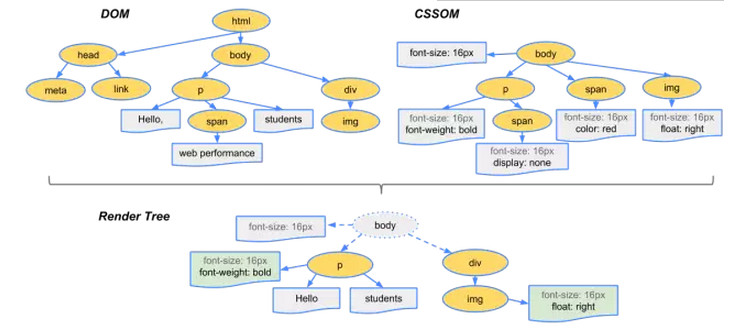
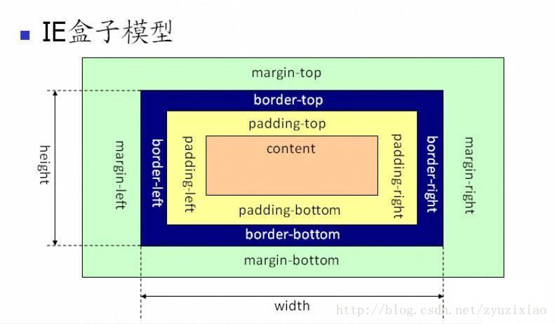
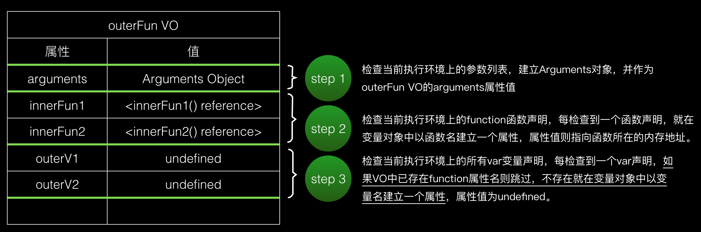

<a href="#html">HTML</a>

<a href="#css">CSS</a>

<a href="#js">JavaScript</a>

<a href="#vue">Vue.js</a>

<a href="#tables">其他表格</a>

# get 和 post 请求的区别

1.  最直观的就是语义上的区别，get 用于获取数据，post 用于提交数据
2.  get 参数有长度限制（受限于 url 长度，具体的数值取决于浏览器和服务器的限制），而 post 无限制

# HTTP 状态码分类

- 1\*\* 信息，服务器收到请求，需要请求者继续执行操作
- 2\*\* 成功，操作被成功接收并处理
- 3\*\* 重定向，需要进一步的操作以完成请求
- 4\*\* 客户端错误，请求包含语法错误或无法完成请求
- 5\*\* 服务器错误，服务器在处理请求的过程中发生了错误

# 同源策略

web 浏览器允许第一个页面的脚本访问第二个页面里的数据，但是也只有在两个页面有相同的源时。源是由 URI，主机名，端口号组合而成的。这个策略可以阻止一个页面上的恶意脚本通过页面的 DOM 对象获得访问另一个页面上敏感信息的权限。

# SEO(Search English Optimization, 搜索引擎优化)

1.  标签语义化
2.  < meta name="keywords" content="关键词 1，关键词 2" />< meta name="description" content="描述 1，描述 2" />
3.  导航栏的层级数不宜太深

# 前端性能优化 怎么增加页面的加载速度

> 减少 HTTP 请求

### 图片地图：

假设导航栏上有五幅图片，点击每张图片都会进入一个链接，这样五张导航的图片在加载时会产生 5 个 HTTP 请求 然而，使用一个图片地图可以提高效率，这样就只需要一个 HTTP 请求

服务器端图片地图：将所有点击提交到同一个 url，同时提交用户点击的 x.y 坐标，服务器端根据坐标映射响应

客户端图片地图：直接将点击映射到操作

缺点：指定坐标区域时，矩形或圆形比较容易指定，而其它形状手工指定比较难

### CSS Sprites(CSS 精灵)

通过将多个图片融合到一副图里面，然后通过 CSS 的一些技术(如: background-position)布局到网页上 特别是图片特别多的网站，如果能用 css sprites 降低图片数量，带来的将是速度的提升

缺点: 合并所有的样式文件或者脚本文件可能会导致在一个页面加载时加载了多于自己所需要的样式或者脚本，对于只访问该网站一个（或几个）页面的人来说反而增加了下载量

> 使用 CDN

CDN（内容发布网络）是一组分布在多个不同地理位置的 Web 服务器，用于更加有效地向用户发布内容 在优化性能时，向特定用户发布内容的服务器的选择基于对网络慕课拥堵的测量 例如，CDN 可能选择网络阶跃数最小的服务器，或者具有最短响应时间的服务器

CDN 还可以进行数据备份.扩展存储能力，进行缓存，同时有助于缓和 Web 流量峰值压力

缺点：

1.  响应时间可能会受到其他网站流量的影响 CDN 服务提供商在其所有客户之间共享 Web 服务器组

2.  如果 CDN 服务质量下降了，那么你的工作质量也将下降

3.  无法直接控制组件服务器

> 添加 Expires 头

页面的初次访问者会进行很多 HTTP 请求，但是通过使用一个长久的 Expires 头，可以使这些组件被缓存，下次访问的时候，就可以减少不必要的 HTPP 请求，从而提高加载速度

缺点： 它要求服务器和客户端时钟严格同步；过期日期需要经常检查

> 压缩组件

从 HTTP1.1 开始，Web 客户端可以通过 HTTP 请求中的 Accept-Encoding 头来表示对压缩的支持

`Accept-Encoding: gzip,deflate`

如果 Web 服务器看到请求中有这个头，就会使用客户端列出来的方法中的一种来进行压缩 Web 服务器通过响应中的 Content-Encoding 来通知 Web 客户端

`Content-Encoding: gzip`

> 将样式表放在头部

首先说明一下，将样式表放在头部对于实际页面加载的时间并不能造成太大影响，但是这会减少页面首屏出现的时间，使页面内容逐步呈现，改善用户体验，防止“白屏”

我们总是希望页面能够尽快显示内容，为用户提供可视化的回馈，这对网速慢的用户来说是很重要的

将样式表放在文档底部会阻止浏览器中的内容逐步出现 为了避免当样式变化时重绘页面元素，浏览器会阻塞内容逐步呈现，造成“白屏” 这源自浏览器的行为：如果样式表仍在加载，构建呈现树就是一种浪费，因为所有样式表加载解析完毕之前务虚会之任何东西

> 将脚本放在底部

更样式表相同，脚本放在底部对于实际页面加载的时间并不能造成太大影响，但是这会减少页面首屏出现的时间，使页面内容逐步呈现

js 的下载和执行会阻塞 Dom 树的构建（严谨地说是中断了 Dom 树的更新），所以 script 标签放在首屏范围内的 HTML 代码段里会截断首屏的内容

下载脚本时并行下载是被禁用的——即使使用了不同的主机名，也不会启用其他的下载 因为脚本可能修改页面内容，因此浏览器会等待；另外，也是为了保证脚本能够按照正确的顺序执行，因为后面的脚本可能与前面的脚本存在依赖关系，不按照顺序执行可能会产生错误

> 避免 CSS 表达式

IE5 以及之后版本.IE8 之前版本支持

```
width: expression(func(),document.body.clientWidth > 400 ? "400px" : "auto");
```

> 使用外部的 JavaScript 和 CSS

内联脚本或者样式可以减少 HTTP 请求，按理来说可以提高页面加载的速度 然而在实际情况中，当脚本或者样式是从外部引入的文件，浏览器就有可能缓存它们，从而在以后加载的时候能够直接使用缓存，而 HTML 文档的大小减小，从而提高加载速度

> 减少 DNS 查找

当我们在浏览器的地址栏输入网址（譬如： www.linux178.com） ，然后回车，回车这一瞬间到看到页面到底发生了什么呢？

域名解析 --> 发起 TCP 的 3 次握手 --> 建立 TCP 连接后发起 http 请求 --> 服务器响应 http 请求，浏览器得到 html 代码 --> 浏览器解析 html 代码，并请求 html 代码中的资源（如 js.css.图片等） --> 浏览器对页面进行渲染呈现给用户

减少主机名的数量就可以减少 DNS 查找的数量

> 压缩代码

> 避免重定向

# 输入一个网址，浏览器执行的过程

域名解析 --> 发起 TCP 的 3 次握手 --> 建立 TCP 连接后发起 http 请求 --> 服务器响应 http 请求，浏览器得到 html 代码 --> 浏览器解析 html 代码，并请求 html 代码中的资源（如 js.css.图片等） --> 浏览器对页面进行渲染呈现给用户

# 浏览器加载和渲染过程

当浏览器获得一个 html 文件时，会“自上而下”加载，并在加载过程中进行解析渲染。
解析：

1.  浏览器会将 HTML 解析成一个 DOM 树，DOM 树的构建过程是一个深度遍历过程：当前节点的所有子节点都构建好后才会去构建当前节点的下一个兄弟节点。
2.  将 CSS 解析成 CSS Rule Tree 。
3.  根据 DOM 树和 CSSOM 来构造 Rendering Tree。注意：Rendering Tree 渲染树并不等同于 DOM 树，因为一些像 Header 或 display:none 的东西就没必要放在渲染树中了。
4.  有了 Render Tree，浏览器已经能知道网页中有哪些节点.各个节点的 CSS 定义以及他们的从属关系。下一步操作称之为 Layout，顾名思义就是计算出每个节点在屏幕中的位置。
5.  再下一步就是绘制，即遍历 render 树，并使用 UI 后端层绘制每个节点。



上述这个过程是逐步完成的，为了更好的用户体验，渲染引擎将会尽可能早的将内容呈现到屏幕上，并不会等到所有的 html 都解析完成之后再去构建和布局 render 树。它是解析完一部分内容就显示一部分内容，同时，可能还在通过网络下载其余内容。

# 浏览器的缓存机制

> ## 浏览器端的缓存规则：

对于浏览器端的缓存来讲，这些规则是在 HTTP 协议头和 HTML 页面的 Meta 标签中定义的。他们分别从新鲜度和校验值两个维度来规定浏览器是否可以直接使用缓存中的副本，还是需要去源服务器获取更新的版本。

新鲜度（过期机制）：也就是缓存副本有效期。一个缓存副本必须满足以下条件，浏览器会认为它是有效的，足够新的：

1.  含有完整的过期时间控制头信息（HTTP 协议报头），并且仍在有效期内；

2.  浏览器已经使用过这个缓存副本，并且在一个会话中已经检查过新鲜度；

满足以上两个情况的一种，浏览器会直接从缓存中获取副本并渲染。

校验值（验证机制）：服务器返回资源的时候有时在控制头信息带上这个资源的实体标签 Etag（Entity Tag），它可以用来作为浏览器再次请求过程的校验标识。如过发现校验标识不匹配，说明资源已经被修改或过期，浏览器需求重新获取资源内容。

> ## 在 HTTP 请求和响应的消息报头中，常见的与缓存有关的消息报头

> Cache-Control 与 Expires

Cache-Control 与 Expires 的作用一致，都是指明当前资源的有效期，控制浏览器是否直接从浏览器缓存取数据还是重新发请求到服务器取数据。只不过 Cache-Control 的选择更多，设置更细致，如果同时设置的话，其优先级高于 Expires。

> Last-Modified/ETag 与 Cache-Control/Expires

配置 Last-Modified/ETag 的情况下，浏览器再次访问统一 URI 的资源，还是会发送请求到服务器询问文件是否已经修改，如果没有，服务器会只发送一个 304 回给浏览器，告诉浏览器直接从自己本地的缓存取数据；如果修改过那就整个数据重新发给浏览器；

Cache-Control/Expires 则不同，如果检测到本地的缓存还是有效的时间范围内，浏览器直接使用本地副本，不会发送任何请求。两者一起使用时，Cache-Control/Expires 的优先级要高于 Last-Modified/ETag。即当本地副本根据 Cache-Control/Expires 发现还在有效期内时，则不会再次发送请求去服务器询问修改时间（Last-Modified）或实体标识（Etag）了。

一般情况下，使用 Cache-Control/Expires 会配合 Last-Modified/ETag 一起使用，因为即使服务器设置缓存时间, 当用户点击“刷新”按钮时，浏览器会忽略缓存继续向服务器发送请求，这时 Last-Modified/ETag 将能够很好利用 304，从而减少响应开销。

> Last-Modified 与 ETag

你可能会觉得使用 Last-Modified 已经足以让浏览器知道本地的缓存副本是否足够新，为什么还需要 Etag（实体标识）呢？HTTP1.1 中 Etag 的出现主要是为了解决几个 Last-Modified 比较难解决的问题：

Last-Modified 标注的最后修改只能精确到秒级，如果某些文件在 1 秒钟以内，被修改多次的话，它将不能准确标注文件的新鲜度
如果某些文件会被定期生成，当有时内容并没有任何变化，但 Last-Modified 却改变了，导致文件没法使用缓存
有可能存在服务器没有准确获取文件修改时间，或者与代理服务器时间不一致等情形
Etag 是服务器自动生成或者由开发者生成的对应资源在服务器端的唯一标识符，能够更加准确的控制缓存。Last-Modified 与 ETag 是可以一起使用的，服务器会优先验证 ETag，一致的情况下，才会继续比对 Last-Modified，最后才决定是否返回 304。

# Web 安全问题和防范

### 跨站脚本 XSS(Cross Site Scripting)

代码注入, 攻击者将脚本上传到帖子让其他人浏览到有恶意脚本的页面

防范

1.  输入编码过滤:对于每一个输入，在客户端和服务器端验证是否合法字符，长度是否合法，格式是否正确,对字符进行转义.非法字符过滤

2.  输出编码过滤:对所有要动态输出到页面的内容，进行相关的编码和转义.主要有 HTML 字符过滤和转义,JS 脚本转义过滤.url 转义过滤

3.  设置 http-only,避免攻击脚本读取 cookie

### 跨站请求伪造 CRSF(Cross Site Request Forgery)

是一种伪造跨站请求的攻击方式. 例如利用你在 A 站 (攻击目标) 的 cookie / 权限等, 在 B 站 (恶意/钓鱼网站) 拼装 A 站的请求

防范

1.  在 HTTP 头中自定义属性并验证

2.  检查 CSRF token.

3.  cookie 中加入 hash 随机数.

4.  通过检查来过滤简单的 CSRF 攻击, 主要检查一下两个 header: Origin Header 和 Referer Header

# JSON 是什么

轻量级的数据交换格式, 使用 js 语法的**文本**

<a id="html"></a>

# **HTML**

# HTML5 新增了哪些

语义化方面：header footer nav section article section hgroup aside

视频和音频：audio video

图像方面：canvas, WebGL(通过 canvas.getContext('webgl')获得对象), SVG

数据存储：sessionStorage, localStorage

<a id="css"></a>

# **CSS**

# CSS 选择器

| 选择器               | 例子                  | 例子描述                                          | CSS |
| -------------------- | --------------------- | ------------------------------------------------- | --- |
| .class               | .intro                | 选择 class="intro" 的所有元素                     | 1   |
| #id                  | #firstname            | 选择 id="firstname" 的所有元素                    | 1   |
| \*                   | \*                    | 选择所有元素                                      | 2   |
| element              | p                     | 选择所有`<p>`元素                                 | 1   |
| element,element      | div,p                 | 选择所有`<div>`元素和所有`<p>`元素                | 1   |
| element element      | div p                 | 选择`<div>`元素内部的所有`<p>`元素                | 1   |
| element>element      | div>p                 | 选择父元素为`<div>`元素的所有`<p>`元素            | 2   |
| element+element      | div+p                 | 选择紧接在`<div>`元素之后的所有`<p>`元素          | 2   |
| [attribute]          | [target]              | 选择带有 target 属性所有元素                      | 2   |
| [attribute=value]    | [target=_blank]       | 选择 target="\_blank" 的所有元素                  | 2   |
| [attribute~=value]   | [title~=flower]       | 选择 title 属性包含单词 "flower" 的所有元素       | 2   |
| [attribute\|=value]  | [lang\|=en]           | 选择 lang 属性值以 "en" 开头的所有元素            | 2   |
| :link                | a:link                | 选择所有未被访问的链接                            | 1   |
| :visited             | a:visited             | 选择所有已被访问的链接                            | 1   |
| :active              | a:active              | 选择活动链接                                      | 1   |
| :hover               | a:hover               | 选择鼠标指针位于其上的链接                        | 1   |
| :focus               | input:focus           | 选择获得焦点的 input 元素                         | 2   |
| :first-letter        | p:first-letter        | 选择每个`<p>`元素的首字母                         | 1   |
| :first-line          | p:first-line          | 选择每个`<p>`元素的首行                           | 1   |
| :first-child         | p:first-child         | 选择属于父元素的第一个子元素的每个`<p>`元素       | 2   |
| :before              | p:before              | 在每个`<p>`元素的内容之前插入内容                 | 2   |
| :after               | p:after               | 在每个`<p>`元素的内容之后插入内容                 | 2   |
| :lang(language)      | p:lang(it)            | 选择带有以 "it" 开头的 lang 属性值的每个`<p>`元素 | 2   |
| element1~element2    | p~ul                  | 选择前面有`<p>`元素的每个`<ul>`元素               | 3   |
| [attribute^=value]   | a[src^="https"]       | 选择其 src 属性值以 "https" 开头的每个`<a>`元素   | 3   |
| [attribute$=value]   | a[src$=".pdf"]        | 选择其 src 属性以 ".pdf" 结尾的所有`<a>`元素      | 3   |
| [attribute*=value]   | a[src*="abc"]         | 选择其 src 属性中包含 "abc" 子串的每个`<a>`元素   | 3   |
| :first-of-type       | p:first-of-type       | 选择属于其父元素的首个 `<p>`元素的每个 `<p>`元素  | 3   |
| :last-of-type        | p:last-of-type        | 选择属于其父元素的最后 `<p>`元素的每个 `<p>`元素  | 3   |
| :only-of-type        | p:only-of-type        | 选择属于其父元素唯一的 `<p>`元素的每个 `<p>`元素  | 3   |
| :only-child          | p:only-child          | 选择属于其父元素的唯一子元素的每个 `<p>`元素      | 3   |
| :nth-child(n)        | p:nth-child(2)        | 选择属于其父元素的第二个子元素的每个 `<p>`元素    | 3   |
| :nth-last-child(n)   | p:nth-last-child(2)   | 同上，从最后一个子元素开始计数                    | 3   |
| :nth-of-type(n)      | p:nth-of-type(2)      | 选择属于其父元素第二个 `<p>`元素的每个 `<p>`元素  | 3   |
| :nth-last-of-type(n) | p:nth-last-of-type(2) | 同上，但是从最后一个子元素开始计数                | 3   |
| :last-child          | p:last-child          | 选择属于其父元素最后一个子元素每个 `<p>`元素      | 3   |
| :root                | :root                 | 选择文档的根元素                                  | 3   |
| :empty               | p:empty               | 选择没有子元素的每个 `<p>`元素（包括文本节点）    | 3   |
| :target              | #news:target          | 选择当前活动的 #news 元素                         | 3   |
| :enabled             | input:enabled         | 选择每个启用的`<input>`元素                       | 3   |
| :disabled            | input:disabled        | 选择每个禁用的`<input>`元素                       | 3   |
| :checked             | input:checked         | 选择每个被选中的`<input>`元素                     | 3   |
| :not(selector)       | :not(p)               | 选择非 `<p>`元素的每个元素                        | 3   |
| ::selection          | ::selection           | 选择被用户选取的元素部分                          | 3   |

# css 的选择器权重比较以及权重计算规则

CSS 优先级的计算规则如下：

- 元素标签中定义的样式（Style 属性）,加 1,0,0,0
- 每个 ID 选择符(如 #id),加 0,1,0,0
- 每个 Class 选择符(如 .class).每个属性选择符(如 [attribute=]).每个伪类(如 :hover)加 0,0,1,0
- 每个元素选择符（如 p）或伪元素选择符(如 :firstchild)等，加 0,0,0,1
  然后，将这四个数字分别累加，就得到每个 CSS 定义的优先级的值，
  然后从左到右逐位比较大小，数字大的 CSS 样式的优先级就高。
  1,0,0,0 > 0,99,99,99。也就是说从左往右逐个等级比较，前一等级相等才往后比。
  例子：
  css 文件或`<style>`中如下定义：

1.  h1 {color: red;}
    /_ 一个元素选择符，结果是 0,0,0,1 _/
2.  body h1 {color: green;}
    /_ 两个元素选择符，结果是 0,0,0,2 _/
3.  h2.grape {color: purple;}
    /_ 一个元素选择符.一个 Class 选择符，结果是 0,0,1,1_/
4.  li#answer {color: navy;}
    /_ 一个元素选择符，一个 ID 选择符，结果是 0,1,0,1 _/
    元素的 style 属性中如下定义：
    h1 {color: blue;}
    /_ 元素标签中定义，一个元素选择符，结果是 1,0,0,1_/

如此以来，h1 元素的颜色是蓝色。
注意：
1.!important 声明的样式优先级最高，如果冲突再进行计算。 2.如果优先级相同，则选择最后出现的样式。 3.继承得到的样式的优先级最低。

结论是：比较同一级别的个数，数量多的优先级高，如果相同即比较下一级别的个数
important->内联->ID->类->标签|伪类|属性选择->伪对象->继承->通配符->继承

最后汇总为一张表

| 选择器         | 表达式或示例      | 权重                   |
| -------------- | ----------------- | ---------------------- |
| ID 选择器      | #aaa              | 100                    |
| 类选择器       | .aaa              | 10                     |
| 标签选择器     | h1                | 1                      |
| 属性选择器     | [title]           | 10                     |
| 相邻选择器     | selecter+selecter | 拆分为两个选择器再计算 |
| 兄长选择器     | selecter~selecter | 拆分为两个选择器再计算 |
| 父子选择器     | selecter>selecter | 拆分为两个选择器再计算 |
| 后代选择器     | selecter selecter | 拆分为两个选择器再计算 |
| 通配符         | \*                | 0                      |
| 各种伪类选择器 | :hover            | 10                     |
| 各种伪元素     | ::after           | 1                      |

# display 有哪几种值，分别是什么意思

1.  none 此元素不会被显示，并且不占据页面空间，这也是与 visibility:hidden 不同的地方，设置 visibility:hidden 的元素，不会被显示，但是还是会占据原来的页面空间
2.  inline 行内元素 元素会在一行内显示，超出屏幕宽度自动换行，不能设置宽度和高度，元素的宽度和高度只能是靠元素内的内容撑开
3.  block 块级元素 会独占一行，如果不设置宽度，其宽度会自动填满父元素的宽度，可以设置宽高，即使设置了宽度，小于父元素的宽度，块级元素也会独占一行
4.  inline-block 行内块元素 与行内元素一样可以再一行内显示，而且可以设置宽高，可以设置 margin 和 padding
    示例元素：input,button,img
5.  list-item 列表元素
    示例元素：li
6.  table 会作为块级表格来显示(类似于`<table>`)，表格前后带有换行符
7.  inline-table 会作为内联表格来显示(类似于`<table>`)，表格前后没有换行符
8.  table-cell 会作为表格单元格来显示(类似于`<td>`)
9.  flex 多栏多列布局

# text-decoration 分别有哪几种值

1.  text-decoration:none //默认，定义标准的文本，没有任何样式，正常显示
2.  text-decoration:underline //定义文本下的一条线
3.  text-decoration:overline //定义文本上的一条线
4.  text-decoration:line-through //定义文本中间的一条线
5.  text-decoration:blink //定义闪烁的文本， IE.Chrome 或 Safari 不支持 "blink" 属性值
6.  text-deration:inherit //从父元素继承 text-decoration 的值，任何的版本的 IE(包括 IE8)都不支持属性值 "inherit"

# 标准盒模型和 IE 盒模型

+

> W3C


> IE



# box-sizing:border-box 是什么效果

border-box 就类似于 IE 的盒模型，如果你设置了一个 width，同时设置了 box-sizing:border-box ，这时候浏览器就会帮你把 border 和 padding 计算到 width 中去

# BFC(Block Formatting Context, 块格式化上下文)

BFC 的创建方法

- 根元素或其它包含它的元素；
- 浮动 (元素的 float 不为 none)；
- 绝对定位元素 (元素的 position 为 absolute 或 fixed)；
- 行内块 inline-blocks(元素的 display: inline-block)；
- 表格单元格(元素的 display: table-cell，HTML 表格单元格默认属性)；
- overflow 的值不为 visible 的元素；
- 弹性盒 flex boxes (元素的 display: flex 或 inline-flex)；

BFC 的效果

- 内部的盒会在垂直方向一个接一个排列（可以看作 BFC 中有一个的常规流）；
- 处于同一个 BFC 中的元素相互影响，可能会发生 margin collapse；
- 每个元素的 margin box 的左边，与容器块 border box 的左边相接触(对于从左\* 往右的格式化，否则相反) 即使存在浮动也是如此；
- BFC 就是页面上的一个隔离的独立容器，容器里面的子元素不会影响到外面的元素，反之亦然；
- 计算 BFC 的高度时，考虑 BFC 所包含的所有元素，连浮动元素也参与计算；
- 浮动盒区域不叠加到 BFC 上；

# 垂直 margin 的合并

垂直 margin 合并就是上下相邻的两个块级元素，如果刚好，上面设置 margin-bottom，下面设置 margin-top，这俩外边距相遇了，那两个就合并了，本来可能上面 margin-bottom 设置 20px，margin-top 设置 10px，合并之后两个元素上下的距离就变为 20px，即两个属性中较大的值

垂直 margin 合并是在同一个 BFC 中才会发生的，如果两个 BFC 的垂直 margin 不会合并

# 垂直水平居中

> 元素水平居中

```
// 元素需要设置宽度
// 不是行内元素
margin: 0 auto;
```

> 元素水平垂直居中

方案 1：position 元素已知宽度
父元素设置为：position: relative;
子元素设置为：position: absolute;
距上 50%，据左 50%，然后减去元素自身宽度的距离就可以实现

```
<div class="box">
    <div class="content">
    </div>
</div>

.box {
    background-color: #FF8C00;
    width: 300px;
    height: 300px;
    position: relative;
}
.content {
    background-color: #F00;
    width: 100px;
    height: 100px;
    position: absolute;
    left: 50%;
    top: 50%;
    margin: -50px 0 0 -50px;
}
```

方案 2：position transform 元素未知宽度
如果元素未知宽度，只需将上面例子中的 margin: -50px 0 0 -50px;替换为：transform: translate(-50%,-50%);

```
<div class="box">
    <div class="content">
    </div>
</div>

.box {
    background-color: #FF8C00;
    width: 300px;
    height: 300px;
    position: relative;
}
.content {
    background-color: #F00;
    width: 100px;
    height: 100px;
    position: absolute;
    left: 50%;
    top: 50%;
    transform: translate(-50%,-50%);
}
```

方案 3：flex 布局

```
<div class="box">
    <div class="content">
    </div>
</div>

.box {
    background-color: #FF8C00;
    width: 300px;
    height: 300px;
    display: flex;//flex布局
    justify-content: center;//使子项目水平居中
    align-items: center;//使子项目垂直居中
}
.content {
    background-color: #F00;
    width: 100px;
    height: 100px;
}
```

方案 4：table-cell 布局
因为 table-cell 相当与表格的 td，td 为行内元素，无法设置宽和高，所以嵌套一层，嵌套一层必须设置 display: inline-block;td 的背景覆盖了橘黄色，不推荐使用

```
<div class="box">
    <div class="content">
        <div class="inner">
        </div>
    </div>
</div>

.box {
    background-color: #FF8C00;//橘黄色
    width: 300px;
    height: 300px;
    display: table;
}
.content {
    background-color: #F00;//红色
    display: table-cell;
    vertical-align: middle;//使子元素垂直居中
    text-align: center;//使子元素水平居中
}
.inner {
    background-color: #000;//黑色
    display: inline-block;
    width: 20%;
    height: 20%;
}
```

# 常见的浏览器兼容性问题有哪些

> 第一类：块状元素 float 后，有添加了横向的 margin，在 IE6 下比设置的值要大（属于双倍浮动的 bug）

解决方案：给 float 标签添加 display：inline，将其转换为行内元素

> 第二类：表单元素行高不一致

解决方案：给表单元素添加 float：left（左浮动）；或者是 vertical-align：middle；（垂直对齐方式：居中）

> 第三类：设置较小高度的容器（小于 10px），在 IE6 下不识别小于 10px 的高度；

解决方案：给容器添加 overflow：hidden；

> 第四类：当在 a 标签中嵌套 img 标签时，在某些浏览器中 img 会有蓝色边框；

解决方案：给 img 添加 border：0；或者是 border：none；

> 第五类：min-height 在 IE6 下不兼容

解决方案：

```
1）
min-height：value；
_height：value；
```

```
2）
min-height：value；
height：auto！important；
height：value；
```

> 第六类：图片默认有间隙

解决方案：

1）给 img 标签添加左浮动 float：left；

2）给 img 标签添加 display：block；

> 第七类：按钮默认大小不一

解决方案：

1）用 a 标签来模拟按钮，添加样式；

2）如果按钮是一张背景图片，那么直接给按钮添加背景图；

> 第八类：百分比的 bug

解决方案：父元素宽度为 100%，子元素宽度各为 50%，在 IE6 下各个元素宽度之和超过 100%

解决方案：给右边浮动的子元素添加 clear：right；

> 第九类：鼠标指针 bug

描述：cursor：hand；只有 ie 浏览器识别，其他浏览器不识别

解决方案：cursor：pointer；IE6 以上浏览器及其他内核浏览器都识别；

> 第十类：透明度属性

解决方案：针对 IE 浏览器：filter：alpha（opacity=value）；（取值范围 1--100）

兼容其他浏览器：opacity：value；（取值范围 0--1）

> 第十一类：上下 margin 的重叠问题

描述：给上边元素设置了 margin-bottom，给下边元素设置了 margin-top，浏览器只会识别较大值；

解决方案：margin-top 和 margin-bottom 中选择一个，只设置其中一个值

# 负边距

todo

# CSS Hack 有哪些

```
/* CSS属性级Hack */
color:red; /* 所有浏览器可识别*/
_color:red; /* 仅IE6 识别 */
*color:red; /* IE6.IE7 识别 */
+color:red; /* IE6.IE7 识别 */
*+color:red; /* IE6.IE7 识别 */
[color:red; /* IE6.IE7 识别 */
color:red9; /* IE6.IE7.IE8.IE9 识别 */
color:red; /* IE8.IE9 识别*/
color:red9; /* 仅IE9识别 */
color:red; /* 仅IE9识别 */
color:red !important; /* IE6 不识别!important*/
```

```
/* CSS选择符级Hack */
*html #demo { color:red;} /* 仅IE6 识别 */
*+html #demo { color:red;} /* 仅IE7 识别 */
body:nth-of-type(1) #demo { color:red;} /* IE9+.FF3.5+.Chrome.Safari.Opera 可以识别 */
head:first-child+body #demo { color:red; } /* IE7+.FF.Chrome.Safari.Opera 可以识别 */
:root #demo { color:red9; } : /* 仅IE9识别 */
```

```
/* IE条件注释Hack */
<!--[if IE]>此处内容只有IE可见<![endif]-->
<!--[if IE 6]>此处内容只有IE6.0可见<![endif]-->
<!--[if IE 7]>此处内容只有IE7.0可见<![endif]-->
<!--[if !IE 7]>此处内容只有IE7不能识别<![endif]-->
<!--[if gt IE 6]> IE6以上版本可识别,IE6无法识别 <![endif]-->
<!--[if gte IE 7]> IE7以及IE7以上版本可识别 <![endif]-->
<!--[if lt IE 7]> 低于IE7的版本才能识别，IE7无法识别  <![endif]-->
<!--[if lte IE 7]> IE7以及IE7以下版本可识别<![endif]-->
<!--[if !IE]>此处内容只有非IE可见<![endif]-->
```

<a id="js"></a>

# **JavaScript**

# JavaScript 数据类型

> 5 种不同的数据类型：

- string
- number
- boolean
- object
- function

> 3 种对象类型：

- Object
- Date
- Array

> 2 个不包含任何值的数据类型：

- null
- undefined

```
typeof "John"                 // 返回 string
typeof 3.14                   // 返回 number
typeof NaN                    // 返回 number
typeof false                  // 返回 boolean
typeof [1,2,3,4]              // 返回 object
typeof {name:'John', age:34}  // 返回 object
typeof new Date()             // 返回 object
typeof function () {}         // 返回 function
typeof myCar                  // 返回 undefined (如果 myCar 没有声明)
typeof null                   // 返回 object
```

# 类的创建.继承

> 创建

```
var Animal = function () {
    this.name = 'Animal';
};
```

```
// ES6
class Animal2 {
    constructor () {
        this.name = 'Animal2';
    }
}
```

> 继承

```
function People() {
    this.name = ''
    this.age = 0
}

People.prototype.say = function () {
    console.log(`${this.name} is ${this.age}`)
}

function Student() {
    // 添加(继承)父类属性
    People.call(this)
    this.no = 0
}

// 添加父类原型中的属性和方法(使用空对象中继)
function extend(Child, Parent) {
    // 此处如果使用 Child.prototype = new Parent()
    // 会导致调用两次父类构造函数(上一次是Student中的'People.call(this)')
    // new Parent()会执行父类constructor, 如果constructor比较复杂,
    // 执行两次会耗费资源
    let Tmp = function () {}
    Tmp.prototype = Parent.prototype
    Child.prototype = new Tmp()
    Child.prototype.constructor = Child
}

extend(Student, People)

let student = new Student()
```

```
// ES6

class People {
    constructor() {
        this.name = ''
        this.age = 0
    }

    say() {
        console.log(`${this.name} is ${this.age}`)
    }
}

class Student extends People {
    constructor() {
        super()
        this.no = 0
    }
}

let student = new Student()
```

# 闭包

闭包就是能够读取其他函数内部变量的函数

```
function f1(){
    var n=999;
    function f2(){
        alert(n); // 999
    }
}
```

上面代码中的 f2 函数，就是闭包。

> 闭包的用途

todo

> 闭包的缺点

1.  由于闭包会使得函数中的变量都被保存在内存中，内存消耗很大

2.  使用闭包时，会涉及到跨作用域访问，每次访问都会导致性能损失

# 事件绑定

1.  嵌入 dom

```
<button onclick="open()">按钮</button>

<script>
function open(){
    alert(1)
}
</script>
```

2.  直接绑定

```
<button id="btn">按钮</button>
<script>
document.getElementById('btn').onclick = function(){
    alert(1)
}
</script>
```

3.  事件监听

```
<button id="btn">按钮</button>
<script>
document.getElementById('btn').addEventListener('click',function(){
    alert(1)
})
//兼容IE
document.getElementById('btn').attachEvent('click',function(){
    alert(1)
})
</script>
```

# 事件委托

事件委托是利用事件的冒泡原理来实现的, 我们给最外面的 div 加点击事件，那么里面的 ul，li，a 做点击事件的时候，都会冒泡到最外层的 div 上，所以都会触发，这就是事件委托，委托它们父级代为执行事件

```
window.onload = function(){
    var oUl = document.getElementById("ul1");
    oUl.onclick = function(ev){
        var ev = ev || window.event;
        // 兼容IE
        var target = ev.target || ev.srcElement;
        if(target.tagName == 'LI'){
            alert(123);
            alert(target.innerHTML);
        }
    }
}
```

当用事件委托的时候，根本就不需要去遍历元素的子节点，只需要给父级元素添加事件就好了，其他的都是在 js 里面的执行，这样可以大大的减少 dom 操作，这才是事件委托的精髓所在

event.target 返回触发事件的元素, 起泡元素

event.currentTarget 返回绑定事件的元素

# W3C 和 IE 两种事件绑定有什么不同

W3C

```
// 格式：
target.addEventListener( type, function, useCapture );
// useCapture: 默认false, 是否使用事件捕获
// 例子:  
var myIntro = document.getElementById('intro');
myIntro.addEventListener('click', introClick, false);
```

IE

```
// 格式:
target.attachEvent ( 'on' + type, function );  
// 例子:  
var myIntro = document.getElementById('intro');
myIntro.attachEvent('onclick', introClick);
```

# 事件冒泡的机制

从目标元素起，再依次往顶层对象传递，途中如果有节点绑定了同名事件，这些事件所对应的函数会逐一被触发，此过程便称之为事件冒泡

获取事件冒泡里任意层指定的元素

```
 // 期望li触发事件, 但触发事件的元素可能是li下的某个元素,
 // 所以找到这个元素的父节点, 如果是li的话就触发li的事件
 function toApply(e) {
      let target=e.target||e.srcElement
      while(target.tagName!='LI'){
        // 不断取父节点来替换target
        target=target.parentNode?target.parentNode:''
      }
      if(target) {   //如果目标元素LI存在
        // do something
      }
 }
```

# JavaScript 事件模型

> 原始事件模型

在原始事件模型中（也有说 DOM0 级），事件发生后没有传播的概念，没有事件流 事件发生，马上处理，完事，就这么简单 监听函数只是元素的一个属性值，通过指定元素的属性值来绑定监听器 书写方式有两种：

```
HTML代码中指定属性值：<input type=”button” onclick=”func1()” />

在js代码中指定属性值：document.getElementById('input').onclick = func1
```

优点：所有浏览器都兼容

缺点：1）逻辑与显示没有分离；2）相同事件的监听函数只能绑定一个，后绑定的会覆盖掉前面的，如：a.onclick = func1; a.onclick = func2;将只会执行 func2 中的内容 3）无法通过事件的冒泡.委托等机制（后面系列会讲到）完成更多事情

在当前 web 程序模块化开发以及更加复杂的逻辑状况下，这种方式显然已经落伍了，所以在真正项目中不推荐使用，平时写点博客小例子啥的倒是可以，速度比较快

> IE 事件模型

在参考其他资料时，我有看到这样的一句话“IE 不把该对象传入事件处理函数,由于在任意时刻只会存在一个事件,所以 IE 把它作为全局对象 window 的一个属性”，为求证其真伪，我用 IE8 执行了代码 alert(window.event)，结果弹出是 null，说明该属性已经定义，只是值为 null（与 undefined 不同） 我想难道这个全局对象的属性是在监听函数里才加的？于是执行下面代码：

```
window.onload = function (){alert(window.event);}

setTimeout(function(){alert(window.event);},2000);
```

结果第一次弹出[object event], 两秒后弹出依然是 null 由此可见 IE 是将 event 对象在处理函数中设为 window 的属性，一旦函数执行结束，便被置为 null 了 IE 的事件模型只有两步，先执行元素的监听函数，然后事件沿着父节点一直冒泡到 document 冒泡机制后面系列会讲，此处暂记 IE 模型下的事件监听方式也挺独特，绑定监听函数的方法是：attachEvent( "eventType","handler")，其中 evetType 为事件的类型，如 onclick，注意要加’on’ 解除事件监听器的方法是 detachEvent("eventType","handler" )

IE 的事件模型已经可以解决原始模型的三个缺点，但其自己的缺点就是兼容性，只有 IE 系列浏览器才可以这样写

> DOM2 事件模型

此模型是 W3C 制定的标准模型，既然是标准，那大家都得按这个来，我们现在使用的现代浏览器（指 IE6~8 除外的浏览器）都已经遵循这个规范 W3C 制定的事件模型中，一次事件的发生包含三个过程：

(1)capturing phase:事件捕获阶段 事件被从 document 一直向下传播到目标元素,在这过程中依次检查经过的节点是否注册了该事件的监听函数，若有则执行

(2)target phase:事件处理阶段 事件到达目标元素,执行目标元素的事件处理函数.

(3)bubbling phase:事件冒泡阶段 事件从目标元素上升一直到达 document，同样依次检查经过的节点是否注册了该事件的监听函数，有则执行

所有的事件类型都会经历 captruing phase 但是只有部分事件会经历 bubbling phase 阶段,例如 submit 事件就不会被冒泡

标准的事件监听器该如何绑定：addEventListener("eventType","handler","true|false");其中 eventType 指事件类型，注意不要加‘on’前缀，与 IE 下不同 第二个参数是处理函数，第三个即用来指定是否在捕获阶段进行处理，一般设为 false 来与 IE 保持一致，除非你有特殊的逻辑需求 监听器的解除也类似：removeEventListner("eventType","handler","true!false");

# Ajax 如何跨域

## 1. JSONP

```
// 创建script标签,并追加到dom中
function addScriptTag(src) {
  var script = document.createElement('script');
  script.setAttribute("type","text/javascript");
  script.src = src;
  document.body.appendChild(script);
}

// callback是接收数据并处理的函数
window.onload = function () {
  addScriptTag('http://example.com/ip?callback=foo');
}

// 服务器返回的数据: foo({"test": "testData"});
// 因为创建了script标签, 浏览器接收到数据后会立即执行(作为js脚本)
// 就会执行callback指定的函数并把数据传入
function foo(data) {
  console.log('response data: ' + JSON.stringify(data));
};
```

> 优点

1.  不受到同源策略的限制
2.  兼容性好，在更加古老的浏览器中都可以运行

> 缺点

1.  只支持 GET 请求
2.  它只支持跨域 HTTP 请求这种情况，不能解决不同域的两个页面之间如何进行 JavaScript 调用的问题。
3.  jsonp 在调用失败的时候不会返回各种 HTTP 状态码。
4.  安全性 假如它返回的 javascript 的内容被人控制的

## 2. CORS(跨域资源共享 Cross-origin resource sharing)

服务器端:

```
// 允许的域名
response.setHeader("Access-Control-Allow-Origin", originHeader);
// 允许的请求类型，多个用逗号隔开
response.setHeader("Access-Control-Allow-Methods", "POST, GET, PUT, OPTIONS, DELETE");
// 在实际请求中，允许的自定义header，多个用逗号隔开
response.setHeader("Access-Control-Allow-Headers", "x-requested-with, Content-Type");
// 是否允许带凭证的请求(跨域cookie)
response.setHeader("Access-Control-Allow-Credentials", "true");
```

> 优点

1.  CORS 支持所有类型的 HTTP 请求，功能完善
2.  CORS 可以通过 onerror 事件监听错误，并且浏览器控制台会看到报错信息，利于排查。

> 缺点

1.  兼容性, 只支持现代浏览器
2.  对于复杂请求，CORS 会发两次请求

## 3. 代理请求

服务器 A 的 test01.html 页面想访问服务器 B 的后台 action，返回“test”字符串，此时就出现跨域请求，浏览器控制台会出现报错提示，由于跨域是浏览器的同源策略造成的，对于服务器后台不存在该问题，可以在服务器 A 中添加一个代理 action，在该 action 中完成对服务器 B 中 action 数据的请求，然后在返回到 test01.html 页面

# ajax 跨域携带cookie

```
var xhr = new XMLHttpRequest();  
xhr.open("POST", "http://xxxx.com/xxx", true);  
xhr.withCredentials = true; //支持跨域发送cookies
xhr.send();
```

# true false

> 值为 false

```
new Boolean();
Boolean(0);
Boolean(null);
Boolean(undefined);
Boolean("");
Boolean(false);
Boolean(NaN);
```

> 其他情况均为 true

```
Boolean({}) // true
Boolean([]) // true
Boolean("null") // true
Boolean("0") // true
```

# 设置和删除 cookie

```
// 设置cookie
// key: 键, value: 值, expires: 有效时长(ms)
function setCookie(key, value, expires) {
    let d = new Date();
    d.setTime(d.getTime() + expires);
    document.cookie = key + "=" + value + "; " + "expires="+d.toUTCString();
}

// 获取cookie
function getCookie(cname) {
    var name = cname + "=";
    var ca = document.cookie.split(';');
    for(var i=0; i<ca.length; i++) {
        var c = ca[i];
        while (c.charAt(0)==' ') c = c.substring(1);
        if (c.indexOf(name) != -1) return c.substring(name.length, c.length);
    }
    return "";
}

// 清除cookie  
function clearCookie(key) {
    setCookie(key, "", -1);  
}  
```

# cookie 和 localStorage 的区别

1.  cookie 在浏览器与服务器之间来回传递 sessionStorage 和 localStorage 不会把数据发给服务器，仅在本地保存
2.  cookie 只在设置的 cookie 过期时间之前一直有效，即使窗口或浏览器关闭
    sessionStorage 仅在当前浏览器窗口关闭前有效 localStorage 始终有效，长期保存
3.  cookie 数据不能超过 4k，sessionStorage 和 localStorage 虽然也有存储大小的限制，但比 cookie 大得多，可以达到 5M 或更大

4.  作用域不同: sessionStorage 不在不同的浏览器窗口中共享；localStorage 在所有同源窗口中都是共享的；cookie 也是在所有同源窗口中都是共享的；

# javascript 中的 this

this 永远指向的是最后调用它的对象，也就是看它执行的时候是谁调用的

# localStorage 和 sessionStorage

sessionStorage 存储一个会话中的数据，会话结束后数据就会被销毁

localStorage 的数据是永久存储在客户端的，除非主动删除，否则不会过期

过期时间：localStorage 永久存储，永不失效除非手动删除 sessionStorage 浏览器重新打开后就消失了

大小：每个域名是 5M

localstorage 在泛域名下也存在跨域问题

> API：（localStorage 和 sessionStorage 的 API 都是一样的，这里以 sessionStorage 为示例）

```
sessionStorage.key(0) //0位索引，返回第0位数据的键值
sessionStorage.getItem("key") //键值为key的属性值
sessionStorage.setItem("key","value") //存储名为key，值为value
sessionStorage.removeItem("key") //删除键值为key的属性
sessionStorage.clear(); //删除所有sessionStorage中的属性
```

# 怎么判断一个数组

```
var arr = [1,2,3];
Object.prototype.toString.call(arr); // [object Array]

//还可以用instanceof
arr instanceof Array; // true
```

# prototype 和**proto**

显示原型(prototype): 显示原型实现基于原型的继承和属性的共享

隐式原型([[prototype]]): 隐式原型是的作用就是构成原型链，通过隐式原型可以一层层往上查找对象的原型 **proto**是个不标准的属性，是浏览器为了实现对[[prototype]]的访问所提供的一个方法 常理来说[[prototype]]即隐式原型是不可访问的 ES5 里提供了 Object.getPrototypeOf()这个方法来获得[[prototype]]

prototype 和**proto**都指向原型对象，任意一个函数(包括构造函数)都有一个 prototype 属性，指向该函数的原型对象，同样 **任意一个构造函数实例化的对象** ，都有一个**proto**属性，指向构造函数的原型对象

```
function Foo(){}
var Boo = {name: "Boo"};
Foo.prototype = Boo;
var f = new Foo();

console.log(f.__proto__ === Foo.prototype); // true
console.log(f.__proto__ === Boo);   // true
Object.getPrototypeOf(f) === f.__proto__;   // true

let b = 1;
console.log(b.__proto__ === Number.prototype) // true
console.log(1.__proto__) // Uncaught SyntaxError: Invalid or unexpected token
```


# 作用域.作用域链

> ## 作用域(scope)

## 1. 全局作用域（Global Scope）

最外层函数和在最外层函数外面定义的变量拥有全局作用域

```
var scope="global";  //声明一个全局变量
function checksope(){
    function showglobal(){
        alert(scope); //弹窗全局变量
    }
    showglobal();
}
checksope()   // global 内部函数可以访问全局变量
```

所有末定义直接赋值的变量自动声明为拥有全局作用域

```
function checksope(){
    var scope="local";
    scopeglobal="global";
    alert(scope);
}
checksope();  // local
alert(scopeglobal); //    global  不带var关键词声明的变量，
                          直接升级为全局变量，同时也是全局变量
                           的一个属性
alert(scope); //脚本错误
```

所有 window 对象的属性拥有全局作用域

## 2. 函数作用域

JavaScript 没有块级作用域。JavaScript 取而代之地使用了函数作用域：变量在声明他们的函数体以及这个函数体嵌套的任意函数体内都有定义的。

```
function test（0）{
    var i = 0;  // i在行函数体内时有定义的，
    if（typof 0 == "object"){
        var j = 0;  //j在函数体内是有定义的，不仅仅是在循环内
        for(var k=0; k<10;k++){ //k在行函数体内是有定义的，不仅仅是在循环内
            console.log(k);//输出数字0-9
        }
        console.log(k);  //k 已经定义了，输出10
    }
    console.log(j);    //j 已经定义了，但是可能没有初始化
}
```

## 作为属性的变量

当声明一个全局变量时，实际上是定义了全局对象的一个属性。使用 var 声明的变量不可配置，未声明的可配置

此规则只对全局变量有效

```
var  truvar = 1;   //声明一个不可删除的全局变量
fakevar = 2；       //创建全局对象的一个可删除的属性
this.fakecar2 = 3;//同上
delete truevar //=> false:变量并没有被删除
delete fakevar //=> true:变量并没有被删除
delete this.fakevar2 //=> true:变量并没有被删除
```

> ## 作用域链

每一段 javascript 代码（全局代码或函数）都有一个与之关联的作用域链。这个作用域连是一个对象列表或者链表，这组对象定义了这段代码“作用域中”的变量。当 javascript 需要查找变量 x 的值的时候（这个过程称作“变量解析”),它会从链中的第一个对象开始查找，如果这个对象有一个名为 x 属性，则会直接使用这个属性的值，如果第一个对象中不存在，则会继续寻找下一个对象，依次类推。如果作用域链上没有任何一个对象含有属性 x，则抛出错误（ReferenceError）异常。

不同的层级作用域上对象的分布

1.  在 javascript 的最顶层（也就是不包含任何函数定义内的代码），作用域链由一个全局对象组成。
2.  在不包含嵌套的函数体内，作用域链上有两个对象，第一个是定义函数参数和局部变量的对象，第二个是全局对象。
3.  在一个嵌套的函数体内，作用域链上至少有三个对象。当调用这个函数时，它创建一个新的对象来存储它的局部变量，它实际上保存在同一个作用域链。

# MVVM(Model View ViewModel)

MVVM 的设计思想：关注 Model 的变化，让 MVVM 框架去自动更新 DOM 的状态，从而把开发者从操作 DOM 的繁琐步骤中解脱出来

改变 JavaScript 对象的状态，会导致 DOM 结构作出对应的变化！这让我们的关注点从如何操作 DOM 变成了如何更新 JavaScript 对象的状态，而操作 JavaScript 对象比 DOM 简单多了

# 全文单词首字母大写

```
function ReplaceFirstUper(str)  
{
    str = str.toLowerCase();
    return str.replace(/\b(\w)|\s(\w)/g, function(m){  
        return m.toUpperCase();  
    });
}

console.log(ReplaceFirstUper('i have a pen, i have an apple!'));
// 输出: I Have A Pen, I Have An Apple!
```

# Ajax 的工作原理和过程

Ajax 的工作原理相当于在用户和服务器之间加了—个中间层(AJAX 引擎),使用户操作与服务器响应异步化 并不是所有的用户请求都提交给服务器,像—些数据验证和数据处理等都交给 Ajax 引擎自己来做, 只有确定需要从服务器读取新数据时再由 Ajax 引擎代为向服务器提交请求

Ajax 异步请求

请求过程：浏览器(当前页面不会丢弃) --> Ajax 引擎(http 协议) --> Web 服务器

响应过程：Web 服务器 --> 准备部分数据 ---> Ajax 引擎(http 协议) --> dom 编程

Ajax 的工作过程

1.  创建 Ajax 引擎对象(XMLHttpRequest(其它).ActiveXObject(ie))

2.  打开服务器之间的连接

3.  发送异步请求

4.  获取服务器端的响应数据

```
function getData() {
    // 1. 创建Ajax引擎对象
    var xmlhttp = null;
    // 非IE浏览器创建XmlHttpRequest对象
    if (window.XmlHttpRequest) {
        xmlhttp = new XmlHttpRequest();
    }
    // IE浏览器创建XmlHttpRequest对象
    if (window.ActiveXObject) {
        try { xmlhttp = new ActiveXObject("Microsoft.XMLHTTP"); }
        catch (e) {
            try { xmlhttp = new ActiveXObject("msxml2.XMLHTTP"); }
            catch (ex) {}
        }
    }
    if (!xmlhttp) {
        alert("创建xmlhttp对象异常！");
        return false;
    }
    // 2. 打开服务器之间的连接
    // 第三个参数设置请求是否为异步模式。
    // 如果是TRUE，JavaScript函数将继续执行，而不等待服务器响应。
    // 同步：提交请求->等待服务器处理->处理完毕返回 这个期间客户端浏览器不能干任何事
    // 异步: 请求通过事件触发->服务器处理（这是浏览器仍然可以作其他事情）->处理完毕
    xmlhttp.open("POST", url, false);

    xmlhttp.onreadystatechange = function () {
        if (xmlhttp.readyState == 4) {
            document.getElementById("user1").innerHTML = "数据正在加载...";
            // 4. 获取服务器端的响应数据
            if (xmlhttp.status == 200) {
                console.log(xmlhttp.responseText);
            }
        }
    }
    // 3. 发送异步请求
    xmlhttp.send();
}
```

# JavaScript 异步加载

## 1. defer="defer"和 async="true/false"

html4.0 中定义了 defer
html5.0 中定义了 async

有 async，加载后续文档元素的过程将和 JS 的加载与执行并行进行（异步）

有 defer，加载后续文档元素的过程将和 JS 的加载并行进行（异步），但 JS 的执行要在所有文档元素解析完成之后，DOMContentLoaded 事件触发之前完成

使用这两个属性的脚本中不能调用 document.write 方法

## 2. 动态创建 script

```
function addScriptTag(src){
    var script = document.createElement('script');
    script.setAttribute("type","text/javascript");
    script.src = src;
    document.body.appendChild(script);
}
window.onload = function(){
    addScriptTag("js/index.js");
}
```

# DOMContentLoaded

当页面完全加载完毕后会触发 window.onload 事件，我们知道可以利用 window.onload 事件来触发并执行需要页面完全加载完毕后才能执行的 javascript 脚本，但是假如页面包含很多样式文件.图片文件.子框架页面（iframe）的话，onload 事件也会被相应延迟到这些文件加载完成才执行，有时候并不是我们所需要的，例如我们想知道页面从接受完毕到 dom 树解析完成所需要的时间，那么 onload 事件则不适合了

这个时候 DOMContentLoaded 就出场了，它定义为： 当页面文档加载并解析完毕之后会马上出发 DOMContentLoaded 事件，而不会等待样式文件.图片文件和子框架页面的加载

示例

```
document.addEventListener("DOMContentLoaded", function(event) {
    console.log("DOM fully loaded and parsed");
});
```

# 事件流

DOM 标准事件流则分为三个阶段:事件捕获阶段，处理事件阶段，事件冒泡阶段


# 数组深拷贝

1.  简单方法: `arr2 = JSON.parse(JSON.stringify(arr1));`
2.  递归

# 数组浅拷贝

1.  `arr2 = arr1.slice(0);`
2.  `arr2 = arr1.concat();`

# 高效地递归

(有点蒙蔽，这个问题回答得略卡) 嗯，首先是要尽量做到尾递归，保证堆栈的复杂度最小。。。然后。。。还可以用记忆的方式(js 语言精粹上面的，突然想到了!) 就是每进行一次递归，都把上一次递归结果缓存到一个数组中，下一次递归可以直接调用这个数组的值，减少寄存器的调用。

# 回调地狱

先看下面这段代码

```
fs.readFile('./sample.txt', 'utf-8', (err, content) => {
    let keyword = content.substring(0, 5);
    db.find(`select * from sample where kw = ${keyword}`, (err, res) => {
        get(`/sampleget?count=${res.length}`, data => {
           console.log(data);
        });
    });
});
```

首先我们读取的一个文件中的关键字 keyword，然后根据该 keyword 进行数据库查询，最后依据查询结果请求数据。

可以看到，我们每增加一个异步请求，就会多添加一层回调函数的嵌套，这段代码中三个异步函数的嵌套已经开始使一段本可以语言明确的代码编程不易阅读与维护了。

左侧明显出现了一个三角形的缩进区域，过多的回调也就让我们陷入“回调地狱”。

## Promise 解决回调地狱

嵌套操作变成了通过 then 连接的链式操作。代码的整洁度上有了一个较大的提高。

```
function getData(url) {
    return new Promise((resolve, reject) => {
        setTimeout(() => {
            resolve(url.replace('url', 'data'))
        }, 1000)
    })
}

function doTest() {
    getData('url_111').then(data => {
        console.log(data)
        // getData('url_222').then(data => {
        //     console.log(data)
        // })
        return getData('url_222')
    }).then(data => {
        console.log(data)
        return getData('url_333')
    }).then(data => {
        console.log(data)
    })
}

doTest()
```

# readyState 状态

1.  > 0 － （未初始化）
    > (XMLHttpRequest)对象已经创建，但还没有调用 open()方法。值为 0 表示对象已经存在，否则浏览器会报错：对象不存在。
2.  > 1 － （载入/正在发送请求）
    > 对 XMLHttpRequest 对象进行初始化，即调用 open()方法，根据参数(method,url,true)，完成对象状态的设置。并调用 send()方法开始向服务端发送请求。值为 1 表示正在向服务端发送请求。
3.  > 2 － （载入完成/数据接收）
    > 此阶段接收服务器端的响应数据。但获得的还只是服务端响应的原始数据，并不能直接在客户端使用。值为 2 表示 send()方法执行完成，已经接收完全部响应数据。并为下一阶段对数据解析作好准备。
4.  > 3 － （交互/解析数据）正在解析响应内容
    > 此阶段解析接收到的服务器端响应数据。即根据服务器端响应头部返回的 MIME 类型把数据转换成能通过 responseBody.responseText 或 responseXML 属性存取的格式，为在客户端调用作好准备。值为 3 表示正在解析数据。
5.  > 4 － （后台处理完成）响应内容解析完成，可以在客户端调用了
    > 此阶段确认全部数据都已经解析为客户端可用的格式，解析已经完成。值为 4 表示数据解析完毕，可以通过 XMLHttpRequest 对象的相应属性取得数据。

# Event

| 属性          | 描述                                                                                       |
| ------------- | ------------------------------------------------------------------------------------------ |
| bubbles       | 返回布尔值，指示事件是否是冒泡事件类型。                                                   |
| cancelable    | 返回布尔值，指示事件是否可拥可取消的默认动作。                                             |
| currentTarget | 返回其事件监听器触发该事件的元素。                                                         |
| eventPhase    | 返回事件传播的当前阶段。(Event.CAPTURING_PHASE 1,Event.AT_TARGET 2,Event.BUBBLING_PHASE 3) |
| target        | 返回触发此事件的元素（事件的目标节点）。                                                   |
| timeStamp     | 返回事件生成的日期和时间。                                                                 |
| type          | 返回当前 Event 对象表示的事件的名称。                                                      |

| 方法              | 描述                                     |
| ----------------- | ---------------------------------------- |
| initEvent()       | 初始化新创建的 Event 对象的属性。        |
| preventDefault()  | 通知浏览器不要执行与事件关联的默认动作。 |
| stopPropagation() | 阻止事件继续冒泡。                       |

# 改变 this 的指向，call 和 apply 和 bind 的区别

1.  call(this 指向谁,arg1,arg2,...) // 参数一个一个传

2.  apply(this 指向谁,[arg1,arg2...]) // 参数为数组

3.  bind(this 指向谁) // 定义时不传参，调用时再传参

```
var a=2;
var json = {
    a: 1,
    show(){
        // alert(this.a); // 输出：1
        setTimeout(function(){
            // setTimeout中this默认为window,
            // 使用bind()改变this为json对象
            alert(this.a);
        }.bind(this),1000)
    }
}
json.show();// 正确输出：1，而不是：2
```

# 将字符串转换为整数的 parseInt 的第二个参数代表什么

转换成几进制

# 数组方法

> 创建数组

```
var arr1 = new Array(); //创建一个空数组
var arr2 = new Array(20); // 创建一个包含20项的数组
var arr3 = new Array("lily","lucy","Tom"); // 创建一个包含3个字符串的数组
var arr4 = []; //创建一个空数组
var arr5 = [20]; // 创建一个包含1项的数组
var arr6 = ["lily","lucy","Tom"]; // 创建一个包含3个字符串的数组
```

> 数组方法

1.  join()

join(separator): 将数组的元素组起一个字符串，以 separator 为分隔符，省略的话则用默认用逗号为分隔符，该方法只接收一个参数：即分隔符。

```
var arr = [1,2,3];
console.log(arr.join()); // 1,2,3
console.log(arr.join("-")); // 1-2-3
console.log(arr); // [1, 2, 3]（原数组不变）
```

通过 join()方法可以实现重复字符串，只需传入字符串以及重复的次数，就能返回重复后的字符串，函数如下：

```
function repeatString(str, n) {
return new Array(n + 1).join(str);
}
console.log(repeatString("abc", 3)); // abcabcabc
console.log(repeatString("Hi", 5)); // HiHiHiHiHi
```

2.  push()和 pop()

push(): 可以接收任意数量的参数，把它们逐个添加到数组末尾，并返回修改后数组的长度。
pop()：数组末尾移除最后一项，减少数组的 length 值，然后返回移除的项。

```
var arr = ["Lily","lucy","Tom"];
var count = arr.push("Jack","Sean");
console.log(count); // 5
console.log(arr); // ["Lily", "lucy", "Tom", "Jack", "Sean"]
var item = arr.pop();
console.log(item); // Sean
console.log(arr); // ["Lily", "lucy", "Tom", "Jack"]
```

3.  shift() 和 unshift()

shift()：删除原数组第一项，并返回删除元素的值；如果数组为空则返回 undefined 。
unshift:将参数添加到原数组开头，并返回数组的长度 。

这组方法和上面的 push()和 pop()方法正好对应，一个是操作数组的开头，一个是操作数组的结尾。

```
var arr = ["Lily","lucy","Tom"];
var count = arr.unshift("Jack","Sean");
console.log(count); // 5
console.log(arr); //["Jack", "Sean", "Lily", "lucy", "Tom"]
var item = arr.shift();
console.log(item); // Jack
console.log(arr); // ["Sean", "Lily", "lucy", "Tom"]
```

4.  sort()

sort()：按升序排列数组项——即最小的值位于最前面，最大的值排在最后面。

在排序时，sort()方法会调用每个数组项的 toString()转型方法，然后比较得到的字符串，以确定如何排序。即使数组中的每一项都是数值， sort()方法比较的也是字符串，因此会出现以下的这种情况：

```
var arr1 = ["a", "d", "c", "b"];
console.log(arr1.sort()); // ["a", "b", "c", "d"]
arr2 = [13, 24, 51, 3];
console.log(arr2.sort()); // [13, 24, 3, 51]
console.log(arr2); // [13, 24, 3, 51](元数组被改变)
```

为了解决上述问题，sort()方法可以接收一个比较函数作为参数，以便我们指定哪个值位于哪个值的前面。比较函数接收两个参数，如果第一个参数应该位于第二个之前则返回一个负数，如果两个参数相等则返回 0，如果第一个参数应该位于第二个之后则返回一个正数。以下就是一个简单的比较函数：

```
function compare(value1, value2) {
    if (value1 < value2) {
        return -1;
    } else if (value1 > value2) {
        return 1;
    } else {
        return 0;
    }
}
arr2 = [13, 24, 51, 3];
console.log(arr2.sort(compare)); // [3, 13, 24, 51]
```

如果需要通过比较函数产生降序排序的结果，只要交换比较函数返回的值即可：

```
function compare(value1, value2) {
    if (value1 < value2) {
        return 1;
    } else if (value1 > value2) {
        return -1;
    } else {
        return 0;
    }
}
arr2 = [13, 24, 51, 3];
console.log(arr2.sort(compare)); // [51, 24, 13, 3]
```

5.  reverse()

reverse()：反转数组项的顺序。

```
var arr = [13, 24, 51, 3];
console.log(arr.reverse()); //[3, 51, 24, 13]
console.log(arr); //[3, 51, 24, 13](原数组改变)
```

6.  concat()

concat() ：将参数添加到原数组中。这个方法会先创建当前数组一个副本，然后将接收到的参数添加到这个副本的末尾，最后返回新构建的数组。在没有给 concat()方法传递参数的情况下，它只是复制当前数组并返回副本。

```
var arr = [1,3,5,7];
var arrCopy = arr.concat(9,[11,13]);
console.log(arrCopy); //[1, 3, 5, 7, 9, 11, 13]
console.log(arr); // [1, 3, 5, 7](原数组未被修改)
```

从上面测试结果可以发现：传入的不是数组，则直接把参数添加到数组后面，如果传入的是数组，则将数组中的各个项添加到数组中。但是如果传入的是一个二维数组呢？

```
var arrCopy2 = arr.concat([9,[11,13]]);
console.log(arrCopy2); //[1, 3, 5, 7, 9, Array[2]]
console.log(arrCopy2[5]); //[11, 13]
```

上述代码中，arrCopy2 数组的第五项是一个包含两项的数组，也就是说 concat 方法只能将传入数组中的每一项添加到数组中，如果传入数组中有些项是数组，那么也会把这一数组项当作一项添加到 arrCopy2 中。

7.  slice()

slice()：返回从原数组中指定开始下标到结束下标之间的项组成的新数组。slice()方法可以接受一或两个参数，即要返回项的起始和结束位置。在只有一个参数的情况下， slice()方法返回从该参数指定位置开始到当前数组末尾的所有项。如果有两个参数，该方法返回起始和结束位置之间的项——但不包括结束位置的项。

```
var arr = [1,3,5,7,9,11];
var arrCopy = arr.slice(1);
var arrCopy2 = arr.slice(1,4);
var arrCopy3 = arr.slice(1,-2);
var arrCopy4 = arr.slice(-4,-1);
console.log(arr); //[1, 3, 5, 7, 9, 11](原数组没变)
console.log(arrCopy); //[3, 5, 7, 9, 11]
console.log(arrCopy2); //[3, 5, 7]
console.log(arrCopy3); //[3, 5, 7]
console.log(arrCopy4); //[5, 7, 9]
```

arrCopy 只设置了一个参数，也就是起始下标为 1，所以返回的数组为下标 1（包括下标 1）开始到数组最后。
arrCopy2 设置了两个参数，返回起始下标（包括 1）开始到终止下标（不包括 4）的子数组。
arrCopy3 设置了两个参数，终止下标为负数，当出现负数时，将负数加上数组长度的值（6）来替换该位置的数，因此就是从 1 开始到 4（不包括）的子数组。
arrCopy4 中两个参数都是负数，所以都加上数组长度 6 转换成正数，因此相当于 slice(2,5)。

8.  splice()

splice()：很强大的数组方法，它有很多种用法，可以实现删除.插入和替换。

删除：可以删除任意数量的项，只需指定 2 个参数：要删除的第一项的位置和要删除的项数。例如， splice(0,2)会删除数组中的前两项。

插入：可以向指定位置插入任意数量的项，只需提供 3 个参数：起始位置. 0（要删除的项数）和要插入的项。例如，splice(2,0,4,6)会从当前数组的位置 2 开始插入 4 和 6。
替换：可以向指定位置插入任意数量的项，且同时删除任意数量的项，只需指定 3 个参数：起始位置.要删除的项数和要插入的任意数量的项。插入的项数不必与删除的项数相等。例如，splice (2,1,4,6)会删除当前数组位置 2 的项，然后再从位置 2 开始插入 4 和 6。

splice()方法始终都会返回一个数组，该数组中包含从原始数组中删除的项，如果没有删除任何项，则返回一个空数组。

```
var arr = [1,3,5,7,9,11];
var arrRemoved = arr.splice(0,2);
console.log(arr); //[5, 7, 9, 11]
console.log(arrRemoved); //[1, 3]
var arrRemoved2 = arr.splice(2,0,4,6);
console.log(arr); // [5, 7, 4, 6, 9, 11]
console.log(arrRemoved2); // []
var arrRemoved3 = arr.splice(1,1,2,4);
console.log(arr); // [5, 2, 4, 4, 6, 9, 11]
console.log(arrRemoved3); //[7]
```

9.  indexOf()和 lastIndexOf()

indexOf()：接收两个参数：要查找的项和（可选的）表示查找起点位置的索引。其中， 从数组的开头（位置 0）开始向后查找。
lastIndexOf：接收两个参数：要查找的项和（可选的）表示查找起点位置的索引。其中， 从数组的末尾开始向前查找。

这两个方法都返回要查找的项在数组中的位置，或者在没找到的情况下返回 1。在比较第一个参数与数组中的每一项时，会使用全等操作符。

```
var arr = [1,3,5,7,7,5,3,1];
console.log(arr.indexOf(5)); //2
console.log(arr.lastIndexOf(5)); //5
console.log(arr.indexOf(5,2)); //2
console.log(arr.lastIndexOf(5,4)); //2
console.log(arr.indexOf("5")); //-
```

10. forEach()

forEach()：对数组进行遍历循环，对数组中的每一项运行给定函数。这个方法没有返回值。参数都是 function 类型，默认有传参，参数分别为：遍历的数组内容；第对应的数组索引，数组本身。

```
var arr = [1, 2, 3, 4, 5];
arr.forEach(function(x, index, a){
    console.log(x + '|' + index + '|' + (a === arr));
});
// 输出为：
// 1|0|true
// 2|1|true
// 3|2|true
// 4|3|true
// 5|4|true
```

11. map()

map()：指“映射”，对数组中的每一项运行给定函数，返回每次函数调用的结果组成的数组。

下面代码利用 map 方法实现数组中每个数求平方。

```
var arr = [1, 2, 3, 4, 5];
var arr2 = arr.map(function(item){
    return item*item;
});
console.log(arr2); //[1, 4, 9, 16, 25]
```

12. filter()

filter()：“过滤”功能，数组中的每一项运行给定函数，返回满足过滤条件组成的数组。

```
var arr = [1, 2, 3, 4, 5, 6, 7, 8, 9, 10];
var arr2 = arr.filter(function(x, index) {
    return index % 3 === 0 || x >= 8;
});
console.log(arr2); //[1, 4, 7, 8, 9, 10]
```

13. every()

every()：判断数组中每一项都是否满足条件，只有所有项都满足条件，才会返回 true。

```
var arr = [1, 2, 3, 4, 5];
var arr2 = arr.every(function(x) {
    return x < 10;
});
console.log(arr2); //true
var arr3 = arr.every(function(x) {
    return x < 3;
});
console.log(arr3); // false
```

14. some()

some()：判断数组中是否存在满足条件的项，只要有一项满足条件，就会返回 true。

```
var arr = [1, 2, 3, 4, 5];
var arr2 = arr.some(function(x) {
    return x < 3;
});
console.log(arr2); //true
var arr3 = arr.some(function(x) {
    return x < 1;
});
console.log(arr3); // false
```

15. reduce()和 reduceRight()

这两个方法都会实现迭代数组的所有项，然后构建一个最终返回的值。reduce()方法从数组的第一项开始，逐个遍历到最后。而 reduceRight()则从数组的最后一项开始，向前遍历到第一项。

这两个方法都接收两个参数：一个在每一项上调用的函数和（可选的）作为归并基础的初始值。

传给 reduce()和 reduceRight()的函数接收 4 个参数：前一个值.当前值.项的索引和数组对象。这个函数返回的任何值都会作为第一个参数自动传给下一项。第一次迭代发生在数组的第二项上，因此第一个参数是数组的第一项，第二个参数就是数组的第二项。

下面代码用 reduce()实现数组求和，数组一开始加了一个初始值 10。

```
var values = [1,2,3,4,5];
var sum = values.reduceRight(function(prev, cur, index, array){
    return prev + cur;
},10);
console.log(sum); //25
```

# 字符串方法

1.  charAt 返回指定索引出的字符

```
var str='abcd';
var a=str.charAt(0);
console.log(a); //'a'
console.log(str); //'abcd'
```

2.  charCodeAt 返回指定索引出的 unicode 字符

```
str.charCodeAt(0);   //97
```

3.  indexof 判断一个字符第一次出现在某个字符串的索引，如果包含返回它的索引，如果不包含返回-1.

```
str.indexOf('a');     //0
str.indexOf('e');     //-1
```

4.  lastIndexOf 判断一个字符最后一次出现在某个字符串的索引，如果包含返回它的索引，如果不包含返回-1.

```
str.lastIndexOf('b');   //1
str.lastIndexOf('e');   //-1
```

5.  concat 拼接 2 个字符串，返回一个新字符串，对原有字符串没有任何改变。

```
var str='qwe';
var str1='abc';
var str2=str.concat(str1);
console.log(str2);//"qweabc"
```

6.  substr(n,m) 从索引 n 开始，截取 m 个字符，将截取的字符返回，对原字符串没有任何改变。

```
var b=s.substr(1,1)
console.log(b);  //'w'
```

7.  substring(n,m) 从索引 n 开始，截取到索引 m,不包括 m.将截取的字符返回,对原字符串没有任何改变.

```
var ee=str.substring(1,3);
console.log(ee);  //"bc"
```

8.  slice(n,m) 从索引 n 开始，截取到索引 m,不包括 m.将截取的字符返回,对原字符串没有任何改变.

```
var aa=str.slice(0,3);
console.log（aa）;//'abc'
```

9.  split 用指定字符分割字符串，返回一个数组.对原字符串没有任何改变。

```
var a=str.split('');
console.log(a);  //["a", "b", "c", "d"]
```

10. replace('a',1); 替换指定字符，返回替换后新的字符串，对原有字符串有改变。(第一个参数可以是正则表达式) 只能替换一次 ，配合正则模式修饰符 g 使用

```
var str='aaaaee';
var reg=/a/g;
str.replace(reg,1);   //"1111ee"
```

11. match() 可在字符串内检索指定的值，或找到一个或多个正则表达式的匹配。把找到的字符放在数组里，返回一个数组。

```
var str='aaaa3ed33';
var reg=/a/g;
str.match(reg);  //["a", "a", "a", "a"]
```

12. search() 方法用于检索字符串中指定的子字符串，或检索与正则表达式相匹配的子字符串。

# 数组去重

1.

```
/*
    * 新建一新数组，遍历传入数组，值不在新数组就push进该新数组中
    */
function uniq(array) {
    let temp = [];
    for (let i = 0; i < array.length; i++) {
        if (temp.indexOf(array[i]) == -1) {
            temp.push(array[i]);
        }
    }
    return temp;
}
```

2.

```
/*
    * 缺点: 空间占用多
    *
    * 新建一js对象以及新数组，遍历传入数组时，判断值是否为js对象的键，
    * 不是的话给对象新增该键并放入新数组。
    * 问题: 判断是否为js对象键时，会自动对传入的键执行toString()，
    * 不同的键可能会被误认为一样，例如n[val]-- n[1]、n["1"]；
    * 解决上述问题还是得调用"indexOf"
    */
function uniq(array) {
    let result = [];
    let obj = {};
    for (let i = 0; i < array.length; i++) {
        let item = array[i];
        if (!obj[item]) {
            result.push(item);
            obj[item] = true;
        }
    }
    return result;
}
```

3.

```
/*
    * 给传入数组排序，排序后相同值相邻，
    * 然后遍历时,新数组只加入不与前一值重复的值。
    * 会打乱原来数组的顺序
    */
function uniq(array) {
    array.sort();
    var temp = [array[0]];
    for (var i = 1; i < array.length; i++) {
        if (array[i] !== temp[temp.length - 1]) {
            temp.push(array[i]);
        }
    }
    return temp;
}
```

4.

```
/*
    *
    * 如果当前数组的第i项在当前数组中第一次出现的位置不是i，
    * 那么表示第i项是重复的，忽略掉。否则存入结果数组。
    */
function uniq(array) {
    var temp = [];
    for (var i = 0; i < array.length; i++) {
        if (array.indexOf(array[i]) == i) {
            temp.push(array[i])
        }
    }
    return temp;
}
```

5.

```
// ES6的Set
function uniq(array) {
    return Array.from(new Set(array));
}
```

# new

1.  创建一个新对象；
2.  将构造函数的作用域赋给新对象（因此 this 就指向了这个新对象） ；
3.  执行构造函数中的代码（为这个新对象添加属性） ；
4.  返回新对象。

```
var obj = new Base();
```

```
var obj  = {};
obj.__proto__ = Base.prototype;
Base.call(obj);
```

# 变量对象

变量对象定义着一个函数内定义的参数列表.内部变量和内部函数。



变量对象是在函数被调用，但是函数尚未执行的时刻被创建的，这个创建变量对象的过程实际就是函数内数据(函数参数.内部变量.内部函数)初始化的过程。

# 活动对象

未进入执行阶段之前，变量对象中的属性都不能访问！但是进入执行阶段之后，变量对象转变为了活动对象，里面的属性都能被访问了，然后开始进行执行阶段的操作。所以活动对象实际就是变量对象在真正执行时的另一种形式。

# 变量提升

JavaScript 引擎的工作方式是，先解析代码，获取所有被声明的变量，然后再一行一行地运行。这造成的结果，就是所有的变量的声明语句，都会被提升到代码的头部，这就叫做变量提升。

## 变量提升只对 var 命令声明的变量有效，如果一个变量不是用 var 命令声明的，就不会发生变量提升

```
console.log(a); // undefined
var a =1;
console.log(aa); // ReferenceError: aa is not defined
aa =1;
```

let/const 声明的变量存在变量提升， 但是由于死区(当前作用域顶部到该变量声明位置中间的部分，都是该 let 变量的死区)我们无法在声明前访问这个变量

```
console.log(a);// ReferenceError: a is not defined
let a = 1;
```

> 变量提升的原因

首先要了解两个名词。

**JS 作用域和词法分析**

如何了解 JS 作用域呢？ 那么就要了解什么是执行环境。

执行环境：执行环境定义了变量和函数有权访问的其他数据。每个执行环境都有对应的变量对象(Variable Object),保存着该环境中定义的变量和函数。我们无法通过代码来访问它，但是解析器在处理数据的时候会在后台使用到它。

- 全局执行环境：最外围的执行环境。我们可以认为是 window 对象，因此所有的全局变量和函数都是做为 window 的属性和方法创建的。

- 局部执行环境：每个函数都有自己的执行环境，当执行流进入到一个函数时，函数的环境就被推入到执行栈当中，当函数执行完毕并且没有引用时，栈将其环境弹出，将控制权返回给之前的执行环境。

作用域

- 全局作用域：可以在代码中的任何地方都能被访问。

- 局部作用域 : 只有在函数内部才能访问。

- 作用域链：全局作用域和局部作用域中变量的访问，其实是由作用域链决定的。

每次进入一个新的执行环境，都会创建一个用于搜索变量和函数的作用域链。作用域链是函数被创建的作用域中对象的集合。作用域链可以保证对执行环境有权访问的所有变量和函数的有序访问。

作用域链的最前端始终是当前执行的代码所在的环境的变量对象，如果该环境是函数，则将其活动对象作为变量对象，下一个变量对象来自包含环境，下一个变量对象来自包含环境的包含环境，依次往上，直到全局执行变量。

标识符解析沿着作用域一级一级的向上搜索标识符的过程。搜索过程始终是从作用域的前端逐渐向后回朔，直到找到标识符。

这就是 JS 的作用域和作用域链。

词法分析：

在 JS 代码执行前，会执行词法分析。所以 JS 运行要分为词法分析和执行两个阶段。

函数在运行的瞬间，会生成一个活动对象 Active Object，简称 AO。

分析形参

- 如果函数有形参，则给当前活动对象增加属性，赋值为 undefined。
  分析变量
- 如果 AO 上还没有 XXX 属性，则给当前活动对象增加属性，赋值为 undefined.
- 如果 AO 上有 XXX 属性，则不做任何影响。
  分析函数
- 把函数赋值给 AO.XXX 属性
- 如果此前 XXX 属性已存在，则覆盖。

# 浏览器多个标签页之间的通信

页面 A 数据改变, 页面 B 也跟着改变

1.  websocket

2.  在页面 A 设置一个使用定时器不断刷新，检查 Cookies 的值是否发生变化，如果变化就进行更新

3.  监听 localstorage 事件, 当前页面修改 localStorage 会触发其他页面的监听函数

```
// 页面B设置
window.addEventListener('storage', (e) => console.log(e))
```

4.  SharedWorker

# AMD 和 CommonJS

**CommonJS 规范**

模块必须通过 module.exports 导出对外的变量或接口，通过 require()来导入其他模块的输出到当前模块

```
// moduleA.js
module.exports = function(){
   return 'ok';
}

// moduleB.js
var func = require('./moduleA');
// 后续代码要等到moduleA加载完成后才会执行
var result = func();
console.log(result); // ok
```

CommonJS 是同步加载的。

在服务器端，所有模块都存放在本地磁盘, 加载时间是硬盘的读取时间。

在浏览器端，模块都放在服务器上，加载时间取决于网速，会阻塞页面。

**AMD 规范**

实现: require.js

```
// [module]: 要加载的模块的数组
// callback: 加载成功之后的回调函数
require([module], callback);
```

```
// moduleA.js
define("moduleA", ["moduleC", "moduleD"], function(m1, m2) {
    return 'ok';
});

// moduleB.js
require(["moduleA"], function(func) {
    var result = func();
    console.log(result); // ok
});
```

AMD 的加载是异步的, 不会阻塞页面

# async 和 await

```
function getData(url) {
    return new Promise((resolve, reject) => {
        setTimeout(() => {
            resolve(url.replace('url', 'data'))
        }, 1000)
    })
}

function doTest() {
    getData('url_111').then(data => {
        console.log(data)
        return getData('url_222')
    }).then(data => {
        console.log(data)
        return getData('url_333')
    }).then(data => {
        console.log(data)
    })
}

doTest()
/**
    * 输出:
    * data_111
    * data_222
    * data_333
    */

async function doTest2() {
    // data是resolve的参数:url.replace('url', 'data')
    // await等到getData执行完才会继续执行后面的代码
    let data = await getData('async_url_111')
    console.log(data)
    data = await getData('async_url_222')
    console.log(data)
    data = await getData('async_url_333')
    console.log(data)

    return 'ok'
}

// async 函数返回的 Promise 对象，
//必须等到内部所有的 await 命令的 Promise 对象执行完，
//才会执行 then 方法的回调
doTest2().then(msg => {
    console.log(msg)
})
//
/**
    * 输出:
    * async_data_111
    * async_data_222
    * async_data_333
    * ok
    */
```

# 箭头函数

优势

- 更加简洁

- 修复了 this 的指向

普通函数中的 this:

1.  this 总是代表它的直接调用者(js 的 this 是执行上下文), 例如 obj.func ,那么 func 中的 this 就是 obj

2.  非严格模式下, 没找到直接调用者,则 this 指的是 window

3.  在严格模式下, 没找到直接调用者,则 this 指的是 undefined

4.  使用 call,apply,bind 可以改变 this 的指向

箭头函数中的 this

箭头函数没有自己的 this(也没有 arguments), 它的 this(和 arguments)是从父作用域继承而来; 默认指向在定义它时所处的对象(宿主对象),而不是执行时的对象

由于箭头函数不绑定 this, 它会捕获其所在上下文(即定义的位置)的 this 值, 作为自己的 this 值

所以 call() / apply() / bind() 方法对于箭头函数来说只是传入参数，对它的 this 毫无影响。

```
function P() {
    this.tmp = 0;
    setInterval(function () {
        // this -> Window
        this.tmp++;
        console.log('P -> ' + this.tmp);
    }, 1000);
}

function P2(val) {
    this.tmp2 = val;
    setInterval(() => {
        // this -> P2实例化的对象
        this.tmp2++;
        console.log('P2 -> ' + this.tmp2);
    }, 1000);
}

let o = new P();
let o2 = new P2(0);
let o3 = new P2(100);

/*
    输出:
    P -> NaN
    P2 -> 1
    P2 -> 101
    P -> NaN
    P2 -> 2
    P2 -> 102
    P -> NaN
    P2 -> 3
    P2 -> 103
*/
```

# Promise

三种状态:

1.  Pending(进行中)
2.  Fulfilled(已完成)
3.  Rejected(已失败)

Promise 对象的状态改变，只有两种可能: 从 Pending 变为 Fulfilled 和从 Pending 变为 Rejected。只要这两种情况发生，状态就不会再变了

常用方法

- Promise.all

Promise.all 可以将多个 Promise 实例包装成一个新的 Promise 实例。成功的时候返回(等到所有 Promise 完成后才返回)的是一个结果数组，失败的时候则返回最先被 reject 失败状态的值。

```
let p1 = new Promise((resolve, reject) => {
    resolve('p1')
})

let p2 = new Promise((resolve, reject) => {
    resolve('p2')
})

Promise.all([p1, p2]).then((result) => {
    console.log(result) // ['p1', 'p2']
})
```

- Promise.race

返回最先完成的结果，不管结果本身是成功状态还是失败状态。

实现原理
todo

# TCP 建立连接的三次握手和释放连接的四次挥手

todo

# 观察者模式

todo

# 模块化

## 什么是模块

todo

# 自我介绍

todo

# 项目中遇到什么问题

todo

# 项目有什么收获

todo

# 原型链

todo

# git 工作流

todo

# WebSocket

todo

# SharedWorker

todo

# ES6 新特性

todo

# ES7/8 新特性

ES7

1.  判断元素是否在数组中 `Array.prototype.includes(返回Boolean)`

2.  求幂运算 `2 ** 7(2的7次方)`

ES8

1.  在字符串开头或结尾添加填充字符串 `String.prototype.padStart`和`String.prototype.padEnd`

```
// 第一个参数是填充后字符串的长度
// 第二个参数是填充的字符串, 默认是空格
'es8'.padStart(6, 'woof');  // 'wooes8'
'es8'.padEnd(9, 'woof');  // 'es8woofwo'
```

2.  `Object.values`和`Object.entries` 这两个静态方法是对原有的`Object.keys()`方法的补充。

```
const obj = {
  x: 'xxx',
  y: 1
};

Object.keys(obj); // ['x', 'y']

Object.values(obj); // ['xxx', 1]

Object.entries(obj); // [['x', 'xxx'], ['y', 1]]
```

3.  获取对象的属性描述符(不能是继承自原型链中的属性) `Object.getOwnPropertyDescriptors`

```
const obj = { es8: 'hello es8' };
Object.getOwnPropertyDescriptor(obj, 'es8');
/*
    {
        configurable: true,
        enumerable: true,
        value: "hello es8"
        writable: true
    }
*/
```

4.  允许定义或调用函数时在参数末尾添加逗号

```
function es8(var1, var2, var3,) {
  console.log(arguments.length); // 3
}
es8(10, 20, 30,);
```

5.  async/await

<a id="vue"></a>

# **Vue.js**

# Vue 生命周期


<a id="tables"></a>

# **其他表格**

# 常见 http 状态码

| 状态码 | 状态码英文名称                  | 中文描述                                                                                                                                                         |
| ------ | ------------------------------- | ---------------------------------------------------------------------------------------------------------------------------------------------------------------- |
| 100    | Continue                        | 继续。客户端应继续其请求                                                                                                                                         |
| 101    | Switching Protocols             | 切换协议。服务器根据客户端的请求切换协议。只能切换到更高级的协议，例如，切换到 HTTP 的新版本协议                                                                 |
| 200    | OK                              | 请求成功。一般用于 GET 与 POST 请求                                                                                                                              |
| 201    | Created                         | 已创建。成功请求并创建了新的资源                                                                                                                                 |
| 202    | Accepted                        | 已接受。已经接受请求，但未处理完成                                                                                                                               |
| 203    | Non-Authoritative Information   | 非授权信息。请求成功。但返回的 meta 信息不在原始的服务器，而是一个副本                                                                                           |
| 204    | No Content                      | 无内容。服务器成功处理，但未返回内容。在未更新网页的情况下，可确保浏览器继续显示当前文档                                                                         |
| 205    | Reset Content                   | 重置内容。服务器处理成功，用户终端（例如：浏览器）应重置文档视图。可通过此返回码清除浏览器的表单域                                                               |
| 206    | Partial Content                 | 部分内容。服务器成功处理了部分 GET 请求                                                                                                                          |
| 300    | Multiple Choices                | 多种选择。请求的资源可包括多个位置，相应可返回一个资源特征与地址的列表用于用户终端（例如：浏览器）选择                                                           |
| 301    | Moved Permanently               | 永久移动。请求的资源已被永久的移动到新 URI，返回信息会包括新的 URI，浏览器会自动定向到新 URI。今后任何新的请求都应使用新的 URI 代替                              |
| 302    | Found                           | 临时移动。与 301 类似。但资源只是临时被移动。客户端应继续使用原有 URI                                                                                            |
| 303    | See Other                       | 查看其它地址。与 301 类似。使用 GET 和 POST 请求查看                                                                                                             |
| 304    | Not Modified                    | 未修改。所请求的资源未修改，服务器返回此状态码时，不会返回任何资源。客户端通常会缓存访问过的资源，通过提供一个头信息指出客户端希望只返回在指定日期之后修改的资源 |
| 305    | Use Proxy                       | 使用代理。所请求的资源必须通过代理访问                                                                                                                           |
| 306    | Unused                          | 已经被废弃的 HTTP 状态码                                                                                                                                         |
| 307    | Temporary Redirect              | 临时重定向。与 302 类似。使用 GET 请求重定向                                                                                                                     |
| 400    | Bad Request                     | 客户端请求的语法错误，服务器无法理解                                                                                                                             |
| 401    | Unauthorized                    | 请求要求用户的身份认证                                                                                                                                           |
| 402    | Payment Required                | 保留，将来使用                                                                                                                                                   |
| 403    | Forbidden                       | 服务器理解请求客户端的请求，但是拒绝执行此请求                                                                                                                   |
| 404    | Not Found                       | 服务器无法根据客户端的请求找到资源（网页）。通过此代码，网站设计人员可设置"您所请求的资源无法找到"的个性页面                                                     |
| 405    | Method Not Allowed              | 客户端请求中的方法被禁止                                                                                                                                         |
| 406    | Not Acceptable                  | 服务器无法根据客户端请求的内容特性完成请求                                                                                                                       |
| 407    | Proxy Authentication Required   | 请求要求代理的身份认证，与 401 类似，但请求者应当使用代理进行授权                                                                                                |
| 408    | Request Time-out                | 服务器等待客户端发送的请求时间过长，超时                                                                                                                         |
| 409    | Conflict                        | 服务器完成客户端的 PUT 请求是可能返回此代码，服务器处理请求时发生了冲突                                                                                          |
| 410    | Gone                            | 客户端请求的资源已经不存在。410 不同于 404，如果资源以前有现在被永久删除了可使用 410 代码，网站设计人员可通过 301 代码指定资源的新位置                           |
| 411    | Length Required                 | 服务器无法处理客户端发送的不带 Content-Length 的请求信息                                                                                                         |
| 412    | Precondition Failed             | 客户端请求信息的先决条件错误                                                                                                                                     |
| 413    | Request Entity Too Large        | 由于请求的实体过大，服务器无法处理，因此拒绝请求。为防止客户端的连续请求，服务器可能会关闭连接。如果只是服务器暂时无法处理，则会包含一个 Retry-After 的响应信息  |
| 414    | Request-URI Too Large           | 请求的 URI 过长（URI 通常为网址），服务器无法处理                                                                                                                |
| 415    | Unsupported Media Type          | 服务器无法处理请求附带的媒体格式                                                                                                                                 |
| 416    | Requested range not satisfiable | 客户端请求的范围无效                                                                                                                                             |
| 417    | Expectation Failed              | 服务器无法满足 Expect 的请求头信息                                                                                                                               |
| 500    | Internal Server Error           | 服务器内部错误，无法完成请求                                                                                                                                     |
| 501    | Not Implemented                 | 服务器不支持请求的功能，无法完成请求                                                                                                                             |
| 502    | Bad Gateway                     | 充当网关或代理的服务器，从远端服务器接收到了一个无效的请求                                                                                                       |
| 503    | Service Unavailable             | 由于超载或系统维护，服务器暂时的无法处理客户端的请求。延时的长度可包含在服务器的 Retry-After 头信息中                                                            |
| 504    | Gateway Time-out                | 充当网关或代理的服务器，未及时从远端服务器获取请求                                                                                                               |
| 505    | HTTP Version not supported      | 服务器不支持请求的 HTTP 协议的版本，无法完成处理                                                                                                                 |

# 正则表达式

| 字符          | 描述                                                                                                                                                                                                                                                      |
| ------------- | --------------------------------------------------------------------------------------------------------------------------------------------------------------------------------------------------------------------------------------------------------- |
| \\            | 转义符。例如，'n' 匹配字符 "n"。'\\n' 匹配一个换行符。序列 '\\\\' 匹配 "\\" 而 "\\(" 则匹配 "("。                                                                                                                                                         |
| ^             | 匹配输入字符串的开始位置。如果设置了 RegExp 对象的 Multiline 属性，^ 也匹配 '\n' 或 '\r' 之后的位置。                                                                                                                                                     |
| $             | 匹配输入字符串的结束位置。如果设置了 RegExp 对象的 Multiline 属性，$ 也匹配 '\n' 或 '\r' 之前的位置。                                                                                                                                                     |
| \*            | 匹配前面的子表达式零次或多次。例如，zo* 能匹配 "z" 以及 "zoo"。* 等价于{0,}。                                                                                                                                                                             |
| +             | 匹配前面的子表达式一次或多次。例如，'zo+' 能匹配 "zo" 以及 "zoo"，但不能匹配 "z"。+ 等价于 {1,}。                                                                                                                                                         |
| ?             | 匹配前面的子表达式零次或一次。例如，"do(es)?" 可以匹配 "do" 或 "does" 。? 等价于 {0,1}。                                                                                                                                                                  |
| {n}           | n 是一个非负整数。匹配确定的 n 次。例如，'o{2}' 不能匹配 "Bob" 中的 'o'，但是能匹配 "food" 中的两个 o。                                                                                                                                                   |
| {n,}          | n 是一个非负整数。至少匹配 n 次。例如，'o{2,}' 不能匹配 "Bob" 中的 'o'，但能匹配 "foooood" 中的所有 o。'o{1,}' 等价于 'o+'。'o{0,}' 则等价于 'o\*'。                                                                                                      |
| {n,m}         | m 和 n 均为非负整数，其中 n <= m。最少匹配 n 次且最多匹配 m 次。例如，"o{1,3}" 将匹配 "fooooood" 中的前三个 o。'o{0,1}' 等价于 'o?'。请注意在逗号和两个数之间不能有空格。                                                                                 |
| ?             | 当该字符紧跟在任何一个其他限制符 (\*, +, ?, {n}, {n,}, {n,m}) 后面时，匹配模式是非贪婪的。非贪婪模式尽可能少的匹配所搜索的字符串，而默认的贪婪模式则尽可能多的匹配所搜索的字符串。例如，对于字符串 "oooo"，'o+?' 将匹配单个 "o"，而 'o+' 将匹配所有 'o'。 |
| .             | 匹配除换行符（\n、\r）之外的任何单个字符。要匹配包括 '\n' 在内的任何字符，请使用像"(.                                                                                                                                                                     | \n)"的模式。 |
| (pattern)     | 匹配 pattern 并获取这一匹配。所获取的匹配可以从产生的 Matches 集合得到，在 VBScript 中使用 SubMatches 集合，在 JScript 中则使用 $0…$9 属性。要匹配圆括号字符，请使用 '\(' 或 '\)'。                                                                       |
| (?:pattern)   | 匹配 pattern 但不获取匹配结果，也就是说这是一个非获取匹配，不进行存储供以后使用。这在使用 "或" 字符 (                                                                                                                                                     | ) 来组合一个模式的各个部分是很有用。例如， 'industr(?:y | ies) 就是一个比 'industry | industries' 更简略的表达式。 |
| (?=pattern)   | 正向肯定预查（look ahead positive assert），在任何匹配 pattern 的字符串开始处匹配查找字符串。这是一个非获取匹配，也就是说，该匹配不需要获取供以后使用。例如，"Windows(?=95                                                                                | 98 | NT | 2000)"能匹配"Windows2000"中的"Windows"，但不能匹配"Windows3.1"中的"Windows"。预查不消耗字符，也就是说，在一个匹配发生后，在最后一次匹配之后立即开始下一次匹配的搜索，而不是从包含预查的字符之后开始。 |
| (?!pattern)   | 正向否定预查(negative assert)，在任何不匹配 pattern 的字符串开始处匹配查找字符串。这是一个非获取匹配，也就是说，该匹配不需要获取供以后使用。例如"Windows(?!95                                                                                             | 98 | NT | 2000)"能匹配"Windows3.1"中的"Windows"，但不能匹配"Windows2000"中的"Windows"。预查不消耗字符，也就是说，在一个匹配发生后，在最后一次匹配之后立即开始下一次匹配的搜索，而不是从包含预查的字符之后开始。 |
| (?<=pattern)  | 反向(look behind)肯定预查，与正向肯定预查类似，只是方向相反。例如，"(?<=95\|98\|NT\|2000)Windows"能匹配"2000Windows"中的"Windows"，但不能匹配"3.1Windows"中的"Windows"。                                                                                  |
| (?<\!pattern) | 反向否定预查，与正向否定预查类似，只是方向相反。例如"(?<\!95\|98\|NT\|2000)Windows"能匹配"3.1Windows"中的"Windows"，但不能匹配"2000Windows"中的"Windows"。                                                                                                |
| x\|y          | 匹配 x 或 y。例如，'z                                                                                                                                                                                                                                     | food' 能匹配 "z" 或 "food"。'(z\|f)ood' 则匹配 "zood" 或 "food"。 |
| [xyz]         | 字符集合。匹配所包含的任意一个字符。例如， '[abc]' 可以匹配 "plain" 中的 'a'。                                                                                                                                                                            |
| [^xyz]        | 负值字符集合。匹配未包含的任意字符。例如， '[^abc]' 可以匹配 "plain" 中的'p'、'l'、'i'、'n'。                                                                                                                                                             |
| [a-z]         | 字符范围。匹配指定范围内的任意字符。例如，'[a-z]' 可以匹配 'a' 到 'z' 范围内的任意小写字母字符。                                                                                                                                                          |
| [^a-z]        | 负值字符范围。匹配任何不在指定范围内的任意字符。例如，'[^a-z]' 可以匹配任何不在 'a' 到 'z' 范围内的任意字符。                                                                                                                                             |
| \\b           | 匹配一个单词边界，也就是指单词和空格间的位置。例如， 'er\\b' 可以匹配"never" 中的 'er'，但不能匹配 "verb" 中的 'er'。                                                                                                                                     |
| \\B           | 匹配非单词边界。'er\\B' 能匹配 "verb" 中的 'er'，但不能匹配 "never" 中的 'er'。                                                                                                                                                                           |
| \\cx          | 匹配由 x 指明的控制字符。例如， \\cM 匹配一个 Control-M 或回车符。x 的值必须为 A-Z 或 a-z 之一。否则，将 c 视为一个原义的 'c' 字符。                                                                                                                      |
| \\d           | 匹配一个数字字符。等价于 [0-9]。                                                                                                                                                                                                                          |
| \\D           | 匹配一个非数字字符。等价于 [^0-9]。                                                                                                                                                                                                                       |
| \\f           | 匹配一个换页符。等价于 \\x0c 和 \\cL。                                                                                                                                                                                                                    |
| \\n           | 匹配一个换行符。等价于 \\x0a 和 \\cJ。                                                                                                                                                                                                                    |
| \\r           | 匹配一个回车符。等价于 \\x0d 和 \\cM。                                                                                                                                                                                                                    |
| \\s           | 匹配任何空白字符，包括空格、制表符、换页符等等。等价于 [ \\f\\n\\r\\t\\v]。                                                                                                                                                                               |
| \\S           | 匹配任何非空白字符。等价于 [^                                                                                                                                                                                                                             |
| f\\n          | 匹 r 一个 t 表符 v]。                                                                                                                                                                                                                                     |
| \\t           | 匹配一个制表符。等价于 \\x09 和 \\cI。                                                                                                                                                                                                                    |
| \\v           | 匹配一个垂直制表符。等价于 \\x0b 和 \\cK。                                                                                                                                                                                                                |
| \\w           | 匹配字母、数字、下划线。等价于'[A-Za-z0-9_]'。                                                                                                                                                                                                            |
| \\W           | 匹配非字母、数字、下划线。等价于 '[^a-za-z0-9_]'。                                                                                                                                                                                                        |
| \\xn          | 匹配 n，其中 n 为十六进制转义值。十六进制转义值必须为确定的两个数字长。例如，'\\x41' 匹配 "A"。'\\x041' 则等价于 '\\x04' & "1"。正则表达式中可以使用 ASCII 编码。                                                                                         |
| \\num         | 匹配 num，其中 num 是一个正整数。对所获取的匹配的引用。例如，'(.)\\1' 匹配两个连续的相同字符。                                                                                                                                                            |
| \\n           | 标识一个八进制转义值或一个向后引用。如果 \\n 之前至少 n 个获取的子表达式，则 n 为向后引用。否则，如果 n 为八进制数字 (0-7)，则 n 为一个八进制转义值。                                                                                                     |
| \\nm          | 标识一个八进制转义值或一个向后引用。如果 \\nm 之前至少有 nm 个获得子表达式，则 nm 为向后引用。如果 \\nm 之前至少有 n 个获取，则 n 为一个后跟文字 m 的向后引用。如果前面的条件都不满足，若 n 和 m 均为八进制数字 (0-7)，则 \\nm 将匹配八进制转义值 nm。    |
| \\nml         | 如果 n 为八进制数字 (0-3)，且 m 和 l 均为八进制数字 (0-7)，则匹配八进制转义值 nml。                                                                                                                                                                       |
| \\un          | 匹配 n，其中 n 是一个用四个十六进制数字表示的 Unicode 字符。例如， \\u00A9 匹配版权符号 (?)。                                                                                                                                                             |
