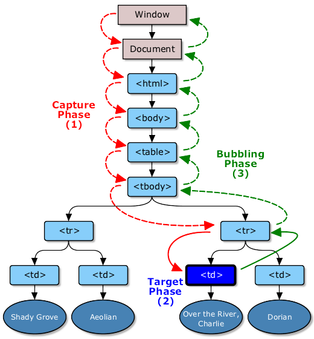

- <a href="#事件绑定">事件绑定</a>
- <a href="#事件委托">事件委托</a>
- <a href="#W3C和IE两种事件绑定有什么不同">W3C和IE两种事件绑定有什么不同</a>
- <a href="#事件冒泡的机制">事件冒泡的机制</a>
- <a href="#JavaScript事件模型">JavaScript事件模型</a>
- <a href="#Event">Event对象</a>
- <a href="#事件流">事件流</a>

<a id="事件绑定"></a>
# 事件绑定

1.  嵌入 dom

```
<button onclick="open()">按钮</button>

<script>
function open(){
    alert(1)
}
</script>
```

2.  直接绑定

```
<button id="btn">按钮</button>
<script>
document.getElementById('btn').onclick = function(){
    alert(1)
}
</script>
```

3.  事件监听

```
<button id="btn">按钮</button>
<script>
document.getElementById('btn').addEventListener('click',function(){
    alert(1)
})
//兼容IE
document.getElementById('btn').attachEvent('click',function(){
    alert(1)
})
</script>
```

<a id="事件委托"></a>
# 事件委托

事件委托是利用事件的冒泡原理来实现的, 我们给最外面的 div 加点击事件，那么里面的 ul，li，a 做点击事件的时候，都会冒泡到最外层的 div 上，所以都会触发，这就是事件委托，委托它们父级代为执行事件

```
window.onload = function(){
    var oUl = document.getElementById("ul1");
    oUl.onclick = function(ev){
        var ev = ev || window.event;
        // 兼容IE
        var target = ev.target || ev.srcElement;
        if(target.tagName == 'LI'){
            alert(123);
            alert(target.innerHTML);
        }
    }
}
```

当用事件委托的时候，根本就不需要去遍历元素的子节点，只需要给父级元素添加事件就好了，其他的都是在 js 里面的执行，这样可以大大的减少 dom 操作，这才是事件委托的精髓所在

event.target 返回触发事件的元素, 起泡元素

event.currentTarget 返回绑定事件的元素

<a id="W3C和IE两种事件绑定有什么不同"></a>
# W3C和IE两种事件绑定有什么不同

W3C

```
// 格式：
target.addEventListener( type, function, useCapture );
// useCapture: 默认false, 是否使用事件捕获
// 例子:  
var myIntro = document.getElementById('intro');
myIntro.addEventListener('click', introClick, false);
```

IE

```
// 格式:
target.attachEvent ( 'on' + type, function );  
// 例子:  
var myIntro = document.getElementById('intro');
myIntro.attachEvent('onclick', introClick);
```

<a id="事件冒泡的机制"></a>
# 事件冒泡的机制

从目标元素起，再依次往顶层对象传递，途中如果有节点绑定了同名事件，这些事件所对应的函数会逐一被触发，此过程便称之为事件冒泡

获取事件冒泡里任意层指定的元素

```
// 期望li触发事件, 但触发事件的元素可能是li下的某个元素,
// 所以找到这个元素的父节点, 如果是li的话就触发li的事件
function toApply(e) {
  let target=e.target||e.srcElement
  while(target.parentNode){
    // 不断取父节点来替换target
    target=target.parentNode
  }
  // 如果目标元素LI存在
  if(target.tagName!='LI') {
    // do something
  }
}
```

<a id="JavaScript事件模型"></a>
# JavaScript事件模型

## 原始事件模型

没有事件流, 事件发生后马上处理

```
// HTML代码中指定属性值
<input type=”button” onclick=”func1()” />

// 在js代码中指定属性值
document.getElementById('input').onclick = func1
```

优点

所有浏览器都兼容

缺点

1. 逻辑与显示没有分离

2. 相同事件的监听函数只能绑定一个，后绑定的会覆盖掉前面的

3. 没有事件的冒泡.委托等机制

## IE 事件模型

IE 把event作为全局对象 window 的一个属性

```
window.onload = function (){
  alert(window.event); // [object event]
}

setTimeout(function(){
  alert(window.event); // null
},2000);
```

IE 是将 event 对象在处理函数中设为 window 的属性，
一旦函数执行结束，便被置为 null,
IE 的事件模型只有两步，先执行元素的监听函数，然后事件沿着父节点一直冒泡到 document

## DOM2 事件模型

一次事件的发生包含三个过程：

1. capturing phase: 事件捕获阶段 事件被从 document 一直向下传播到目标元素,在这过程中依次检查经过的节点是否注册了该事件的监听函数，若有则执行

2. target phase: 事件处理阶段 事件到达目标元素,执行目标元素的事件处理函数.

3. bubbling phase: 事件冒泡阶段 事件从目标元素上升一直到达 document，同样依次检查经过的节点是否注册了该事件的监听函数，有则执行

所有的事件类型都会经历 captruing phase 但是只有部分事件会经历 bubbling phase 阶段,例如 submit 事件就不会被冒泡

<a id="Event"></a>
# Event对象

| 属性          | 描述                                                                                       |
| ------------- | ------------------------------------------------------------------------------------------ |
| bubbles       | 返回布尔值，指示事件是否是冒泡事件类型。                                                   |
| cancelable    | 返回布尔值，指示事件是否可拥可取消的默认动作。                                             |
| currentTarget | 返回其事件监听器触发该事件的元素。                                                         |
| eventPhase    | 返回事件传播的当前阶段。(Event.CAPTURING_PHASE 1,Event.AT_TARGET 2,Event.BUBBLING_PHASE 3) |
| target        | 返回触发此事件的元素（事件的目标节点）。                                                   |
| timeStamp     | 返回事件生成的日期和时间。                                                                 |
| type          | 返回当前 Event 对象表示的事件的名称。                                                      |

| 方法              | 描述                                     |
| ----------------- | ---------------------------------------- |
| initEvent()       | 初始化新创建的 Event 对象的属性。        |
| preventDefault()  | 通知浏览器不要执行与事件关联的默认动作。 |
| stopPropagation() | 阻止事件继续冒泡。                       |

<a id="事件流"></a>
# 事件流

DOM 标准事件流则分为三个阶段:事件捕获阶段，处理事件阶段，事件冒泡阶段


