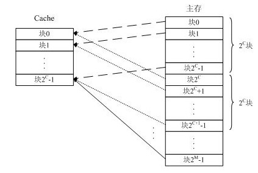
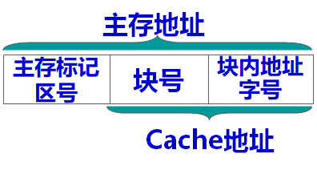
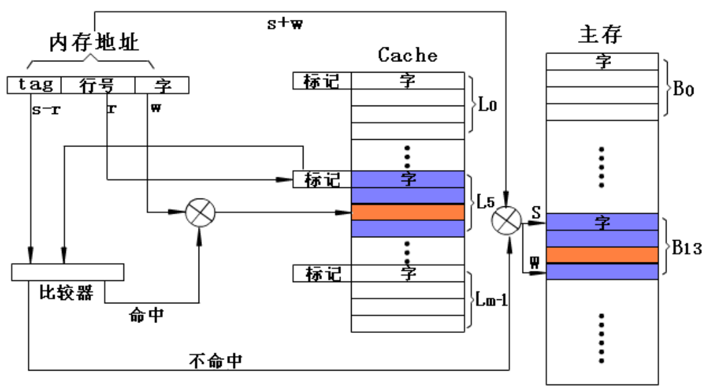
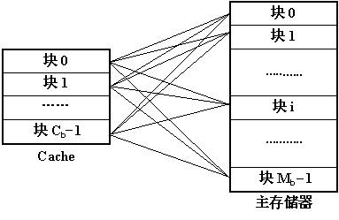
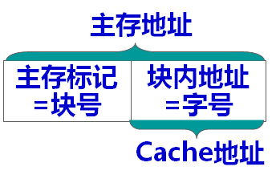
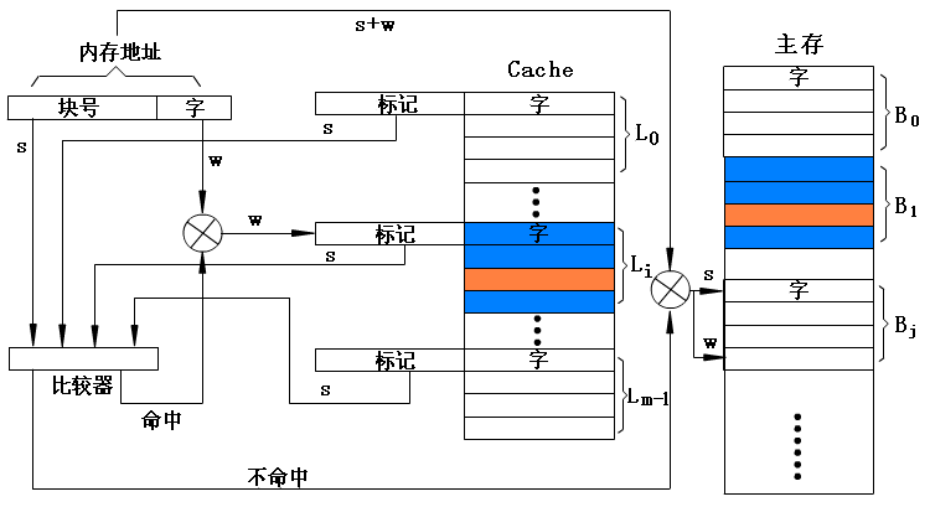
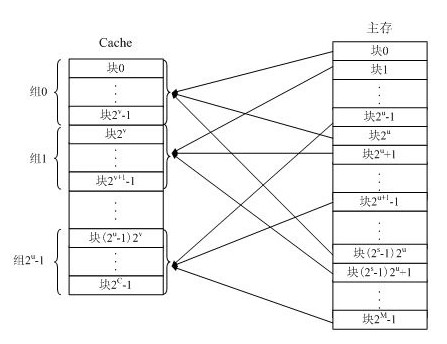
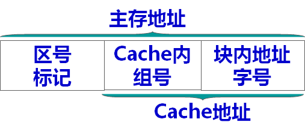

# 分块

将若干个存储字组成一个块, 主存和Cache的块大小保持一致。

对于一个n位地址的存储空间, 如果分成了2^m个块, 则需要m位地址表示所有的块, 称为m位块地址。剩下的n-m位则表示每个块内有n-m个字, 称为n-m位块内地址。

对于主存和cache, 它们的块地址不同, 块内地址相同。

# 直接映射

- 主存的第1个块映射到cache的第1个块
- 主存的第2个块映射到cache的第2个块
- ......
- 主存的第i个块映射到cache的最后一个块
- 主存的第i+1个块再次映射到cache的第1个块
- 主存的第i+2个块再次映射到cache的第2个块
- ......

由于cache的一个块可能映射到主存的多个块, 所以需要给cache设置标记来表示主存的哪一个块。

标记部分的长度为: 主存的地址位数-cache的地址位数

求主存的第i块映射到cache的哪一块: `i mod m` m是cache中的总块数

## 直接映射的cache检索过程

在直接映射方式中, 首先用r位行号(块地址)找到cache中的对应块, 取出该块的标记部分, 然后用地址中的s-r位标记部分与块的标记在比较器中做比较。
若符合命中, 就在cache中找到了对应的块, 然后用地址中最低位w(块内地址)读取所需的字。
若未命中, 按内存地址从主存中读取这个字。

- 优点：硬件简单，容易实现
- 缺点：命中率低， Cache的存储空间利用率低

# 全相联映射

主存的一个块直接映射到cache中的任意一行上。

由于主存的任何一个块都可能映射到cache中的任何一个块, 所以需要给cache设置标记来表示主存的哪一个块。

标志位的长度为: 主存的块地址位数-主存(或cache)的块内地址位数

## 全相联映射方式检索过程

在全相联映射方式中，将内存地址的s位块号与cache中所有行的标记同时在比较器中做比较。
若块号命中，按w位字地址从cache中读取一个字。
若未命中，则按内存地址从主存中读取这个字。

- 优点：命中率较高，Cache的存储空间利用率高
- 缺点：线路复杂，成本高，速度低

# 组相联映射

将cache分成若干组，每组若干行，主存的块先按顺序找到cache的某个组, 再映射到该组内的任意一块, 即组间采用直接映射，组内为全相联映射

- 优点：硬件较简单，速度较快，命中率较高

求主存的第i块映射到cache的哪一组: `i mod m` m是cache中的总组数

如果分成了2^m个组(称为2^m路组相联), 则需要m位地址表示所有的组

由于映射到同一组的主存块的块地址末尾m位是相同的, 所以标记部分只需要取块地址的前面部分表示组内映射到哪个块

## 组相联cache的检索过程

在组相联映射方式中，首先用给定s位块号的低d位找到cache的相应组，然后将块号的高s-d位与该组中每块的所有标记同时比较，哪一块的标记相符即该行命中。再以内存地址的低w位检索此行对应的字。

