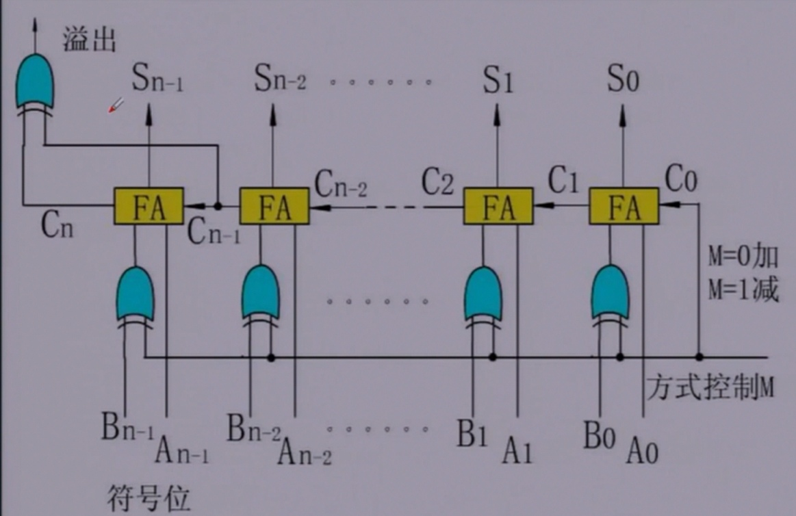

# 加减规则

使用补码运算，运算结果也是补码，符号位参与运算

- x+y=x的补码+y的补码
- x-y=x的补码+(-y)的补码

# 二进制数的相反数

符号位连同数值位一起取反后加1

例如 
- 0011 → 1101 (3 → -3)
- 1101 → 0011 (-3 → 3)

# 溢出

- 计算的结果大于能表示的最大正数称为上溢
- 计算的结果小于能表示的最小负数称为下溢

## 溢出判断

### 双符号位法

- 符号位用两位表示，00表示正，11表示负
- 两位符号位都参与运算

- 运算结束后，符号位相同表示没有溢出
- 符号位不同表示溢出

因此，可以用异或门来判断是否溢出。

### 单符号位法

- 最高数值位有进位且符号位没有进位表示发生上溢
- 最高数值位没有进位且符号位有进位表示发生下溢

# 二进制加(减)法器

- 加数Ai直接和全加器的输入端相连
- 被加数Bi通过异或门和全加器的输入端相连
- 进位Ci和全加器的进位输入端相连

## 加法运算

M=0, 进位位C0输入0, 此时异或门的M输入全为0, 所以Bi输入原样进入全加器, 此时执行的是A+B的运算

## 减法运算

M=1, 进位位C0输入1, 此时异或门的M输入全为1, 所以Bi被取反后进入全加器, 再加上最低位的C0, 就变成了B的相反数, 此时执行的是A-B的运算

## 溢出判断

数值位最高位的进位Cn-1和符号位的进位Cn被作为同一个异或门的输入, 所以此处使用的是单符号位法判断溢出
