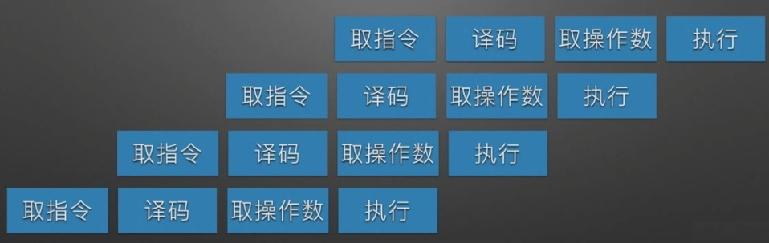

# CISC

CISC的英文全称为“Complex Instruction Set Computer”，即“复杂指令系统计算机”

早期的CPU全部是CISC架构，它的设计目的是要用最少的机器语言指令来完成所需的计算任务。

比如对于乘法运算，在CISC架构的CPU上，可能需要这样一条指令: 
```
MUL ADDRA, ADDRB
```
就可以将ADDRA和ADDRB中的数相乘并将结果储存在ADDRA中。

这种架构会增加CPU结构的复杂性和对CPU工艺的要求，但对于编译器的开发十分有利。比如上面的例子，C程序中的`a*=b`就可以直接编译为一条乘法指令。

今天只有Intel及其兼容CPU还在使用CISC架构。

在CISC微处理器中，程序的各条指令一般是按顺序串行执行的。


# RISC

RISC的英文全称为“Reduced Instruction Set Computer”，即“精简指令集计算机”

RISC架构要求软件来指定各个操作步骤。上面的例子如果要在RISC架构上实现，将ADDRA, ADDRB中的数据读入寄存器，相乘和将结果写回内存的操作都必须由软件来实现，比如：
```
MOV A, ADDRA; 
MOV B, ADDRB; 
MUL A, B; 
STR ADDRA, A;
```

这种架构可以降低CPU的复杂性以及允许在同样的工艺水平下生产出功能更强大的CPU，但对于编译器的设计有更高的要求。

在CISC微处理器中，程序的各条指令是按流水线执行的。


