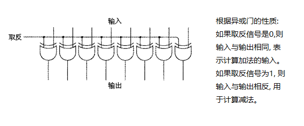
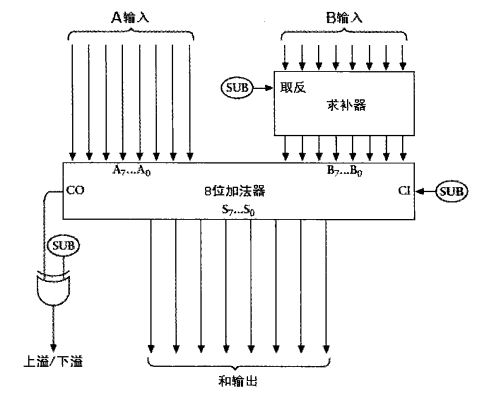

# 减法运算时避免借位

补数: 补数是一种处理有符号数的方法, 用于变换数字的符号。常在计算机科学中应用, 被称为"补码"。

## 减数小于被减数

实现 `253 - 176 = 77`
* 为了避免借位, 首先从999中减去减数: `999 - 176 = 823`
* 由于操作数是三位数, 所以使用999, 如果操作数是四位数, 则使用9999
* 从一串9中减去一个数叫做对9求补数
* 无论减数是多少, 计算对9的补数都不需要借位
* 计算出减数对9的补数后, 将补数与被减数相加: `823 + 253 = 1076`
* 最后将结果加1后再减去1000: `1076 + 1 - 1000 = 77`
* 到此, 得到了结果

原理
* `253 - 176 == 253 - 176 + 1000 - 1000`
* 变形后: `253 - 176 + 999 + 1 - 1000`
* 将数字重新组合: `999 - 176 + 253 + 1 - 1000`
* 此时与上面的计算方法一样了

## 减数大于被减数

实现 `176 - 253 = -77`
* 为了避免借位, 首先从999中减去减数: `999 - 253 = 746`
* 计算出减数对9的补数后, 将补数与被减数相加: `746 + 176 = 922`
* 最后用999减去上一步得到的结果: `999 - 922 = 77`
* 将结果符号取反, 就得到了结果`-77`

原理
* `176 - 253 == 176 - 253 + 999 - 999`
* 变形后: `999 - 253 + 176 - 999`
* 将数字重新组合: `-999 + (999 - 253 + 176)`
* 此时与上面的计算方法一样了

# 计算二进制减法

* 计算二进制减法时, 与上面十进制的方法一致, 区别在于减数是由一串1中减去的, 结果称为1的补数
* 在计算1的补数时, 只需要将二进制按位取反即可得到结果(反码)

# 负数的表示方式

todo

# 减法器实现

首先增加一个信号用来控制减数/加数的输入:

图中的电路叫做求补器

减法器:

