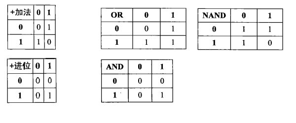
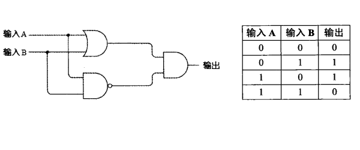
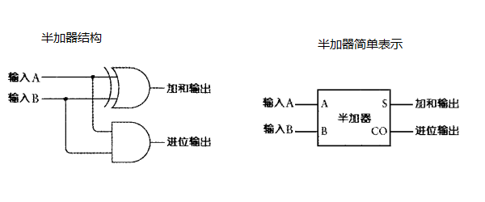
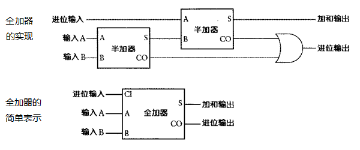
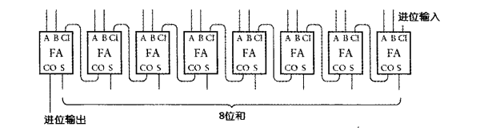

# 二进制加法表

从加法表可以看出:
1. 加法位的结果和或门很接近, 除了右下角的结果
2. 加法位的结果和与非门同样很接近, 除了左上角的结果
3. 进位位的结果和与门的结果一样

把或门和与非门经过组合可以得出与加法位相同的输出:

实际上这就是异或门

# 一位二进制半加器实现

1. 使用异或门实现加法位
1. 使用与门实现进位位

# 一位二进制全加器实现

将两个半加器和一个或门连接

# 八位二进制全加器实现

